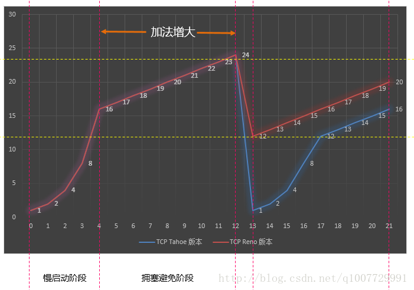

如果网络上的延时突然增加，那么，`TCP` 对这个事做出的应对只有重传数据，但是，重传会导致网络的负担更重，于是会导致更大的延迟以及更多的丢包，进入恶性循环被不断地放大。
如果一个网络内有成千上万的TCP连接都这么行事，那么马上就会形成**网络风暴**，`TCP` 这个协议就会拖垮整个网络。

所以，`TCP` 不能忽略网络上发生的事情，而无脑地一个劲地重发数据，对网络造成更大的伤害。对此 `TCP` 的设计理念是：`TCP` 不是一个自私的协议，当拥塞发生的时候，要做自我牺牲，类似于熔断的概念。就像交通阻塞一样，每个车都应该把路让出来，不要再去抢路了。

关于拥塞控制的论文请参看《[Congestion Avoidance and Control](http://ee.lbl.gov/papers/congavoid.pdf)》(PDF)

拥塞控制主要是四个算法：**1. 慢启动，2. 拥塞避免，3. 拥塞发生，4. 快速恢复**。这四个算法不是一天都搞出来的，这个四算法的发展经历了很多时间，到今天都还在优化中。

# 慢热启动算法 – Slow Start

慢启动的意思是，刚刚加入网络的连接，以一个较低的速度开始传输，一点一点地提速。

慢启动的算法如下 (`cwnd` 全称 `Congestion Window`，拥塞窗口，表示可以**并行发送的包的窗口大小**)：

1. 连接建好时先初始化 `cwnd = 1`，表明可以传一个 `MSS` 大小的数据。

2. 每当收到一个 `ACK`，`cwnd++`；呈线性上升

3. 每当过了一个 `RTT`，`cwnd = cwnd*2`；呈指数上升

4. 还有一个慢启动阈值 `ssthresh（slow start threshold）`，当 `cwnd >= ssthresh` 时，就会进入 "拥塞避免算法"

如果网速很快的话，`RTT` 会短，那么，这个慢启动就一点也不慢，新加入的连接很快就能到达峰速：

`Linux 2.6` 下，`cwnd` 是跟 `MSS` 的值来变的，如果 `MSS< 1095`，则 `cwnd = 4`；如果 `MSS>2190`，则 `cwnd=2`；其它情况下，则是 `3`

`Linux 3.0` 下，`cwnd` 初始值为 `10`

#  拥塞避免算法 – Congestion Avoidance

前面说过，还有一个 `ssthresh (slow start threshold)`，是一个上限，当 `cwnd >= ssthresh` 时，就会进入 "拥塞避免算法"。一般来说 `ssthresh` 的值是 `65535`，单位是字节，当 `cwnd` 达到这个阈值后，算法如下：

1. 收到一个 `ACK` 时，`cwnd = cwnd + 1/cwnd`
2. 当每过一个 `RTT` 时，`cwnd = cwnd + 1`

这样就可以避免增长过快导致网络拥塞，慢慢的增加调整到网络的最佳值。很明显，是一个线性上升的算法。

# 拥塞状态时的算法

前面我们说过，当丢包的时候，会有两种情况：
1. 等到 `RTO` 超时，重传数据包。`TCP` 认为这种情况太糟糕，反应也很强烈。
  1. `sshthresh =  cwnd /2`
  2. `cwnd` 重置为 1
  3. 进入慢启动过程

2. 快速重传算法，也就是在收到3个 `duplicate ACK` 时就开启重传，而不用等到 `RTO `超时。
   1. `TCP Tahoe` 的实现和 `RTO` 超时一样。
   2. `TCP Reno` 的实现是：
      1. `sshthresh = cwnd / 2`
      2. `cwnd = sshthresh + 3 * MSS`
      3. 进入快速重传算法 `Fast Recovery`

我们可以看到 `RTO` 超时后，`sshthresh` 会变成 `cwnd` 的一半。这意味着，如果是 `cwnd <= sshthresh` 时出现的丢包，那么 `TCP` 的 `sshthresh` 就会减掉一半，然后等 `cwnd` 又很快地以指数级增涨爬到这个地方时，又会慢慢的线性增涨。可以看到，`TCP` 是怎么通过这种强烈地震荡快速而小心得找到网站流量的平衡点的。

#### 参考

[陈皓 - TCP 的那些事儿（上）](https://coolshell.cn/articles/11564.html#%E8%B6%85%E6%97%B6%E9%87%8D%E4%BC%A0%E6%9C%BA%E5%88%B6)
