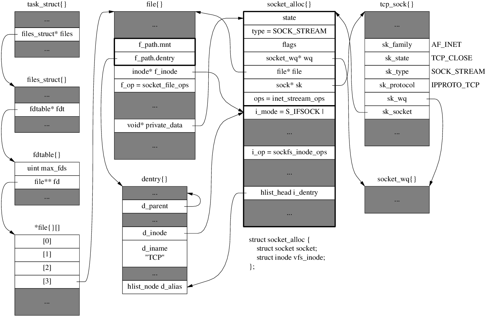

#### TCP连接四元组

源IP、源端口、目的IP、目的端口

目的IP是固定的，如果只跑一个进程的话（如Nginx进程），目的端口也是固定的。因此连接数上限是 IP数×端口数 = `2^32 × 2^16 = 2^48`，约两百多万亿。如果服务器每个端口跑一个进程，那连接数上限是 2 ^ 64。

但实践中，每维持一条TCP连接，都需要创建一个文件对象。Linux出于安全考虑，在多个配置里都限制了可打开的最大文件数。

假设对最大文件数进行了修改，改为不限文件数。每条TCP链接都需要file、socket等内核对象，一条空连接占3.3KB左右。以 4GB 内存的服务器为例，最多能支撑 4GB / 3.3KB，约100万左右。

>  此时如果另一端发送数据，可能就会导致服务器卡死。

#### 空TCP连接占用内存

空 `TCP` 连接是不占用 `socket` 缓冲区的。只有有数据的活跃连接才占。空连接主要占内存的地方在于 `TCP` 连接本身的结构体，记录了 `fd` 文件、文件夹、`socket` 结构体等。占用大概 `3KB` 左右的内存。

#### 参考

[陈硕 - Linux 中每个 TCP 连接最少占用多少内存](https://zhuanlan.zhihu.com/p/25241630)