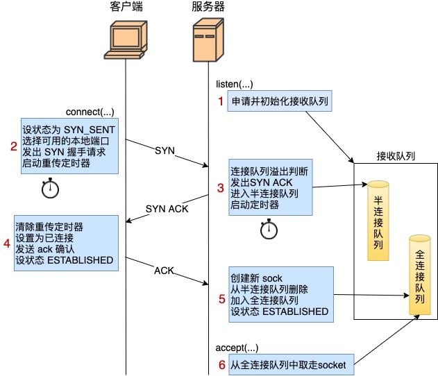

在基于 TCP 的服务开发中，三次握手的主要流程如下：

客户端：发送 SYN包

服务端：回复 ACK

客户端：回复 ACK

本篇来看一下三次握手的具体实现（基于 Linux3.0 源码）


客户端程序的核心代码如下：

```c
// 客户端核心代码
int main(){
    fd = socket(AF_INET,SOCK_STREAM, 0);
    connect(fd, ...);
}
```


服务端的如下：

```c
// 服务端核心代码
int main(int argc, char const *argv[])
{
    int fd = socket(AF_INET, SOCK_STREAM, 0);
    bind(fd, ...);
    listen(fd, 128);
    accept(fd, ...);
}
```


# 服务端 listen

`listen` 函数内部，主要做了半连接队列和全连接队列的初始化、内存申请过程。

半连接队列用于存放未完成三次握手的连接（刚从客户端发送过来的 SYN包

全连接队列用于存放完成三次握手的连接


# 客户端 connect

```c
//file: net/ipv4/tcp_ipv4.c
int tcp_v4_connect(struct sock *sk, struct sockaddr *uaddr, int addr_len)
{
    //设置 socket 状态为 TCP_SYN_SENT
    tcp_set_state(sk, TCP_SYN_SENT);

    //动态选择一个端口
    err = inet_hash_connect(&tcp_death_row, sk);

    //构建 syn 报文，并发送
    err = tcp_connect(sk);
}
```


这里先随机选一个端口，再发送 SYN 报文

#### 端口的选择

```c
// net/ipv4/inet_hashtables.c
int inet_hash_connect(struct inet_timewait_death_row *death_row, struct sock *sk)
{
    // inet_sk_port_offset(sk)：这个函数是根据要连接的目的 IP 和端口等信息生成一个随机数
    return __inet_hash_connect(death_row, sk, inet_sk_port_offset(sk), 
    __inet_check_established, __inet_hash_nolisten);
}
```


```c
// net/ipv4/inet_hashtables.c
int __inet_hash_connect(...) {
  	// 判断该 socket 是否已通过 bind() 函数绑定了端口
  	const unsigned short snum = inet_sk(sk)->inet_num;
  	if (!snum) {
        // 读取 net.ipv4.ip_local_port_range 这个内核参数（管理员配置的可用的端口范围）
        inet_get_local_port_range(&low, &high); 
        remaining = (high - low) + 1;
        for (i = 1; i <= remaining; i++) {
            // 以 low+随机数为起点 遍历可用端口
            port = low + (i + offset) % remaining; 
        
            // 读取 net.ipv4.ip_local_reserved_ports 参数，判断是否为保留端口
            if (inet_is_reserved_local_port(port)) continue; 
      
            // 如果端口已经被使用
            if (net_eq(ib_net(tb), net) && tb->port == port) {
                // 再通过 check_established 继续检查四元组，判断端口是否可用
                if (!check_established(death_row, sk, port, &tw))
                goto ok;
            }
        }
    }
}
```


#### 发送 SYN包

```c
// net/ipv4/tcp_output.c
int tcp_connect(struct sock *sk)
{
    // 添加到发送队列 sk_write_queue 上
    tcp_connect_queue_skb(sk, buff);

    // 实际发出 syn
    err = tp->fastopen_req ? tcp_send_syn_data(sk, buff) : tcp_transmit_skb(sk, buff, 1, sk->sk_allocation);

    // 启动重传定时器
    inet_csk_reset_xmit_timer(sk, ICSK_TIME_RETRANS, inet_csk(sk)->icsk_rto, TCP_RTO_MAX);
}
```


# 服务端响应 SYN

```c
// net/ipv4/tcp_ipv4.c
int tcp_v4_do_rcv(struct sock *sk, struct sk_buff *skb)
{
    // 查看半连接队列。第二次握手不会进这个条件分支，第三次才会
    if (sk->sk_state == TCP_LISTEN) {
       struct sock *nsk = tcp_v4_hnd_req(sk, skb);
    }
    
    if (tcp_rcv_state_process(sk, skb, tcp_hdr(skb), skb->len)) {
        rsk = sk;
        goto reset;
    }
}
```


```c
// net/ipv4/tcp_input.c
int tcp_rcv_state_process(struct sock *sk, struct sk_buff *skb, const struct tcphdr *th, unsigned int len)
{
    switch (sk->sk_state) {
    
    case TCP_LISTEN:
        // ACK包，直接返回1
        if (th->ack)
            return 1;
        // RST信号，丢弃
        if (th->rst)
            goto discard;
        // SYN包
		    if (th->syn) {
			      if (icsk->icsk_af_ops->conn_request(sk, skb) < 0)
				        return 1;
 ......
}  
```

`conn_request` 指向 `tcp_v4_conn_request` 函数，是服务端响应 SYN 的主要逻辑函数

```c
// net/ipv4/tcp_ipv4.c
int tcp_v4_conn_request(struct sock *sk, struct sk_buff *skb)
{
    // 看看半连接队列是否满了
    if (inet_csk_reqsk_queue_is_full(sk) && !isn) {
        want_cookie = tcp_syn_flood_action(sk, skb, "TCP");
        if (!want_cookie)
            goto drop;
    }
  
    // 在全连接队列满的情况下，如果有 young_ack，那么直接丢
    // young_ack 是半连接队列里保持着的一个计数器。记录的是刚有SYN到达，没有被SYN_ACK重传定时器重传过SYN_ACK，同时也没有完成过三次握手的sock数量
    // 我理解就是全连接队列满 & 半连接队列里还有连接的情况
    if (sk_acceptq_is_full(sk) && inet_csk_reqsk_queue_young(sk) > 1) {
        NET_INC_STATS_BH(sock_net(sk), LINUX_MIB_LISTENOVERFLOWS);
        goto drop;
    }
  
    // 分配 request_sock 内核对象
    req = inet_reqsk_alloc(&tcp_request_sock_ops);
  
    // 构造 syn+ack 包
    skb_synack = tcp_make_synack(sk, dst, req, fastopen_cookie_present(&valid_foc) ? &valid_foc : NULL);
  
    if (likely(!do_fastopen)) {
        // 发送 syn + ack 响应
        err = ip_build_and_send_pkt(skb_synack, sk, ireq->loc_addr, ireq->rmt_addr, ireq->opt);

        // 添加到半连接队列，并开启计时器
        inet_csk_reqsk_queue_hash_add(sk, req, TCP_TIMEOUT_INIT);
    }
}
```


# 客户端响应 SYNACK

客户端也会进入到 `tcp_rcv_state_process` 函数中。不过由于自身 socket 的状态是 `TCP_SYN_SENT`，所以会进入到另一个不同的分支中去。

```c
// net/ipv4/tcp_input.c
// 除了 ESTABLISHED 和 TIME_WAIT，其他状态下的 TCP 处理都走这里
int tcp_rcv_state_process(struct sock *sk, struct sk_buff *skb, const struct tcphdr *th, unsigned int len)
{
    switch (sk->sk_state) {
    // 客户端第二次握手处理 
    case TCP_SYN_SENT:
        queued = tcp_rcv_synsent_state_process(sk, skb, th, len);
}
  
static int tcp_rcv_synsent_state_process(struct sock *sk, struct sk_buff *skb, const struct tcphdr *th, unsigned int len)
{
    if (th->ack) {
        // 删除发送队列、定时器
        tcp_ack(sk, skb, FLAG_SLOWPATH);
        // 连接建立完成 
        tcp_finish_connect(sk, skb);
        // 发送第三次握手
        tcp_send_ack(sk);
}
  
// net/ipv4/tcp_input.c
void tcp_finish_connect(struct sock *sk, struct sk_buff *skb)
{
    // 修改 socket 状态为 TCP_ESTABLISHED
    tcp_set_state(sk, TCP_ESTABLISHED);

    // 初始化拥塞控制
    tcp_init_congestion_control(sk);

    // 打开保活计时器
    if (sock_flag(sk, SOCK_KEEPOPEN))
        inet_csk_reset_keepalive_timer(sk, keepalive_time_when(tp));
}
```

就是在这一步客户端修改了自己的 socket 状态为 `ESTABLISHED`，并清除了 connect 时设置的重传定时器，开启了保活计时器


# 服务端响应 ACK

服务器响应第三次握手的 ack 时同样会进入到第二次握手时的 `tcp_v4_do_rcv` 函数，不过之前在半连接队列里找不到连接，这次可以了，因此会进入不同的条件分支 `tcp_v4_hnd_req`。

```c
// net/ipv4/tcp_ipv4.c
int tcp_v4_do_rcv(struct sock *sk, struct sk_buff *skb)
{
     // 这里修改连接状态为 ESTABLISHED
     if (tcp_rcv_state_process(sk, skb, tcp_hdr(skb), skb->len)) {
         ...
     }
}

static struct sock *tcp_v4_hnd_req(struct sock *sk, struct sk_buff *skb)
{
    // 查找半连接队列
    struct request_sock *req = inet_csk_search_req(sk, &prev, th->source, iph->saddr, iph->daddr);
    if (req)
        return tcp_check_req(sk, skb, req, prev, false);
}
```

```c
// net/ipv4/tcp_minisocks.c
struct sock *tcp_check_req(struct sock *sk, struct sk_buff *skb,
      struct request_sock *req,
      struct request_sock **prev,
      bool fastopen)
{

    // 创建子 socket
    child = inet_csk(sk)->icsk_af_ops->syn_recv_sock(sk, skb, req, NULL);

    // 清理半连接队列
    inet_csk_reqsk_queue_unlink(sk, req, prev);
    inet_csk_reqsk_queue_removed(sk, req);

    // 添加全连接队列
    inet_csk_reqsk_queue_add(sk, req, child);
    return child;
}
```


# 服务器 accept

最后 accept 一步长话短说。

```c
//  net/ipv4/inet_connection_sock.c
struct sock *inet_csk_accept(struct sock *sk, int flags, int *err)
{
    // 从全连接队列中获取 socket，就是从全连接队列的链表里获取出第一个元素返回就行了。
    struct request_sock_queue *queue = &icsk->icsk_accept_queue;
    req = reqsk_queue_remove(queue);

    newsk = req->sk;
    return newsk;
}
```


# 总结



1. 服务器 listen，计算全/半连接队列的长度，申请相关内存并初始化。
2. 客户端 connect 时，把本地 socket 状态设置成了 TCP_SYN_SENT，选择一个可用的端口，发出 SYN 握手请求并启动重传定时器。
3. 服务器响应 ack 时，会判断下接收队列是否满了，满的话可能会丢弃该请求。否则发出 synack，申请 request_sock 添加到半连接队列中，同时启动定时器。
4. 客户端响应 synack 时，清除了 connect 时设置的重传定时器，把当前 socket 状态设置为 ESTABLISHED，开启保活计时器后发出第三次握手的 ack 确认。
5. 服务器响应 ack 时，把对应半连接对象删除，创建了新的 sock 后加入到全连接队列中，最后将新连接状态设置为 ESTABLISHED。
6. accept 从已经建立好的全连接队列中取出一个返回给用户进程。

另外要注意的是，如果握手过程中发生丢包（网络问题，或者是连接队列溢出），内核会等待定时器到期后重试，重试时间间隔在 3.10 版本里分别是 1s 2s 4s ...。在一些老版本里，比如 2.6 里，第一次重试时间是 3 秒。最大重试次数分别由 tcp_syn_retries 和 tcp_synack_retries 控制。

如果你的线上接口正常都是几十毫秒内返回，但偶尔出现了 1 s、或者 3 s 等这种偶发的响应耗时变长的问题，那么你就要去定位一下看看是不是出现了握手包的超时重传了。


#### 参考

[张彦飞allen - 三次握手](https://mp.weixin.qq.com/s/vlrzGc5bFrPIr9a7HIr2eA)