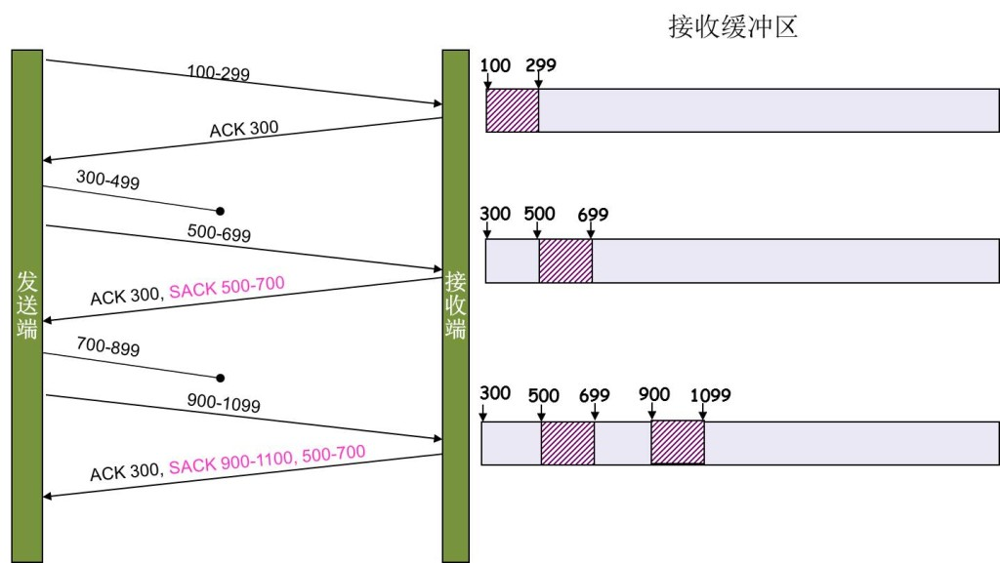

# TCP重传机制

TCP要保证所有的数据包都可以到达，所以，必需要有重传机制。

注意，接收端给发送端的 `ack` 确认只会确认最后一个连续的包，比如，发送端发了 1,2,3,4,5 一共五份数据，接收端收到了1，2，于是回ack 3，然后收到了4（注意此时3没收到），此时的TCP会怎么办？我们要知道，因为正如前面所说的，**SeqNum和Ack是以字节数为单位，所以 ack 的时候，不能跳着确认，只能确认最大的连续收到的包**，不然，发送端就以为之前的都收到了。

## 超时重传机制

一种是不回 `ack`，死等3，当发送方发现收不到3的 `ack` 超时后，会重传3。一旦接收方收到3后，会 `ack` 回 4——意味着3和4都收到了。

但是，这种方式会有比较严重的问题，那就是因为要死等3，所以会导致4和5即便已经收到了，而发送方也完全不知道发生了什么事，因为没有收到 `ack`，所以，发送方可能会悲观地认为也丢了，所以有可能也会导致4和5的重传。

对此有两种选择：

- 一种是仅重传 `timeout` 的包。也就是第3份数据。
- 另一种是重传 `timeout` 后所有的数据，也就是第3，4，5这三份数据。

这两种方式有好也有不好。第一种会节省带宽，但是慢，第二种会快一点，但是会浪费带宽，也可能会有无用功。但总体来说都不好。因为都在等 `timeout`，`timeout` 可能会很长（在下篇会说TCP是怎么动态地计算出 `timeout` 的）

## 快速重传机制

于是，TCP引入了一种叫 **Fast Retransmit**  的算法，**不以时间驱动，而以数据驱动重传**。也就是说，如果，包没有连续到达，就 `ack` 最后那个可能被丢了的包，如果发送方连续收到3次相同的 `ack`，就重传。Fast Retransmit 的好处是不用等超时了再重传。

比如：如果发送方发出了1，2，3，4，5份数据，第一份先到送了，于是就 `ack` 回2，结果2因为某些原因没收到，3到达了，仍然 `ack` 回2，后面的4和5都到了，也仍然 `ack` 回2，因为2还是没有收到，于是发送端收到了三个 `ack=2` 的确认，知道了2还没有到，于是就马上重传2。然后，接收端收到了2，此时因为3，4，5都收到了，于是 `ack` 回6。示意图如下：

`Fast Retransmit` 只解决了一个问题，就是 `timeout` 的问题，它依然面临一个艰难的选择，就是，是重传之前的一个还是重传所有的问题。对于上面的示例来说，是重传#2呢还是重传#2，#3，#4，#5呢？因为发送端并不清楚这连续的3个 `ack(2)` 是谁传回来的？也许是#6，#10，#20传来的，这样发送端很有可能要重传从2到20的这堆数据（这就是某些 `TCP` 的实际的实现）。可见，这是一把双刃剑。

## SACK 方法

另外一种更好的方式叫：**Selective Acknowledgment (SACK)**（参看[RFC 2018](https://tools.ietf.org/html/rfc2018)），这种方式需要在 `TCP` 头里加一个 `SACK` 的东西，`ACK` 还是 `Fast Retransmit` 的 `ACK`，新增的 `SACK` 用于汇报已收到的数据段。参看下图：

这样，在发送端就可以根据回传的 `SACK` 来知道哪些数据到了，哪些没有到。于是就优化了 `Fast Retransmit` 的算法。当然，这个协议需要两边都支持。在 `Linux` 下，可以通过 `tcp_sack` 参数打开这个功能（`Linux 2.4` 后默认打开）。

注意1：接收方有权把已经报给发送端 `SACK` 里的数据给丢了。因此不能用 `SACK` 完全代替 `ACK`，`ACK` 仍然需要保留。

注意2：`SACK` 会消费发送方的资源，试想，如果一个攻击者给数据发送方发一堆 `SACK` 的选项，这会导致发送方开始要重传甚至遍历已经发出的数据，这会消耗很多发送端的资源。详细的东西请参看《[TCP SACK的性能权衡](https://www.ibm.com/developerworks/cn/linux/l-tcp-sack/)》

## Duplicate SACK / D-SACK

有时候接收端收到数据了，但是返回的 `ACK` 丢了 / 超时到达。发送端没有收到 `ACK`，以为丢包了，就会重传。这种重传其实是没必要的。

因此有了 `Duplicate SACK` ，又称 `D-SACK`。从上面可以看到，`SACK` 是一个区间数组，如果这个数组的第一个区间被 `ACK` 覆盖，或者被第二个区间包含，就是 `D-SACK` 的做法，表示收到的数据之前传过了，是重复的数据，不需再传了。

## 超时时长的设置

### TCP的RTT算法

从前面的 `TCP` 重传机制我们知道 `Timeout` 的设置对于重传非常重要。

- 设长了，重发就慢，丢了老半天才重发，没有效率，性能差
- 设短了，会导致可能并没有丢就重发。于是重发的就快，会增加网络拥塞，导致更多的超时，更多的重发。

而且，这个超时时间在不同的网络的情况下，根本没有办法设置一个死的值，只能动态地设置

 为了动态地设置，`TCP` 引入了 **RTT: Round Trip Time**，也就是一个数据包从发出去到回来的时间。这样发送端就大约知道需要多少的时间，从而可以方便地设置 **RTO (Retransmission TimeOut)**，以让我们的重传机制更高效。 听起来似乎很简单，好像就是在发送端发包时记下 `t0`，然后接收端再把这个 `ack` 回来时再记一个 `t1`，于是 `RTT = t1 – t0`。没那么简单，这只是一个采样，不能代表普遍情况。

总体思路是：超时时间 = 较大权重 × 最近几次 RTT + 较小权重 + 稍远几次的 RTT

### 经典算法

[RFC793](https://tools.ietf.org/html/rfc793) 中定义的经典算法是这样的：

1）首先，先采样 `RTT`，记下最近好几次的 `RTT` 值。

2）然后做平滑计算 `SRTT（(Smoothed RTT)`。公式为：
$$
SRTT = ( α * SRTT ) + ((1- α) * RTT)
$$
其中的 α 取值在0.8 到 0.9之间，这个算法英文叫 `Exponential weighted moving average`，中文叫加权移动平均

3）开始计算 `RTO`。公式如下：
$$
RTO = min [ UBOUND,  max [ LBOUND,  (β * SRTT) ]  ]
$$
其中：

- `UBOUND` 是最大的 `timeout` 时间，上限值
- `LBOUND` 是最小的 `timeout` 时间，下限值
- β 值一般在1.3到2.0之间。

#### Karn / Partridge 算法

但是上面的这个算法在重传的时候会出有一个终极问题——你是用第一次发数据的时间和 `ACK` 回来的时间做 `RTT` 样本值，还是用重传的时间和 `ACK` 回来的时间做RTT样本值？

这个问题无论你选那头都是按下葫芦起了瓢。 如下图所示：

- 情况（a）是 `ACK` 没回来，所以重传。如果你计算第一次发送和 `ACK` 的时间，那么，明显算大了。
- 情况（b）是 `ACK` 回来慢了，但是导致了重传，但刚重传不一会儿，之前 `ACK` 就回来了。如果你是算重传的时间和 `ACK` 回来的时间的差，就会算短了。

所以1987年的时候，搞了一个叫[Karn / Partridge Algorithm](https://en.wikipedia.org/wiki/Karn's_Algorithm)，这个算法的最大特点是——**忽略重传，不把重传的RTT做采样**（你看，你不需要去解决不存在的问题）。

但是，这样一来，又会引发一个大BUG——**如果在某一时间，网络闪动，突然变慢了，产生了比较大的延时，这个延时导致要重转所有的包（因为之前的RTO很小），于是，因为重转的不算，所以，RTO就不会被更新，这是一个灾难**。 于是Karn算法用了一个取巧的方式——只要一发生重传，就对现有的 `RTO` 值翻倍（这就是所谓的 Exponential backoff），很明显，这种死规矩对于一个需要估计比较准确的RTT也不靠谱。

#### Jacobson / Karels 算法

前面两种算法用的都是“加权移动平均”，这种方法最大的毛病就是如果RTT有一个大的波动的话，很难被发现，因为被平滑掉了。所以，1988年，又有人推出来了一个新的算法，这个算法叫 Jacobson / Karels Algorithm（参看[RFC6289](https://tools.ietf.org/html/rfc6298)）。这个算法引入了最新的 `RTT` 的采样和平滑过的 `SRTT` 的差距做因子来计算。 公式如下：（其中的DevRTT是Deviation RTT的意思）

计算平滑RTT
$$
SRTT = SRTT + α (RTT – SRTT)
$$

计算平滑RTT和真实的差距（加权移动平均）
$$
DevRTT = (1-β)*DevRTT + β*(|RTT-SRTT|)
$$

神一样的公式
$$
RTO= µ * SRTT + ∂ *DevRTT
$$

在 `Linux` 下，`α = 0.125，β = 0.25， μ = 1，∂ = 4`。这就是算法中的“调得一手好参数”，(nobody knows why, it just works…） 

最后的这个算法在被用在今天的TCP协议中（Linux的源代码在：[tcp_rtt_estimator](http://lxr.free-electrons.com/source/net/ipv4/tcp_input.c?v=2.6.32#L609)）。

#### 参考

> [陈皓 - TCP 的那些事儿（上）](https://coolshell.cn/articles/11564.html#%E8%B6%85%E6%97%B6%E9%87%8D%E4%BC%A0%E6%9C%BA%E5%88%B6)
