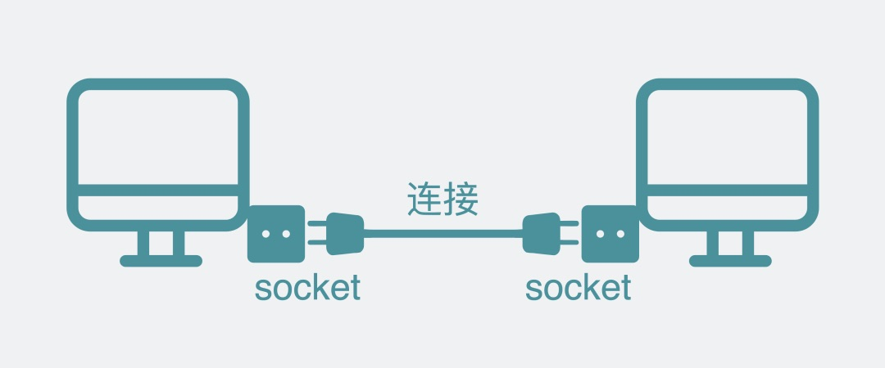
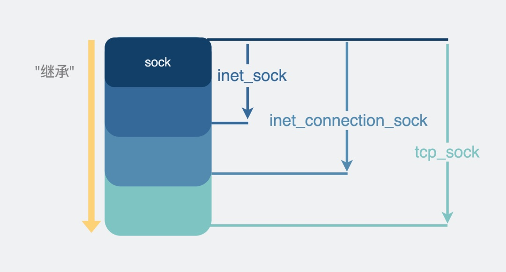
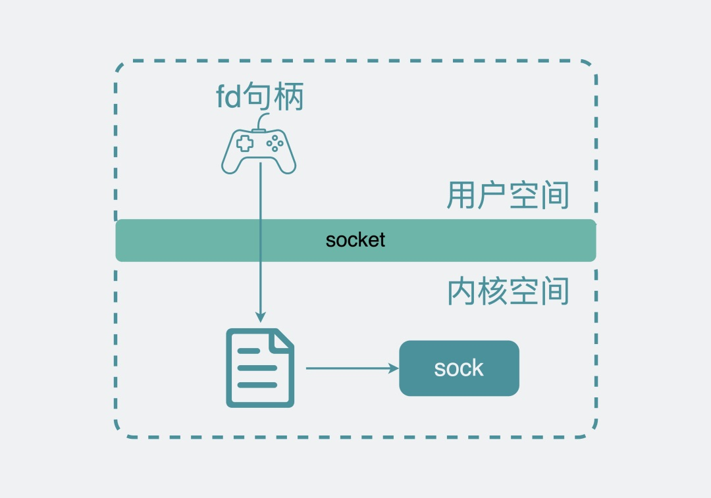
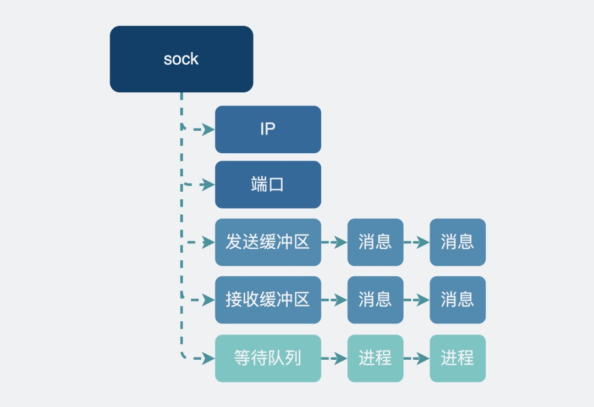

socket 直译过来是插头的意思，通过 socket，我们可以与某台机子建立"连接"，建立"连接"的过程，就像是将插口插入插槽一样。



socket 的用法如下：

```c
sock_fd = socket(AF_INET, SOCK_STREAM, IPPROTO_TCP);
```

该方法会返回 `socket_fd`，它是 socket文件的句柄，是个数字，相当于 socket的身份证号。

得到了 `socket_fd`之后，对于服务端，就可以依次执行 `bind()`, `listen()`, `accept()`方法，然后坐等客户端的连接请求。

对于客户端，得到 `socket_fd`之后，你就可以执行 `connect()`方法向服务端发起建立连接的请求，此时就会发生TCP三次握手。

连接建立完成后，客户端可以执行 `send()` 方法发送消息，服务端可以执行 `recv()`方法接收消息，反过来，服务器也可以执行 `send()`，客户端执行 `recv()`方法。


### sock 结构

为了实现以上的读写功能，需要定义一个数据结构去支持这些功能，这个数据结构，叫 `sock`。

首先它要有基本的 IP、端口字段。

其次，它要支持 TCP/UDP 等多种协议。这些协议虽然各不相同，但还是有一些功能相似的地方，比如收发数据时的一些逻辑完全可以复用。按面向对象编程的思想，我们可以将不同的协议当成是不同的对象类（或结构体），将公共的部分提取出来，通过"继承"的方式，复用功能。

于是，我们将功能重新划分下，定义了一些数据结构。



`inet_sock `特指用了**网络传输**功能的 `sock`，在`sock`的基础上还加入了`TTL`，**端口，IP地址**这些跟网络传输相关的字段信息。说到这里大家就懵了，难道还有不是用网络传输的？有，比如`Unix domain socket`，用于本机进程之间的通信，直接读写文件，不需要经过网络协议栈。

`inet_connection_sock` 是指**面向连接**的`sock`，在`inet_sock`的基础上加入面向连接的协议里相关字段，比如`accept队列`，数据包分片大小，握手失败重试次数等。虽然我们现在提到面向连接的协议就是指TCP，但设计上linux需要支持扩展**其他**面向连接的**新协议**，

`tcp_sock` 就是正儿八经的**tcp协议**专用的`sock`结构了，在`inet_connection_sock`基础上还加入了tcp特有的**滑动窗口**、**拥塞避免**等功能。同样udp协议也会有一个专用的数据结构，叫`udp_sock`。

好了，现在有了这套数据结构，我们将它们跟**硬件**网卡对接一下，就实现了网络传输的功能。


### 提供socket层

可以想象得到，这里面的代码肯定非常复杂，同时还操作了网卡硬件，需要比较高的操作系统权限，再考虑到性能和安全，于是决定将它放在操作系统内核里。对外通过文件句柄的形式提供服务。在用户空间里操作这个句柄，文件系统就会将操作指向内核 `sock` 结构，操作这个特殊的文件就相当于操作内核里对应的 `sock`。


有了 `sock_fd句柄` 之后，我们就需要提供一些接口方法，让用户更方便的实现特定的网络编程功能。这些接口，我们列了一下，发现需要有 `send()，recv()，bind(), listen()，connect()` 这些。到这里，我们的内核网络传输功能就算设计完成了。

所以说，`socket` 其实就是个代码库 or 接口层，它介于内核和应用程序之间，提供了一些高度封装过的接口，让我们去使用内核网络传输功能。

到这里，我们应该明白了。我们平时写的应用程序里代码里虽然用了 `socket` 实现了收发数据包的功能，但其实真正执行网络通信功能的，不是应用程序，而是linux内核。相当于应用程序通过 `socket` 提供的接口，将网络传输的这部分工作外包给了linux内核。

这听起来像不像我们最熟悉的前后端分离的服务架构，虽然这么说不太严谨，但看上去linux就像是被分成了应用程序和内核两个服务。内核就像是后端，暴露了好多个api接口，其中一类就是 `socket` 的 `send(), recv()` 等方法。应用程序就像是前端，负责调用内核提供的接口来实现想要的功能。


## socket如何实现网络通信

### 建立连接

在客户端，代码执行socket提供的 `connect(sockfd, "ip:port")`方法时，会通过**sockfd句柄**找到对应的**文件**，再根据文件里的信息**指向**内核的`sock`结构。通过这个sock结构主动发起三次握手。

在服务端握手次数还没达到"三次"的连接，叫**半连接**，完成好三次握手的连接，叫**全连接**。它们分别会用**半连接队列**和**全连接队列**来存放，这两个队列会在你执行 `listen()`方法的时候创建好。当服务端执行`accept()`方法时，就会从全连接队列里拿出一条全连接。

> 虽然都叫队列，但半连接队列其实是个hash表，而全连接队列其实是个链表。


### 数据传输

为了实现发送和接收数据的功能，sock结构体里带了**一个发送缓冲区和一个接收缓冲区**，说是**缓冲区**，但其实就是个**链表**，上面挂着一个个准备要发送或接收的数据。

当应用执行`send()`方法**发送数据**时，同样也会通过`sock_fd`句柄找到对应的文件，根据文件指向的`sock`结构，找到这个`sock`结构里带的**发送缓冲区**，将数据会放到发送缓冲区，然后结束流程，内核看心情决定什么时候将这份数据发送出去。

**接收数据**流程也类似，当数据送到linux内核后，数据不是立马给到应用程序的，而是先放在接收缓冲区中，等待**应用程序**什么时候执行`recv()`方法来拿一下。

#### 据从远端发过来了，怎么通知并给到应用程序呢？

这就需要用到**等待队列**。



当你的应用进程执行 `recv()`方法尝试获取（阻塞场景下）接收缓冲区的数据时。

- 如果有数据，那正好，取走就好了。这点没啥疑问。
- 但如果没数据，就会将自己的**进程**信息注册到这个sock用的**等待队列**里，然后进程**休眠**。如果这时候有数据从远端发过来了，数据进入到接收缓冲区时，内核就会取出sock的等待队列里的进程，**唤醒**进程来取数据。

有时候，你会看到**多个进程**通过`fork`的方式，`listen`了同一个`socket_fd`。在内核，它们都是**同一个sock**，多个进程执行listen()之后，都嗷嗷等待连接进来，所以都会将自身的进程信息注册到这个socket_fd对应的内核sock的**等待队列**中。如果这时真来了一个连接，是该唤醒等待队列里的哪个进程来接收连接呢？这个问题的答案比较有趣。

- 在linux 2.6以前，会唤醒等待队列里的所有进程。但最后其实只有一个进程会处理这个连接请求，其他进程又重新进入休眠，这些被唤醒了又无事可做最后只能重新回去休眠的进程会消耗一定的资源，这个叫惊群效应。
- 在linux 2.6之后，只会唤醒等待队列里的其中一个进程。


#### 服务端 listen 的时候，那么多数据到一个 socket 怎么区分多个客户端的？

以TCP为例，服务端执行listen方法后，会等待客户端发送数据来。客户端发来的数据包上会有源IP地址和端口，以及目的IP地址和端口，这四个元素构成一个四元组，可以用于唯一标记一个客户端。

服务端会创建一个新的内核sock，并用四元组生成一个hash key，将它放入到一个hash表中。

下次再有消息进来的时候，通过消息自带的四元组生成`hash key`再到这个`hash表`里重新取出**对应的sock**就好了。所以说**服务端是通过四元组来区分多个客户端的**。


#### 参考

[小白debug - socket到底是什么？别再把它叫套接字了](https://mp.weixin.qq.com/s/bD1XB-fVSlV3rIqoQdA40g)
