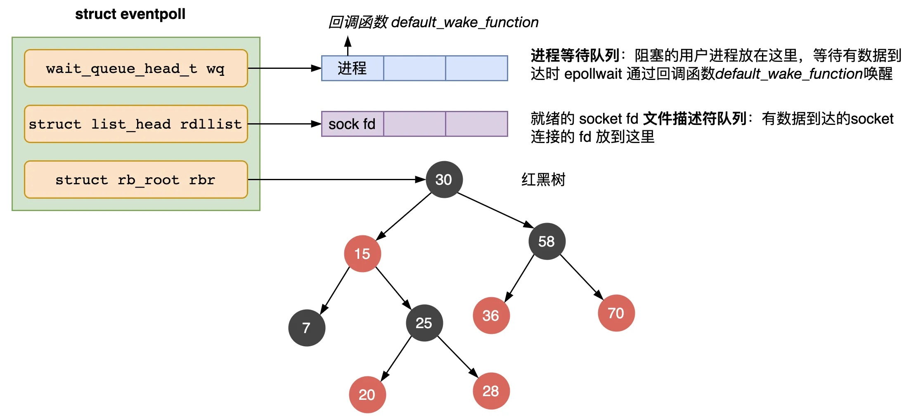

《UNIX 网络编程》中总结了五种IO模型，分别是：

- 阻塞I/O
- 非阻塞I/O
- I/O复用
- 信号驱动式I/O(SIGIO)
- 异步I/O(POSIX的aio_系列函数)


# 阻塞 IO

想一下如果让你来写一个处理网络请求的服务端，你会怎么写？

最基础的做法是，先起一个线程监听所有的网络连接。成功建立连接后，处理该请求。请求处理完成后，建立下一个连接，处理下一个请求。如此串行的、阻塞的处理。

```c
listenfd = socket();   // 打开一个网络通信端口
bind(listenfd);        // 绑定
listen(listenfd);      // 监听
while(1) {
    connfd = accept(listenfd);      // 建立连接
    int n = read(connfd, buf);      // 读数据（阻塞）
    doSomeThing(buf);               // 处理数据
    close(connfd);                  // 关闭连接，循环等待下一个连接
}
```


把服务端处理请求的细节展开，得到如下图所示的同步阻塞网络 IO 的数据接收流程：


这就是传统的阻塞 IO。如果这个连接的客户端一直不发数据，那么服务端线程将会一直阻塞在 `recvfrom` 函数上不返回，也无法接受其他客户端连接。


# 非阻塞IO

为了解决上面的问题，其关键在于改造这个 `read` 函数。当没有数据到达时，立刻返回一个错误值（-1），而不是阻塞地等待。


操作系统提供了这样的功能，只需要在调用 `read` 前，将文件描述符设置为非阻塞即可。

```c
fcntl(connfd, F_SETFL, O_NONBLOCK);        // 将文件描述符设置为非阻塞
int n = read(connfd, buffer) != SUCCESS);  // read函数
```

这样，就需要用户线程循环调用 `read`，直到返回值不为 -1，再开始处理业务。

这种循环调用 `read` 的方式通常称为轮询 (polling)，持续轮询内核，以这种方式查看某个操作是否就绪。`select`，`poll`、`epoll` 都需要通过轮询的方式调用。


这里注意一个细节：

非阻塞的 `read`，指的是在数据到达前，即数据还未到达网卡，或者到达网卡但还没有拷贝到内核缓冲区之前，这个阶段是非阻塞的。

当数据已到达内核缓冲区，此时调用 `read` 函数仍然是阻塞的，需要等待数据从内核缓冲区拷贝到用户缓冲区，才能返回。

也就是说，非阻塞IO模型将原来的两处阻塞变成了一处阻塞。


# IO 多路复用

先解释一下多路复用这个词的概念：上面讨论的都是一个连接的情况。想要并发处理多个连接，最简单的方式就是为每一个连接启动一个线程处理，（ `apache` 就是这样做的），但这样很浪费性能，因为每个连接只有一段时间在工作，其他时间是空闲的。因此有一个更聪明的方案：只起 1 个线程处理连接。处理时使用上面提到的非阻塞IO，这样连接有数据时线程去处理，没数据时线程便切换至下一个连接。这种使用一个线程处理多个连接，也即多个连接共用一个线程的做法，就叫多路复用。

这样的设计首先需要一个队列保存连接：

```c
fdlist.add(connfd); // 将连接放入队列
```

然后起一个的线程去不断遍历这个数组，使用非阻塞 `read` 方法判断该连接上是否有数据到达。

```c
while(1) {
    for (fd <-- fdlist) {      // 循环从队列里取连接
        if (read(fd) != -1) {  // 调用read
            doSomeThing();
        }
    }
}
```

基于这种设计，Linux 下提供了 3 种多路复用函数：`select, poll, epoll`


## **select**

`select`：Linux 下多路复用最简单的实现。通过它，我们可以不用为每个 `fd` 调用一次 `read` 了，而是一次传一批 `fd`， 让操作系统去遍历，确定哪个文件描述符可以读写， 然后告诉我们去处理。


`select` 系统调用的函数定义如下。

```c
int select(
    int nfds,                 // 文件描述符数量
    fd_set *readfds,          // 监控有读数据到达文件描述符集合，传入传出参数
    fd_set *writefds,         // 监控写数据到达文件描述符集合，传入传出参数
    fd_set *exceptfds,        // 监控异常发生达文件描述符集合, 传入传出参数
    struct timeval *timeout); // timeout：定时阻塞监控时间，3种情况：NULL=阻塞等待；0=非阻塞立即返回；其他x=等待x时间
```


`fd` (file descriptor) 文件描述符是一个非负整数，可视为文件的ID/身份证号。

`fd_set` 是一个默认总大小为 `__FD_SETSIZE = 1024` 的 bitmap ( `[32]int64`)，每位可标记一个 `fd`

`select` 内部会遍历前 `nfds` 个 `fd`，对每个 ` fd` 判断是否就绪，如果就绪，则修改相应 `fd_set` 上对应的位为 1。调用者再检查 `fd_set`


### select 的实现

设程序 A 同时监视 `sock1, sock2, sock3` 三个 `socket`。

在调用 `select` 之后，操作系统把进程A分别加入这三个 `socket` 的等待队列中。

当任何一个 `socket` 收到数据后，中断程序将唤起进程A。所谓唤起进程，就是遍历所有的 `socket`，将进程A从所有 `socket` 的等待队列中移除，然后加入到工作队列里面。


### select的使用

服务端代码，这样来写。首先一个线程不断接收客户端连接，并把 `socket fd` 放到一个 `list` 里。

```c
while(1) {
    connfd = accept(listenfd);          // 建立连接
    fcntl(connfd, F_SETFL, O_NONBLOCK); // 设置非阻塞read
    fdlist.add(connfd);                 // 放到队列里
}
```

然后，另一个线程调用 `select`，将这个 `list` 交给操作系统去遍历。

```c
while(1) {
    // 把一堆文件描述符 list 传给 select 函数
    // 有已就绪的文件描述符就返回，nready 表示有多少个就绪的
    nready = select(list);
    ...
}
```

不过，当 `select` 函数返回后，用户依然需要遍历刚刚提交给操作系统的 `list`。操作系统只会将准备就绪的文件描述符做上标识，并返回 `ready` 的数量。

```c
while(1) {
    nready = select(max + 1, &fd_set, NULL, NULL, NULL)
    // 用户层依然要遍历，只不过少了很多无效的系统调用
    for (fd <-- fdlist) {
        if (FD_ISSET(fd[i], &fd_set)) { // // fd_set中为1的位置表示的连接，意味着有数据到达，可以让用户进程读取
            read(fd, buf);
            if(--nready == 0) break; 
        }
    }
}
```


可以看出几个问题（这几点将在 `epoll` 中得到优化）：

1. `select` 调用时会陷入内核，需要将传参中的 `fd_set` 拷贝到内核空间；`select` 执行完毕后，还需要将 `fd_set` 从内核拷贝回用户空间；高并发场景下这样的拷贝消耗的资源是惊人的。（epoll优化为不拷贝）

2. `select` 在内核层仍然是是在遍历每个 `socket`，是个同步过程，只不过无系统调用切换上下文的开销。（epoll优化为异步事件通知）

3. `select` 仅仅返回可读文件描述符的个数，具体哪个可读还是要用户自己遍历。（epoll为只返回给用户就绪的文件描述符，无需用户做无效的遍历）

4. 正是因为遍历操作开销大，出于效率的考量，才会规定 `select` 的最大监视数量，默认只能监视 1024 个 `socket`。


整个 `select` 的流程图如下。


可以看到，这种方式，既做到了一个线程处理多个客户端连接（文件描述符），又减少了系统调用的开销（多个文件描述符只有一次 `select` 的系统调用 + n 次就绪状态的文件描述符的 `read` 系统调用）。


## poll

`poll` 的实现和 `select` 非常相似，只是描述 `fd` 集合的方式不同，`select` 使用了 `bitmap` 作为 `fd_set`，设置了最大大小为 1024个。`poll` 改用了一个链表  `pollfd` ，因此没有这个限制。和 `select` 相比只是实现细节上的区分，并没有本质上的区别。

```c
int poll(struct pollfd *fds, nfds_tnfds, int timeout);

struct pollfd {
    int   fd;      /*文件描述符*/
    short events;  /*监控的事件*/
    short revents; /*监控事件中满足条件返回的事件*/
};
```


## epoll

`epoll` 是最终的大 `boss`，它解决了 `select` 和 `poll` 的一些问题。

上面说了 `select` 的三个问题， `epoll` 主要就是针对这三点进行了改进。

1. 内核中使用红黑树保存一份文件描述符集合，每个文件描述符只在添加时传入一次，无需每次调用 `select` 时都整体重新传入
   1. 解决了`select` 中 `fd_set` 重复拷贝到内核的问题

2. 内核不再通过轮询的方式找到就绪的文件描述符，而是通过异步 IO 事件唤醒

3. 内核仅会将有 IO 事件的文件描述符返回给用户，用户也无需遍历整个文件描述符集合


具体，操作系统提供了这三个函数。

```c
// 创建epoll内核对象，内含红黑树结构用于管理fd
int epoll_create(int size) 

// 向epoll红黑树中添加 fd
int epoll_ctl(int epfd, int op, int fd, struct epoll_event *event);

// 返回就绪的fd（参数events字段存储结果就绪的fd，返回就绪fd数量）
int epoll_wait(int epfd, struct epoll_event *events, int max events, int timeout);
```


使用方法如下：

```c
int epfd = epoll_create(10); // 创建一个 epoll 对象

for (i = 0; i < 5; i++)
{
    static struct epoll_event ev;
    ev.data.fd = accept(sock_fd, (struct sockaddr *)&client_addr, &sin_size);  
    ev.events = EPOLLIN;
    epoll_ctl(epfd, EPOLL_CTL_ADD, ev.data.fd, &ev);  // 向 epoll 对象中添加要管理的连接 
}

struct epoll_event events[5];
while(1)               
{ 
    nfds = epoll_wait(epfd, events, 5, 10000);   // 等待连接
    for (i=0; i<nfds; i++)
    {
        read(events[i].data.fd, buff, MAXBUF)
    }
}
```


`epoll对象` 主要结构体如下：

```c
struct eventpoll {
    wait_queue_head_t wq;      // 等待队列链表，存放阻塞的进程。数据就绪后会回这里找之前阻塞的进程，恢复执行
    struct rb_root rbr;        // 红黑树，管理用户进程下添加进来的所有 socket 连接。epoll_ctl() 向树中添加fd
    struct list_head rdllist;  // 数据就绪的文件描述符链表。这样应用进程只需要读该链表，而不需要读整棵树。
}
```




`epoll` 采用**红黑树**来存储所有监听的 `fd`，红黑树本身插入和删除性能比较稳定，时间复杂度 `O(logN)`。

`epoll` 利用 `epoll_ctl` 来插入或者删除一个 `fd`，实现用户态到内核态的数据拷贝，这确保了每一个 `fd` 在其生命周期只需要被拷贝一次，而不是每次调用 `epoll_wait` 的时候都拷贝一次。相比 `select & poll` 需要把全部监听的 `fd` 集合从用户态拷贝至内核态的做法，效率高出了一大截。

当把 `fd` 添加进来的时候时候会完成关键的一步：该 `fd` 会与相应的设备（网卡）驱动程序建立回调关系，也就是在内核中断处理程序为它注册一个回调函数，当 `fd` 的 `socket` 有数据到达后，会触发中断，内核处理中断时就会调用这个回调函数。这个回调函数的内容就是把这个 `fd` 添加到一个就绪链表 `rdllist` 中。

`epoll_wait` 实际上就是去检查 `rdllist` 链表是否为空，不空说明有就绪的 `fd`，从 `wq` 里找到并唤醒之前阻塞的用户进程，把 `rdllist` 中就绪的 `fd` 返回给该进程，让进程调用 `recv` 把该 `fd` 的 `socket` 里的数据拷贝到用户空间使用。


### 边缘触发 / 水平触发

`epoll` 支持两种事件触发模式，分别是**边缘触发（edge-triggered，ET）和水平触发（level-triggered，LT）**。

二者的主要区别在于什么时候通知应用程序进行读写操作。边缘触发模式只在状态变化时通知一次，而水平触发模式会在处于就绪状态时不断通知。


#### 边缘触发 Edge-triggered(ET)

使用边缘触发模式时，如果被监控的 `fd socket` 上有数据到达，根据上面介绍的流程，该 `fd` 会被放入 `rdllist`。如果此时我们调用 `epoll_wait()` 获取该就绪队列，那么该队列会被清空，下次再调用 `epoll_wait()` 就不会再返回该 `fd` 了。

也就是说，进程只会从 `epoll_wait()` 中苏醒一次，即使进程没有调用 `read()` 函数从内核读取数据，也依然只苏醒一次，因此我们程序要保证一次性将内核缓冲区的数据读取完

举个例子，你的快递被放到了一个快递箱里，如果快递箱只会通过短信通知你一次，即使你一直没有去取，它也不会再发送第二条短信提醒你。

如果使用边缘触发模式，I/O 事件发生时只会通知一次，而且我们不知道到底能读写多少数据

因此，我们会**循环**从文件描述符读写数据，那么如果文件描述符是阻塞的，没有数据可读写时，进程会阻塞在读写函数那里，程序就没办法继续往下执行。所以，边缘触发模式一般和非阻塞 I/O 搭配使用，程序会一直执行 I/O 操作，直到系统调用（如 `read` 和 `write`）返回错误，错误类型为 `EAGAIN` 或 `EWOULDBLOCK`。

一般来说，边缘触发的效率比水平触发的效率要高，因为边缘触发可以减少 `epoll_wait` 的系统调用次数，系统调用也是有一定的开销的的。

使用时是类似这样的：

```c
ev.events = EPOLLIN | EPOLLET;                         // 设置边缘模式 ET
epoll_ctl(epfd, EPOLL_CTL_ADD, ev.data.fd, &ev);

while(1)               
{
    nfds = epoll_wait(epfd, events, 5, 10000);         // 一个有数据的 fd 在这里返回一次后，下次就不再会返回了
    for (i=0; i<nfds; i++)
    {
        for {                                          // 这里必须一次性读完，所以用循环一直读，直到没有数据可读
            n = read(events[i].data.fd, buff, MAXBUF)  // 且这里的 read 必须是非阻塞 read，否则就会卡在这里阻塞别的进程
            if n < 0 {
                break    
            }
        }
    }
}
```


#### 水平触发 Level-triggered (LT)

水平触发是默认的模式。

使用水平触发模式时，只要被监控的 `fd socket` 缓冲区中有数据，`epoll_wait()` 就会返回这个 `fd`，直到 `socket` 缓冲区中没有数据了，它才会在下一次调用 `epoll_wait()` 时被从 `rdlist` 中移除

仍然用上面快递的例子，如果快递箱发现你的快递没有被取出，它就会不停地发短信通知你，直到你取出了快递，它才消停


# 同步非阻塞

所有I/O多路复用操作都是**同步**的，涵盖 `select / poll / epoll`。

**阻塞/非阻塞**是相对于同步I/O来说的，与异步I/O无关。

使用 `select / poll / epoll` 时，仍然需要起一个死循环，循环内显式的调用 `select / poll / epoll_wait` 查询是否有就绪的 `fd`，如果有，再自行执行后续的回调函数。因此只是非阻塞了，但回调仍然是同步执行的，即**同步非阻塞**调用。就像餐厅排队，取了号去逛街，逛一会儿就得回来问下到号了没有，需要不断的询问。

真正的异步 I/O，应当是把回调函数交给操作系统，系统在 `fd` 就绪时，自动执行回调，而不是用户进程自己检查、自己执行。

另外，`select / poll / epoll` 实际上也提供了阻塞的调用方式。将参数里的 `timeout` 设成 `NULL / -1`，就变成阻塞的了。不过应该没人这么用吧。


# 总结

1. 如果不使用内核提供的 IO多路复用，我们需要为每个连接起一个进程来处理，进程内不断调用内核的 `read` 方法轮询，判断 `fd` 的就绪状态。对于那些未就绪的 `fd`，每次 `read` 都是无效且耗费资源的操作
2. 通过 `select` 方法，我们可以将一批 `fd` 交给内核，内核来进行遍历。内核会给就绪的 `fd` 打上标记，我们再遍历一次 `fd`列表，处理其中就绪的 `fd` 就可以了。相比1来说，复用一个进程处理连接而不是多个进程；且省去了每次循环里用户态切到内核态再调用 `read` 的开销
3. `poll` 方法去掉了 `select` 只能监听 1024 个 `fd` 的限制
4. `epoll`  方法对 `select` 的一些缺点进行了优化，如：
   1. 用户调用时不再需要复制一份 `fd` 列表给内核，而是通过 `epoll_ctl` 方法直接向内核中写入 `fd`
   2. 内核仅会将就绪的 `fd` 返回给用户，不再需要用户自行遍历 `fd` 列表
   3. 内核也不是通过轮询的方式找到就绪的 `fd` 了 ，而是通过异步唤醒机制，性能更好


#### 问题

IO多路复用，复用的是什么？目的是什么？

- 复用的是进程。相比单进程单连接的处理方法，IO多路复用使用2个线程即可处理多个连接（一个把连接放入队列，一个从队列中取出处理）。目的是1减少进程数量，2减少阻塞次数，3减少无用遍历和复制，提高程序效率

UNIX、MacOS 下没有 `epoll`，取而代之的是 `kqueue`，实现和 `epoll` 类似


# 参考

[闪客sun - 你管这破玩意叫 IO 多路复用？]( https://mp.weixin.qq.com/s/YdIdoZ_yusVWza1PU7lWaw)

[同步非阻塞的讨论](https://github.com/CyC2018/CS-Notes/issues/194)

[小林coding - IO 多路复用是什么意思？](https://www.zhihu.com/question/32163005)

[mingguangtu - 深入学习IO多路复用 select/poll/epoll 实现原理](https://cloud.tencent.com/developer/article/2188691)

[罗培羽 - 如果这篇文章说不清epoll的本质，那就过来掐死我吧！ （1）](https://zhuanlan.zhihu.com/p/63179839)

