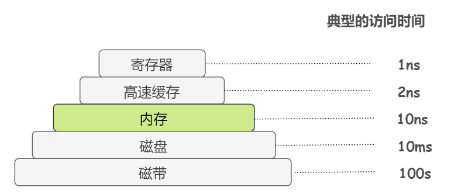

#### 为什么要设计那么多级内存？

成本考虑。

如果不考虑成本，大家肯定希望内存容量无限大，CPU 访问它的速度无限快，并且能够永久性的存储数据。

但现阶段的技术满足不了。因此才提出了分层存储体系的概念。

在这个体系中，计算机拥有：

若干 KB 超级快速、超级昂贵且易失性的**寄存器**；

若干 MB 快速、昂贵且易失性的**高速缓存**（cache）

若干 GB 的速度与价格都适中、且同样易失性的**内存**

以及若干 TB 低速、廉价、非易失性的**磁盘**存储

另外还有诸如磁带等可移动的存储装置。

