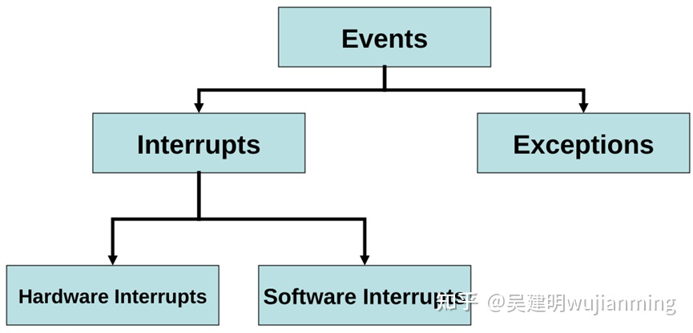
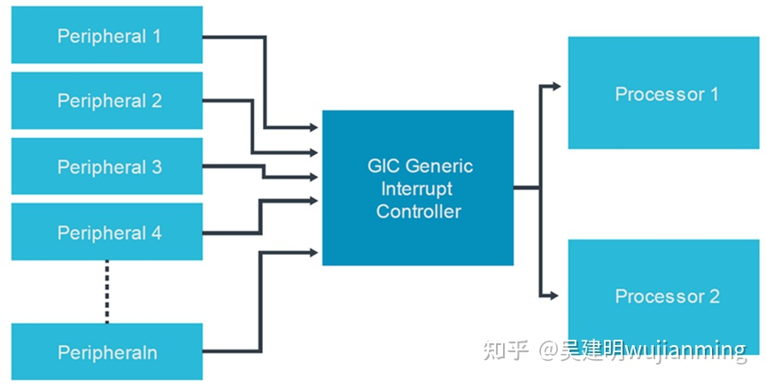
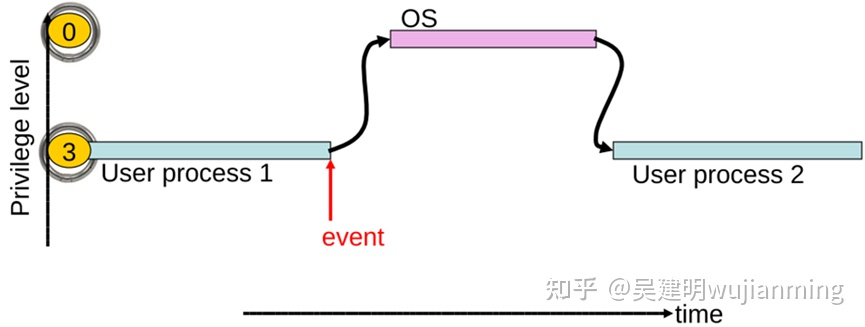
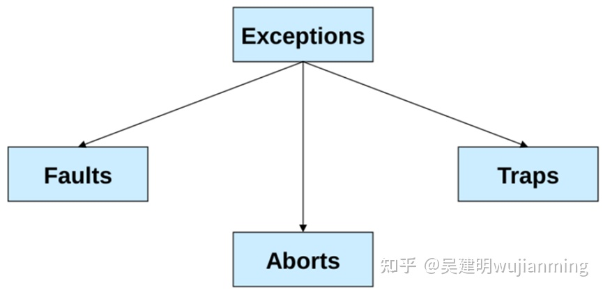

中断是系统用来响应硬件设备请求的一种机制，操作系统收到硬件的中断请求，会打断正在执行的进程，然后调用内核中的中断处理程序来响应请求。

# 1. 中断的由来

1956年，ERA 1103A计算机系统引入了中断（interrupt）机制。

ERA 1103A用于接收、处理风洞试验数据，再将数据处理结果返回给风洞，如此循环往复。但风洞数据的准备时间比较长，ERA 1103A只能处于等待状态，这段时间被白白的浪费掉了。为了提高ERA 1103A的利用率，其引出了一条中断线，在等待风洞数据的这段时间运行其他程序，当风洞数据到来的时通过中断线告知ERA 1103A停止当前工作去接收风洞数据。

以上就是最初的中断设计原型。

# 2. 中断分类

现代处理器的中断概念变得越来越广泛，已经不仅仅局限于外部设备中断。

中断存在的意义是CPU控制外部设备的同时，外部设备也可以高效的“控制CPU”。这种设计思想扩展到了外部硬件控制CPU、软件控制CPU、CPU运行管理等三个方面。

因此，使用events事件表示，更加贴切实际，但在平时描述中，基本上仍然采用了中断这个词。

events的分类如下图所示，主要包括中断和异常，外部硬件控制CPU对应hardware interupt，软件控制CPU对应software interrupt，CPU运行管理则对应exception。

## 2.1 硬件中断

硬件中断是平时接触的最多的一类event，比如鼠标、键盘、网卡等等都可以产生硬件中断。因为CPU并不知道外部硬件设备何时产生硬件中断请求，不会提前获知产生硬件中断的前提，因此，硬件中断属于异步event。

CPU和外部IO设备通过一根或多根硬件连线，进行硬件中断信号的传递。这种硬件连线可以在SoC内部实现，可以在外部PCB板上实现。

当CPU内部集成了中断控制器IP之后，各个IO设备的中断信号线可以在SoC内部连接到中断控制器。如非常常见的ARM GIC，不仅可以处理外部IO设备的硬件中断，也可以处理CPU内部之间硬件中断。其内部结构如下图所示：

外部IO设备可以通过中断控制芯片连接到CPU，该类芯片通常称之为PIC。

## 2.2 软件中断

假设操作系统阻止非特权代码直接访问系统资源，那么应用程序如何访问这些受保护的资源呢？此时，软件中断就可以实现这一目的。当一个应用软件终止或者向操作系统请求一些服务时，软件中断就会发生。如果说在软件代码中包含了系统调用，可以将software interrupt理解为同步事件。

当CPU接收到一个软件中断信号时，可能会暂时将控制切换到一个中断处理程序程序，内核中被中断挂起的进程(例如，一个程序的运行实例)将在中断被接受后恢复。

## 2.3 异常

CPU异常发生在各种错误的情况下，如当访问无效的内存地址或除零时，为了作出反应，产生了异常处理机制。不同架构的处理器对异常类型的定义有所不同，但核心思想是CPU工作过程遇到了不被允许的错误或者强制停止指令等，可以将异常做如下分类。

# Linux网络包接收过程中的中断

在Linux的源代码中，网络设备驱动对应的逻辑位于`driver/net/ethernet`, 其中intel系列网卡的驱动在`driver/net/ethernet/intel`目录下。协议栈模块代码位于`kernel`和`net` 目录。

内核和网络设备驱动是通过中断的方式来处理的。当设备上有数据到达的时候，会给CPU的相关引脚上触发一个电压变化，以通知CPU来处理数据。

2.4以后的内核版本采用的下半部实现方式是软中断，由 `ksoftirqd` 内核线程全权处理。和硬中断不同的是，硬中断是通过给CPU物理引脚施加电压变化，而软中断是通过给内存中的一个变量的二进制赋值以通知软中断处理程序。

> skb: sk_buff 结构体

当网卡上收到数据以后，Linux中第一个工作的模块是网络驱动。网络驱动会以DMA的方式把网卡上收到的帧写到内存里。再向CPU发起一个中断，以通知CPU有数据到达。第二，当CPU收到中断请求后，会去调用网络驱动注册的中断处理函数。网卡的中断处理函数并不做过多工作，发出软中断请求，然后尽快释放CPU。`ksoftirqd` 检测到有软中断请求到达，调用 `poll` 开始轮询收包，收到后交由各级协议栈处理。

### 参考

[吴建明 - 处理器中断的本质，硬中断、软中断、异常的区别](https://zhuanlan.zhihu.com/p/477913808)

[张彦飞Allen - 图解Linux网络包接收过程](https://mp.weixin.qq.com/s?__biz=MjM5Njg5NDgwNA==&mid=2247484058&idx=1&sn=a2621bc27c74b313528eefbc81ee8c0f&scene=21#wechat_redirect)
