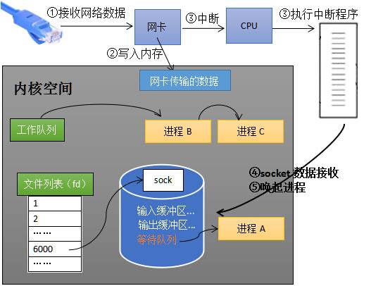
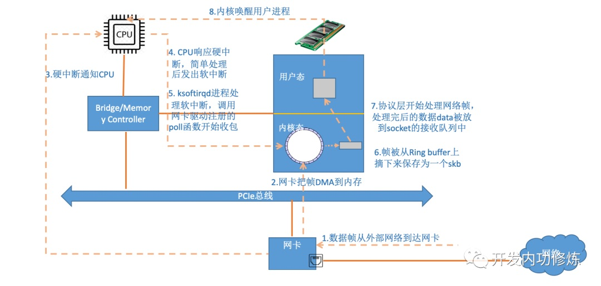

# 1. 内核接收网络数据的过程

1. 计算机收到了对端传送的数据
2. 数据经由网卡传送到内存
3. 网卡通过中断信号通知 CPU 有数据到达，CPU 执行中断程序。此处的中断程序主要有两项功能：
   1. 先通过数据包里的端口号找到对应的 socket，将网络数据写入到socket的接收缓冲区里面
   2. 再唤醒进程A，重新将进程A放入工作队列中

# 2. Linux网络包接收过程中的中断

在Linux的源代码中，网络设备驱动对应的逻辑位于`driver/net/ethernet`, 其中intel系列网卡的驱动在`driver/net/ethernet/intel`目录下。协议栈模块代码位于`kernel`和`net`目录。

内核和网络设备驱动是通过中断的方式来处理的。当设备上有数据到达的时候，会给CPU的相关引脚上触发一个电压变化，以通知CPU来处理数据。

对于网络模块来说，由于处理过程比较复杂和耗时，如果在中断函数中完成所有的处理，将会导致中断处理函数（优先级过高）将过度占据CPU，将导致CPU无法响应其它设备，例如鼠标和键盘的消息。因此Linux中断处理函数是分上半部和下半部的。上半部是只进行最简单的工作，快速处理然后释放CPU，接着CPU就可以允许其它中断进来。剩下将绝大部分的工作都放到下半部中，可以慢慢从容处理。

2.4以后的内核版本采用的下半部实现方式是软中断，由 `ksoftirqd` 内核线程全权处理。和硬中断不同的是，硬中断是通过给CPU物理引脚施加电压变化，而软中断是通过给内存中的一个变量的二进制值以通知软中断处理程序。

> skb: sk_buff 结构体

当网卡上收到数据以后，Linux中第一个工作的模块是网络驱动。网络驱动会以DMA的方式把网卡上收到的帧写到内存里。再向CPU发起一个中断，以通知CPU有数据到达。第二，当CPU收到中断请求后，会去调用网络驱动注册的中断处理函数。网卡的中断处理函数并不做过多工作，发出软中断请求，然后尽快释放CPU。`ksoftirqd` 检测到有软中断请求到达，调用 `poll` 开始轮询收包，收到后交由各级协议栈处理。

### 参考

[张彦飞Allen - 图解Linux网络包接收过程](https://mp.weixin.qq.com/s?__biz=MjM5Njg5NDgwNA==&mid=2247484058&idx=1&sn=a2621bc27c74b313528eefbc81ee8c0f&scene=21#wechat_redirect)
