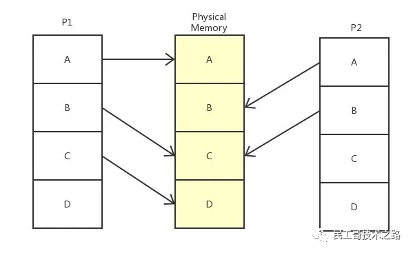
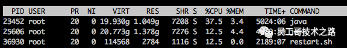

## malloc

我们分配内存时使用的 `malloc` 函数其实不是实现在操作系统里的，而是在标准库中实现的。当我们调用 `malloc` 时实际上是标准库在为我们申请内存。

这里值得注意的是，我们平时在C语言中使用 `malloc` 只是内存分配器的一种，实际上有很多内存分配器，像 `tcmalloc`，`jemalloc` 等等，它们都有各自适用的场景，对于高性能程序来说使用满足特定要求的内存分配器是至关重要的。

我们先来看一下程序在内存中是什么样的：

在堆区和栈区之间有一片空白区域，栈区和堆区的增长需要占用原来的空白区域。

`malloc` 内存不足时要向操作系统申请内存，操作系统才是真大佬，`malloc` 不过是小弟，对每个进程，操作系统 (类Unix系统) 都维护了一个叫做 `brk` 的变量，`brk` 发音 `break`，这个 `brk` 指向了堆区的顶部。

操作系统提供了一个叫做 `brk` 的系统调用，这个 `brk()` 系统调用就是用来增加或者减小堆区的。除了 `brk`，`sbr、mmap` 系统调用也可以实现同样的目的，`mmap` 也更为灵活，但该函数并不是本文重点，就不在这里详细讨论了。

## 虚拟内存

**但是，上述过程根本就没有涉及到哪怕一丁点物理内存。**

实际上，进程看到的内存都是假的，是操作系统给进程的一个幻象，即著名的**虚拟内存**。

所谓虚拟内存就是假的、不是真正的物理内存，虚拟内存是给进程用的，操作系统维护了虚拟内存到物理内存的映射，当 `malloc` 返回后，程序员申请到的内存就是虚拟内存。**此时操作系统根本就没有真正的分配物理内存。**

只有当我们真正使用这段内存时，这时会产生一个缺页异常中断，操作系统捕捉到该错误后开始真正的分配物理内存，操作系统处理完该错误后我们的程序才能真正的读写这块内存。

操作系统有一块物理内存（中间的部分），有两个进程（实际会更多）P1 和 P2，操作系统偷偷地分别告诉 P1 和 P2，我的整个内存都是你的，随便用，管够。可事实上呢，操作系统只是给它们画了个大饼，这些内存说是都给了 P1 和 P2，实际上只给了它们一个序号而已。只有当 P1 和 P2 真正开始使用这些内存时，系统才开始使用辗转挪移，拼凑出各个块给进程用，P2 以为自己在用 A 内存，实际上已经被系统悄悄重定向到真正的 B 去了，甚至，当 P1 和 P2 共用了 C 内存，他们也不知道。

操作系统的这种欺骗进程的手段，就是虚拟内存。对 P1 和 P2 等进程来说，它们都以为自己占用了整个内存，而自己使用的物理内存的哪段地址，它们并不知道也无需关心。

### 为啥要设虚拟内存

1. 解耦，对进程屏蔽了底层的物理RAM和磁盘，提供了更加简洁和易用的接口以及更加复杂的功能，用户程序无需关心底层如何实现
2. 并向进程提供了远超物理内存大小的内存空间
3. 为不同进程提供互相隔离的内存，每个进程都有各自的虚拟内存，某进程 X 不可随意指定个地址就开始读写，提高安全性&并发性
4. `mmap` 这种技术通过将两块虚拟内存映射到同一个物理地址，实现零拷贝，提升IO效率

### malloc 内部的逻辑

现在，`malloc` 内部的逻辑就可以完整讲出来了：

1. `malloc` 开始搜索空闲内存块，如果能找到一块大小合适的就分配出去
2. 如果 `malloc` 找不到一块合适的空闲内存，那么调用 `brk` 等系统调用扩大堆区从而获得更多的空闲内存
3. `malloc` 调用 `brk` 后开始转入内核态，此时操作系统中的虚拟内存系统开始工作，扩大进程的堆区，注意额外扩大的这一部分内存仅仅是虚拟内存，操作系统并没有为此分配真正的物理内存
4. `brk` 执行结束后返回到 `malloc`，从内核态切换到用户态，`malloc` 找到一块合适的空闲内存后返回
5. 程序员拿到新申请的内存，程序继续
6. 当有代码读写新申请的内存时系统内部出现缺页中断，此时再次由用户态切换到内核态，操作系统此时真正的分配物理内存，之后再次由内核态切换回用户态，程序继续。

## 分页和页表

为了维护 应用程序以为的内存地址 和 实际内存地址的关系，需要一个 `map` 存储这种映射关系。虚拟内存其实就是个这样的对照表，叫做页表。

不过，系统里的基本单位是 `Byte` 字节，如果将每一个虚拟内存的 `Byte` 都对应到物理内存的地址。64位系统下，每个条目最少需要 16字节（64位虚拟地址 + 64位物理地址，8+8=16bit），在 `4G` 内存的情况下，就需要 `64GB` 的空间来存放对照表，这表比原本的内存还大，显然太大了，于是操作系统引入了 页（Page）的概念。

在系统启动时，操作系统将整个物理内存以 `4K` 为单位，划分为各个页。之后进行内存分配时，都以页为单位，那么虚拟内存页对应物理内存页的映射表就大大减小了，`4G` 内存，只需要 `4G/4MB * 2B = 8MB` 的映射表即可。一些进程没有使用到的虚拟内存，也并不需要保存映射关系。而且 `Linux` 还为大内存设计了多级页表，可以进一步减少了内存消耗。

## 内存寻址和分配

我们知道通过虚拟内存机制，每个进程都以为自己占用了全部内存，进程访问内存时，操作系统都会把进程提供的虚拟内存地址转换为物理地址，再去对应的物理地址上获取数据。CPU 中有一种硬件，内存管理单元 MMU（Memory Management Unit）专门用来将翻译虚拟内存地址。CPU 还为页表寻址设置了缓存策略，由于程序的局部性，其缓存命中率能达到 98%。

以上情况是页表内存在虚拟地址到物理地址的映射，而如果进程访问的物理地址还没有被分配，系统则会产生一个缺页中断，在中断处理时，系统切到内核态为进程虚拟地址分配物理地址。

# 功能

虚拟内存不仅通过内存地址转换解决了多个进程访问内存冲突的问题，还带来更多的益处。

## 进程内存管理

它有助于进程进行内存管理，主要体现在：

- 易用性：由于虚拟内存对进程的"欺骗"，每个进程都认为自己获取的内存是一块连续的地址。我们在编写应用程序时，就不用考虑大块地址的分配，总是认为系统有足够的大块内存即可。
- 安全：由于进程访问内存时，都要通过页表来寻址，操作系统在页表的各个项目上添加各种访问权限标识位，就可以实现内存的权限控制。

## 数据共享

通过虚拟内存更容易实现内存和数据的共享。

在进程加载系统库时，总是先分配一块内存，将磁盘中的库文件加载到这块内存中，在直接使用物理内存时，由于物理内存地址唯一，即使系统发现同一个库在系统内加载了两次，但每个进程指定的加载内存不一样，系统也无能为力。

而在使用虚拟内存时，系统只需要将进程的虚拟内存地址指向库文件所在的物理内存地址即可。如上文图中所示，进程 P1 和 P2 的 B 地址都指向了物理地址 C。

而通过使用虚拟内存使用共享内存也很简单，系统只需要将各个进程的虚拟内存地址指向系统分配的共享内存地址即可。这就是 `mmap` 实现的根本

## SWAP

虚拟内存可以让帮进程"扩充"内存。

我们前文提到了虚拟内存通过缺页中断为进程分配物理内存，内存总是有限的，如果所有的物理内存都被占用了怎么办呢？

`Linux` 中可以使用 `SWAP` 分区，在分配物理内存、但可用内存不足时，将暂时不用的内存数据先放到磁盘上，让有需要的进程先使用，等进程再需要使用这些数据时，再将这些数据加载到内存中，通过这种交换技术，`Linux` 可以让进程使用更多的内存。

# 常见问题

## 32位和64位

最常见的就是 32位和64位的问题了。

CPU 通过物理总线访问内存，那么访问地址的范围就受限于机器总线的数量，在32位机器上，有32条总线，每条总线有高低两种电位分别代表 bit 的 1 和 0，那么可访问的最大地址就是 `2^32bit = 4GB`，所以说 32 位机器上插入大于 4G 的内存是无效的，CPU 访问不到多于 4G 的内存。

64位机器并没有 64位总线，~~而且其最大内存还要受限于操作系统，`Linux` 目前支持最大 `256G` 内存~~。

根据虚拟内存的概念，在 32 位系统上运行 64 位软件也并无不可，但由于系统对虚拟内存地址的结构设计，64位的虚拟地址在32位系统内并不能使用。

## 直接操作物理内存

操作系统使用了虚拟内存，我们想要直接操作内存该怎么办呢？

`Linux` 会将各个设备都映射到 `/dev/` 目录下的文件，我们可以通过这些设备文件直接操作硬件，内存也不例外。在 `Linux` 中，内存设置被映射为 `/dev/mem`，root 用户通过对这个文件读写，可以直接操作内存。

## JVM 进程占用虚拟内存过多

使用 `TOP` 查看系统性能时，我们会发现在 `VIRT` 这一列，`Java` 进程会占用大量的虚拟内存。

`JAVA` 和 `Go` 都会向操作系统要一大块虚拟内存，尽管实际用不了那么多。此外，`Java` 读取的文件也会被映射为虚拟内存。

真实占用的物理内存要看 `RES (resident)` 列，这一列的值才是真正被映射到物理内存的大小。

## 常用管理命令

我们也可以自己来管理 `Linux` 的虚拟内存。

##### 查看系统内存状态

查看系统内存情况的方式有很多，`free、 vmstat` 等命令都可输出当前系统的内存状态，需要注意的是可用内存并不只是 `free` 这一列，由于操作系统的 `lazy` 特性，大量的 `buffer/cache` 在进程不再使用后，不会被立即清理，如果之前使用它们的进程再次运行还可以继续使用，它们在必要时也是可以被利用的。

此外，通过 `cat /proc/meminfo` 可以查看系统内存被使用的详细情况，包括脏页状态等。

##### pmap

如果想单独查看某一进程的虚拟内存分布情况，可以使用 `pmap pid` 命令，它会把虚拟内存各段的占用情况从低地址到高地址都列出来。

可以添加 `-XX` 参数来输出更详细的信息。

##### 修改内存配置

我们也可以修改 `Linux` 的系统配置，使用 `sysctl vm [-options] CONFIG` 或 直接读写 `/proc/sys/vm/` 目录下的文件来查看和修改配置。

##### SWAP 操作

虚拟内存的 `SWAP` 特性并不总是有益，放任进程不停地将数据在内存与磁盘之间大量交换会极大地占用 CPU，降低系统运行效率。

我们可以修改 `vm.swappiness=0` 来设置内存尽量少使用 `SWAP`，或者干脆使用 `swapoff` 命令禁用掉 `SWAP`。

#### 参考

[码农的荒岛求生 - 申请内存时底层发生了什么？](https://zhuanlan.zhihu.com/p/367386292)

[zhenbianshu - 理解 Linux 的虚拟内存](https://zhenbianshu.github.io/2018/11/understand_virtual_memory.html)