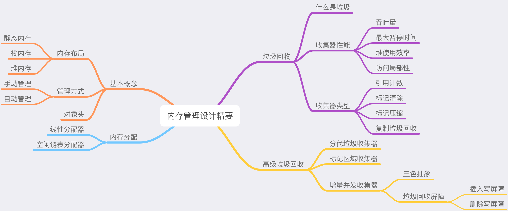

内存管理系统实际上都可以简化成两个模块，即内存分配器（Allocator）、垃圾收集器（Collector）。

## 内存分配

内存分配器只包含线性内存分配器（Sequential Allocator）和空闲链表内存分配器（Free-list Allocator）两种，内存管理机制中的所有内存分配器其实都是上述两种不同分配器的变种。

### 线性分配器（位图法）

线性分配（Bump Allocator）是一种高效的内存分配方法，但是有较大的局限性。当我们在编程语言中使用线性分配器，我们只需要在内存中维护一个指向内存特定位置的指针，当用户程序申请内存时，分配器只需要检查剩余的空闲内存、返回分配的内存区域并移动指针在内存中的位置。

根据线性分配器的原理，我们可以推测它有较快的执行速度，以及较低的实现复杂度；但是线性分配器无法在内存被释放时重用内存。如下图所示，如果已经分配的内存被回收，线性分配器是无法重新利用红色的这部分内存的：

正是因为线性分配器的这种特性，我们需要合适的垃圾回收算法配合使用。标记压缩（Mark-Compact）、复制回收（Copying GC）和分代回收（Generational GC）等算法可以通过拷贝的方式整理存活对象的碎片，将空闲内存定期合并，这样就能利用线性分配器的效率提升内存分配器的性能了。

因为线性分配器的使用需要配合具有拷贝特性的垃圾回收算法，所以 C 和 C++ 等需要直接对外暴露指针的语言就无法使用该策略，我们会在下一节详细介绍常见垃圾回收算法的设计原理。

### 空闲链表分配器

空闲链表分配器（Free-List Allocator）可以重用已经被释放的内存，它在内部会维护一个类似链表的数据结构。当用户程序申请内存时，空闲链表分配器会依次遍历空闲的内存块，找到足够大的内存，然后申请新的资源并修改链表：

因为不同的内存块以链表的方式连接，所以使用这种方式分配内存的分配器可以重新利用回收的资源，但是因为分配内存时需要遍历链表，所以它的时间复杂度就是 `O(n)`。空闲链表分配器可以选择不同的策略在链表中的内存块中进行选择，最常见的就是以下四种方式：

- 首次适应（First-Fit）— 从链表头开始遍历，选择第一个大小大于申请内存的内存块；
- 循环首次适应（Next-Fit）— 从上次遍历的结束位置开始遍历，选择第一个大小大于申请内存的内存块；
- 最优适应（Best-Fit）— 从链表头遍历整个链表，选择最合适的内存块；
- 隔离适应（Segregated-Fit）— 将内存分割成多个链表，每个链表中的内存块大小相同，申请内存时先找到满足条件的链表，再从链表中选择合适的内存块；

上述四种策略的前三种就不过多介绍了，Go 语言使用的内存分配策略与第四种策略有些相似。

#### 参考

[draveness - 内存管理设计精要](https://draveness.me/system-design-memory-management/)

