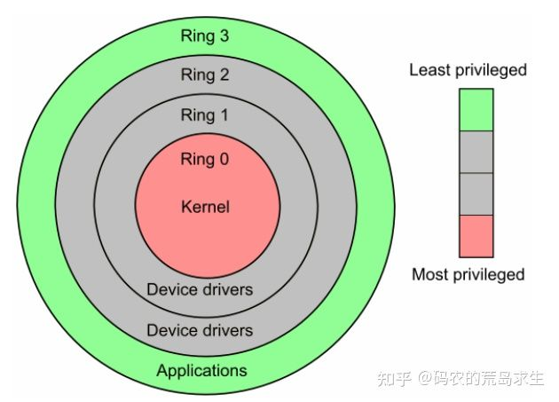

## 内核态 VS 用户态

x86 CPU提供了4种工作状态：0, 1, 2, 3，数字越小表示CPU的特权约大，0号下CPU特权最大，可以执行任何指令。

通过这种设计来保证安全性。一般情况下系统只使用0和3，即 用户态(3) 以及 内核态(0)。

### 内核态 Kernel Mode

CPU执行**操作系统代码**时就处于内核态，在内核态下CPU可以执行任何机器指令、访问所有地址空间、不受限制的访问任何硬件。

### 用户态 User Mode

CPU执行我们写的程序时就处于用户态。在用户态我们的代码处处受限，**不能直接访问硬件、不能访问特定地址空间（比如，尝试写一块属于操作系统的内存），或以错误的类型访问内存区域（比如，尝试写一块只读内存）**，否则操作系统直接将你 kill 掉，这就是著名的Segmentation fault、不能执行特权指令，等等。

### 系统调用 System Call

普通程序永远也去不了内核态，只能以通信的方式从用户态往内核态传递信息。操作系统为普通程序员留了一些特定的 **函数（接口）**，如 `read(), write(), open(), socket()` 等函数，通过调用这些函数就能向操作系统请求服务了，这些函数被称为系统调用 `System Call`。通过系统调用我们可以让操作系统代替我们完成一些事情，像打开文件、网络通信等等。调用时便称为 **陷入内核态**

你可能有些疑惑，什么，还有系统调用这种东西，为什么我没调用过也可以打开文件、进行网络通信？

## 标准库

虽然我们可以通过系统让操作系统替我们完成一些特定任务，但这些系统调用都是和操作系统强相关的，Linux和Windows的系统调用就完全不同。

如果你直接使用系统调用的话，那么Linux版本的程序就没有办法在Windows上运行，因此我们需要某种标准，该标准对程序员屏蔽底层差异，这样程序员写的程序就无需修改的在不同操作系统上运行了。

在语言中，这就是所谓的**标准库**。比如 `go` 的 `runtime` 包，里面对不同系统的 `syscall` 类函数进行了封装

注意，标准库代码也是运行在用户态的，一般来说，我们调用标准库去打开文件、网络通信等等，标准库再根据操作系统选择对应的系统调用。

从分层的角度看，我们的程序一般都是这样的汉堡包类型：

最上层是应用程序，应用程序一般只和标准库打交道 (当然，我们也可以绕过标准库)，标准库通过系统调用和操作系统交互，操作系统管理底层硬件。

这就是为什么在C语言同样的 `open` 函数既能在Linux下打开文件也能在Windows下打开文件的原因。

# 参考

[码农的荒岛求生 - 申请内存时底层发生了什么？](https://zhuanlan.zhihu.com/p/367386292)