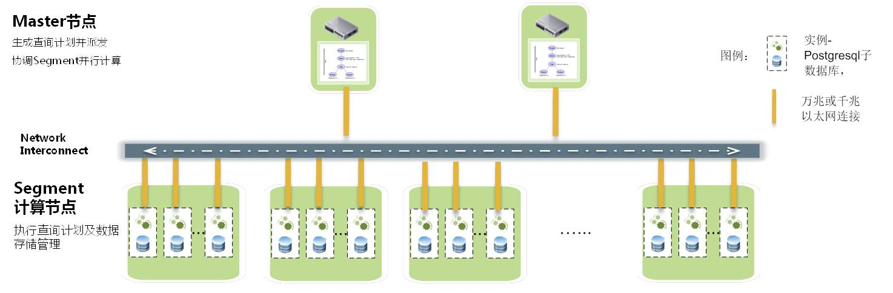

# Greenpulm

基于 `Postgresql` 的 `MPP` （并行计算）架构的 `OLAP` 数据库。

把 `Postgresql` 作为实例架构在 `Interconnect` 下，在 `Interconnect` 的指挥协调下，数十个甚至数千个 `Sub Postgresql` 数据库实例同时开展并行计算。

除此之外，`MPP` 采用两阶段提交和全局事务管理机制来保证集群上分布式事务的一致性，Greenplum像Postgresql一样满足关系型数据库的包括ACID在内的所有特征。

  

 

从上图进而可以看到，`Greenplum` 的最小并行单元不是节点层级，而是在实例层级，每个实例都有自己的 `postgresql` 目录结构，都有各自的一套 `Postgresql` 数据库守护进程（甚至可以通过UT模式进行单个实例的访问）

但是 `GP` 的 `MPP` 调度不智能，无法判断数据在哪个分片上，查询少量数据也会调动所有实例进行查找。这也是 `Doris` 有优势的一点。