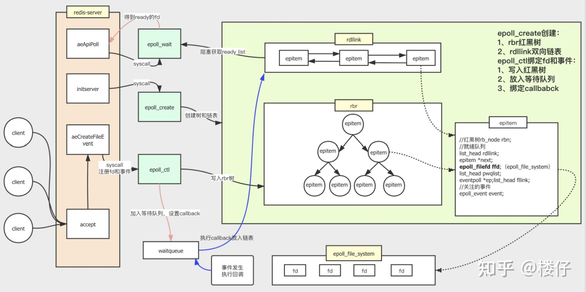
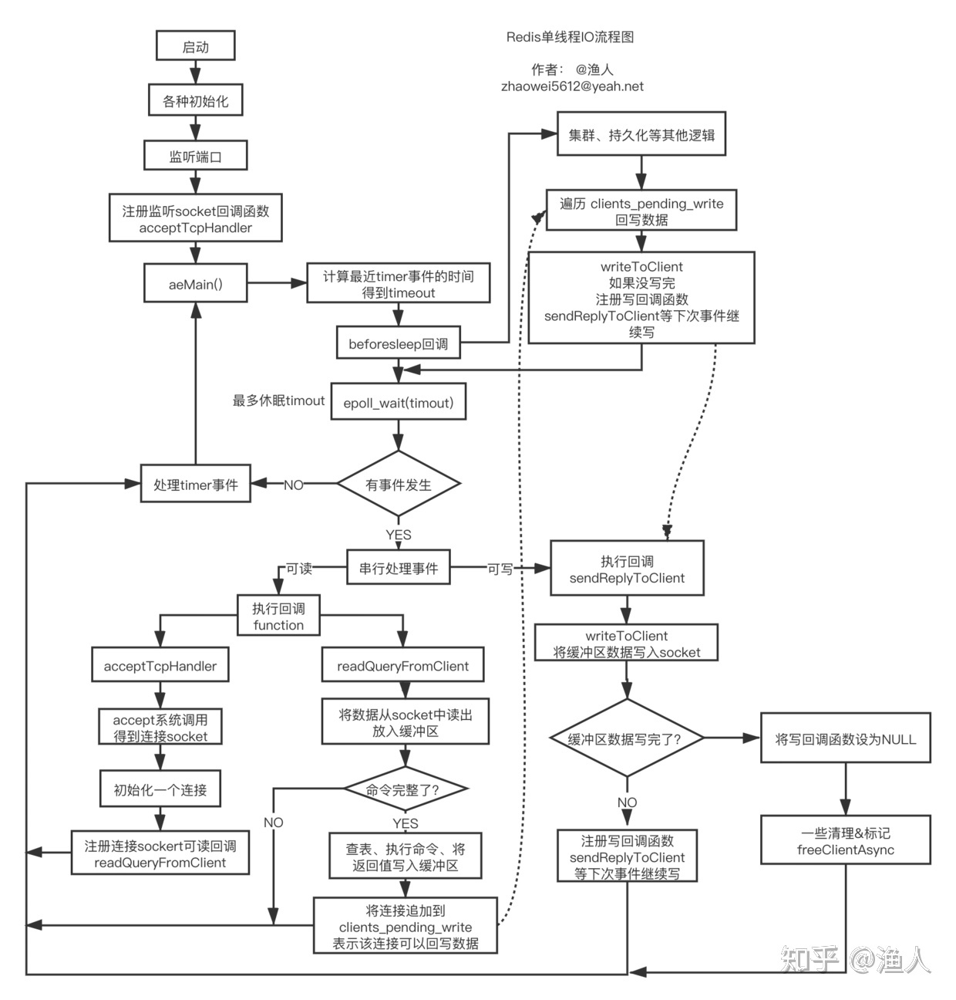
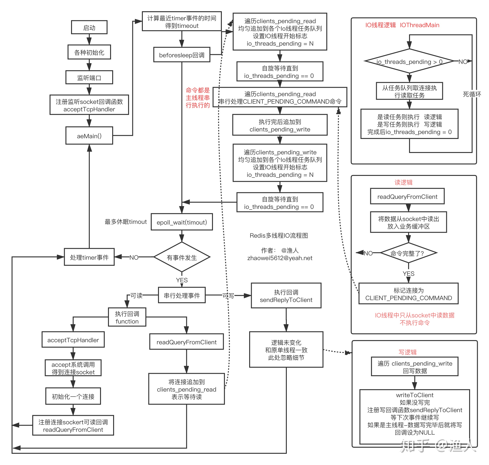

# 核心流程

下图是 `Redis` 的内部核心流程图，内部其实主要是用的 `epoll`，而 `epoll` 通过双向队列和红黑树实现




## **Redis单线程**

对于一个请求操作，Redis主要做 `3` 件事情：读 -> 处理 -> 写

1. 从客户端读取数据 (内核态 `read`)
2. 解析命令、执行 `redis` 命令
3. 回写数据给客户端 (内核态 `write`)

主线程其实就是把所有操作的这 3 件事情，串行一起执行，因为是基于内存，所以执行速度非常快

**优点:**

- 不存在锁的问题
- 避免线程间CPU切换 

**缺点：**

- 不能利用多核（通常在一台机器上运行多个 `redis` 实例以充分利用多核）
- 串行操作，某个操作出问题/大key情况下 会阻塞后续操作


## **Redis多线程**

`Redis` 多线程的优化思路：因为网络 I/O 在 `Redis` 执行期间占用了大部分 CPU 时间，所以把网络 I/O 部分单独抽离出来，做成多线程的方式。

> 虽然 Redis6.0 引入了多线程，但是 Redis 的多线程只是在网络数据的读写这类耗时操作上使用，执行命令仍然是单线程顺序执行。因此不需要担心线程安全问题。啥意思呢，就是只有读取客户端发来的命令、把查询的结果返给客户端时才用多线程。进行查询的动作仍然是单线程的。

这里所说的多线程，其实就是将 `Redis` 单线程中的 `read` 和 `write` 两部分处理成多线程的方式。具体来说，就是新开 `N` 个 **读线程** 和 **写线程**。

采用了 `one thread one loop` 的思路，新开线程专门处理读写。

1. 在主线程里将 `N` 个 `read` 操作派发给读线程处理，期间主线程自旋等待。
   1. 这一步如果用原来的串行方式做，需要 `N * time` 的时间，现在因为是并行 `read`，只需要 `time` 的时间
   1. 派发是有序的，给每个线程分一个数组的槽，线程把命令写到槽里
2. 等到所有读线程处理完 `read` 后主线程再遍历数组，按顺序执行命令
3. 执行完 `redis` 命令后同样将 `write` 操作交给 `N` 个写线程处理


这种做法叫做 **Reactor** 模型，`Nginx` 的 `master-worker` 模型、`Node.js` 的事件处理、 `Golang` 的 `http` 库都可以视为使用了这种模型。以 `netpoll` 为例，里面只用一个协程分发网络连接，将连接里请求的读和写分发给两个协程：

```go
go pconn.readLoop()
go pconn.writeLoop()
```

不过 `redis` 里的线程数是通过配置固定的，不会无限增长。


**优点**

- 测试 4 核吞吐量提升了1倍

**缺点**

- 更复杂了


# 详解

## 单线程IO处理过程

`redis` 启动后会进入一个死循环 `aeMain`，在这个循环里一直等待事件发生，事件分为IO事件和 `timer` 事件，`timer` 事件是一些定时执行的任务，如 `expire key` 等，本文只聊IO事件。

`epoll` 处理的是 `socket fd` 的可读、可写事件，当事件发生后提供一种高效的通知方式， 当想要异步监听某个`socket` 的读写事件时，需要去事件驱动框架中注册要监听事件的 `socket fd`，以及对应事件的回调函数。然后死循环中可以通过 `epoll_wait` 不断地去拿就绪的 `fd`，依次处理即可。

`可读` 可以简单理解为，对应的 `socket` 中有新的tcp数据包到来。

`可写` 可以简单理解为，对应的 `socket` 写缓冲区已经空了(数据通过网络已经发给了客户端)

一图胜前言，完整、详细流程图如下：



- `aeMain()` 内部是一个死循环，会在 `epoll_wait` 处短暂休眠
- `epoll_wait` 返回的是当前可读、可写的 `socket` 列表
- `beforeSleep` 是进入休眠前执行的逻辑，核心是回写数据到 `socket`
- 核心逻辑都是由IO事件触发，要么可读，要么可写，否则执行 `timer` 定时任务
- 第一次的IO可读事件，是监听 `socket` (如 `6379` 的 `socket`)，当有握手请求时，会执行 `accept`调用，得到一个连接 `socket`，注册可读回调 `createClient`，往后客户端和 `redis` 的数据都通过这个 `socket` 进行
- 一个完整的命令，可能会通过多次 `readQueryFromClient` 才能从 `socket` 读完，这意味着多次可读IO事件
- 命令执行的结果会写，也是这样，大概率会通过多次可写回调才能写完
- 当命令被执行完后，对应的连接会被追加到 `clients_pending_write`，`beforeSleep` 会尝试回写到 `socket`，写不完会注册可写事件，下次继续写
- 整个过程IO全部都是同步非阻塞，没有浪费等待时间
- 注册事件的函数叫 `aeCreateFileEvent`


## 多线程IO

上面已经梳理了单线程IO的处理流程，以及多线程IO要解决的问题，接下来将目光放到： 如何用多线程分担IO的负荷。其做法用简单的话来说就是：

- 用一组单独的线程专门进行 `read/write socket` 读写调用 （同步IO）
- 读回调函数中不再读数据，而是将对应的连接追加到可读 `clients_pending_read` 的链表
- 主线程在 `beforeSleep` 中将IO读任务分给IO线程组
- 主线程自己也处理一个IO读任务，并自旋式等IO线程组处理完，再继续往下
- 主线程在 `beforeSleep` 中将IO写任务分给IO线程组
- 主线程自己也处理一个IO写任务，并自旋式等IO线程组处理完，再继续往下
- IO线程组要么同时在读，要么同时在写
- 命令的执行由主线程串行执行 (保持单线程)
- IO线程数量可配置

完整流程图如下：



`beforesleep` 中，先让IO线程读数据，然后再让IO线程写数据。 读写时，多线程能并发执行，利用多核。

1. 将读任务均匀分发到各个IO线程的任务链表 `io_threads_list[i]`，将 `io_threads_pending[i]` 设置为对应的任务数，此时IO线程将从死循环中被激活，开始执行任务，执行完毕后，会将 `io_threads_pending[i]` 清零。 函数名为： `handleClientsWithPendingReadsUsingThreads`
2. 将写任务均匀分发到各个IO线程的任务链表 `io_threads_list[i]`，将 `io_threads_pending[i]` 设置为对应的任务数，此时IO线程将从死循环中被激活，开始执行任务，执行完毕后，会将 `io_threads_pending[i]` 清零。 函数名为： `handleClientsWithPendingWritesUsingThreads`
3. `beforeSleep` 中主线程也会执行其中一个任务 (图中忽略了)，执行完后自旋等待IO线程处理完。
4. 读任务要么在 `beforeSleep` 中被执行，要么在IO线程被执行，不会再在读回调中执行
5. 写任务会分散到 `beforeSleep`、IO线程、写回调中执行
6. 主线程和IO线程交互是无锁的，通过标志位设置进行，不会同时写任务链表


#### 参考

> [Redis 6 的多线程](https://zhuanlan.zhihu.com/p/369702837)
>
> [渔人 - Redis 6.0 多线程IO处理过程详解](https://zhuanlan.zhihu.com/p/144805500)