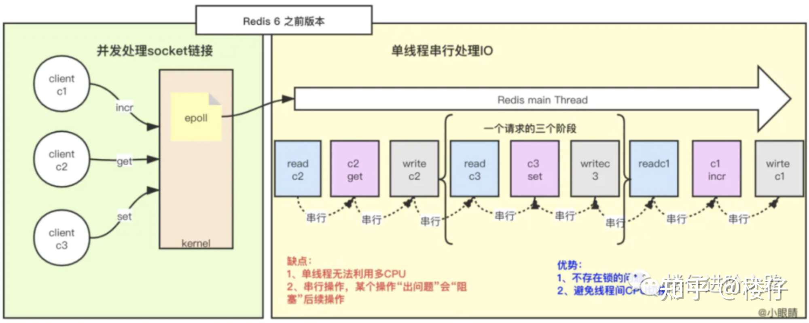
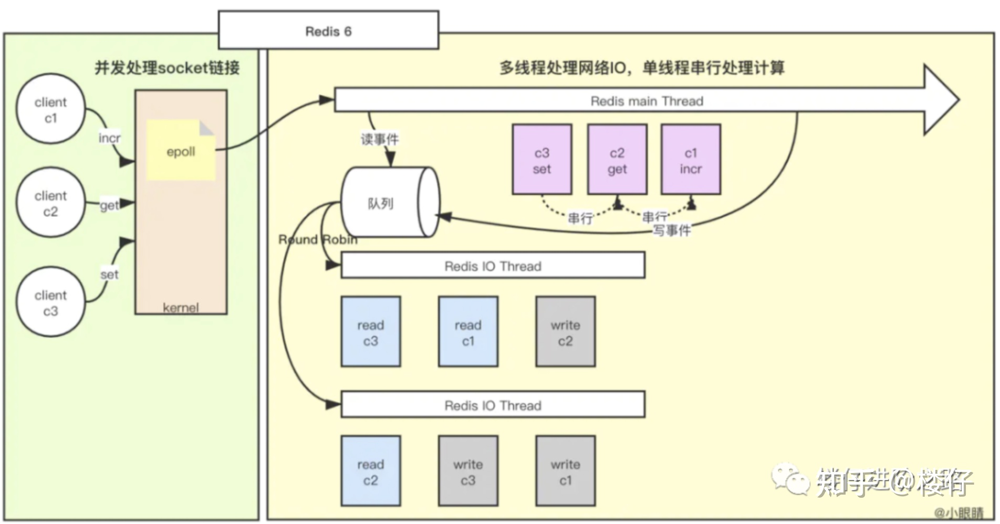

# 核心流程

下图是Redis的内部核心流程图，内部其实主要是通过双向队列和红黑树实现

## **Redis单线程**

对于一个请求操作，Redis主要做3件事情：

1. 从客户端读取数据 (read)
2. 执行Redis命令
3. 回写数据给客户端 (write)。如果再准确点，其实还包括对协议的解析。

主线程其实就是把所有操作的这3件事情，串行一起执行，因为是基于内存，所以执行速度非常快

**优点:**

- 不存在锁的问题
- 避免线程间CPU切换 

**缺点：**

- 单线程无法利用多CPU（通常在一台机器上运行多个redis实例以充分利用多核）
- 串行操作，某个操作出问题会阻塞后续操作

## **Redis多线程**

Redis多线程的优化思路：因为网络I/O在Redis执行期间占用了大部分CPU时间，所以把网络I/O部分单独抽离出来，做成多线程的方式。

这里所说的多线程，其实就是将Redis单线程中的 `read` 和 `write` 两部分处理成多线程的方式，但是"执行Redis命令"还是在主线程中串行执行，这个逻辑保持不变。

# 参考

[Redis 6 的多线程](https://zhuanlan.zhihu.com/p/369702837)