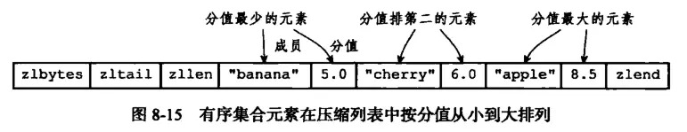

## 结构

```go
type ziplist struct {
    zlbytes int32     // ziplist的长度（单位: 字节)，是一个32位无符号整数
    zltail  int32     // ziplist最后一个节点的偏移量，反向遍历ziplist或者pop尾部节点的时候有用。
    zlle    int16     // ziplist的节点（entry）个数
    entry   []entry   // 节点
    zlend   int8      // 值为0xFF，用于标记ziplist的结尾
}
```


其中 `entry` 的结构如下：

```go
type entry struct {
    prevlength int8   // 上一个节点的长度，为了方便反向遍历 ziplist
    union {
        encoding    string      // 当前节点的编码规则
        data        interface{} // 当前节点的值，可以是数字或字符串
    }
}
```

为了节省内存，根据上一个节点的长度 `prevlength` 可以将 `ziplist` 节点分为两类：
- `entry` 的前 `8` 位小于 `254`，则这 `8` 位就表示上一个节点的长度
- `entry` 的前 `8` 位等于 `254`，则意味着上一个节点的长度无法用 `8` 位表示，后面 `32` 位才是真实的 `prevlength`。用 `254` 不用 `255(11111111)` 作为分界是因为`255` 是 `zlend` 的值，它用于判断 `ziplist` 是否到达尾部。


`encoding` 编码的设计较为复杂，这里简单写下。对于 `encoding` 的前两位：

- `11` 表示为整数
- `00` 表示为字符串
- 整数节点 `encoding` 永远是 `8` 位，字符串节点的 `encoding` 可以有 `8` 位、`16` 位、`40` 位三种长度

所以在 `ziplit.c` 里可以看到大量如下的代码：
```c
if (encoding == ZIP_INT_8B) {
    ret = ((int8_t*)p)[0];
} else if (encoding == ZIP_INT_16B) {
    memcpy(&i16,p,sizeof(i16));
    memrev16ifbe(&i16);
    ret = i16;
}
```


`ziplist` 用在 `Zset` 和 `Quicklist` 中。使用时的结构是这样的：




## 插入/删除元素

- 向中部插入/删除某个节点时，需要更新 `next` 节点的 `pre_entry_length`
- `next` 节点的 `pre_entry_length` 变长或变短可能又导致节点本身长度改变，进而导致 `next.next.pre_entry_length` 需要变更
- 这就是说， 在某个/某些节点的前面添加新节点之后， 程序必须沿着路径挨个检查后续的节点，是否满足新长度的编码要求
- 不过，因为只有在新添加节点的后面有连续多个长度接近 `254` 的节点时，这种连锁更新才会发生， 所以可以普遍地认为，这种连锁更新发生的概率非常小