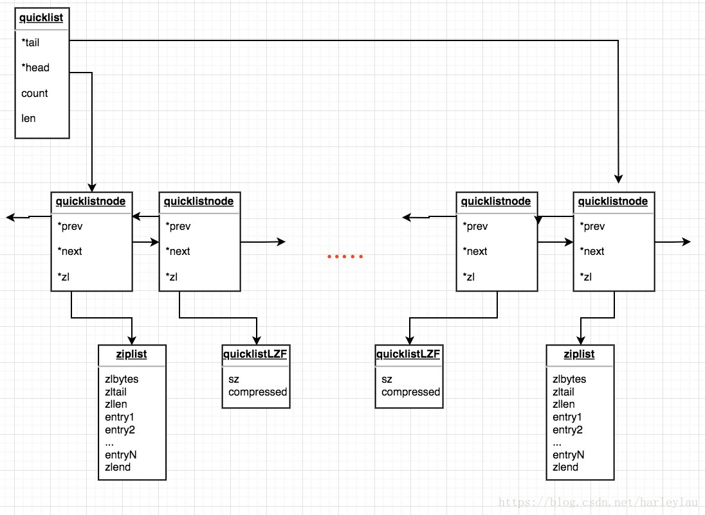

# 概述

`Redis` 中的 `List` 对象在版本 `3.2` 之前，列表底层的编码是 `ziplist` 和 `linkedlist` 实现的， 但是在版本 `3.2` 之后，重新引入了一个 `quicklist`  的数据结构，列表的底层都由 `quicklist` 实现。

在早期的设计中， 当列表对象中元素的长度比较小或者数量比较少的时候，采用 `ziplist` 来存储，当列表对象中元素的长度比较大或者数量比较多的时候，则会转而使用双向列表 `linkedlist` 来存储。这两种存储方式都各有优缺点：

- `ziplist` 存储在一段连续的内存上，所以存储效率很高。但是，它不利于修改操作，插入和删除操作需要频繁的申请和释放内存。特别是当 `ziplist` 长度很长的时候，一次 `realloc` 可能会导致大批量的数据拷贝。

- 双向链表 `linkedlist` 便于在表的两端进行 `push` 和 `pop` 操作，在插入节点上复杂度很低，但是它的内存开销比较大。首先，它在每个节点上除了要保存数据之外，还要额外保存两个指针；其次，双向链表的各个节点是单独的内存块，地址不连续，节点多了容易产生内存碎片。
- 并且临界条件变化时，会触发 `ziplist` 和 `linkedlist` 间的转换，会浪费性能。


那么 `quicklist` 是一种什么样的格式呢？简单的说，我们仍旧可以将其看作一个双向链表，但是列表的每个节点都是一个 `ziplist`，其实就是 `linkedlist` 和 `ziplist` 的结合。`quicklist` 中的每个节点 `ziplist` 都能够存储多个数据元素。


# quicklist实现
接下去我们看下 `quicklist` 的具体实现。

`quicklist` 的定义如下：

```c
typedef struct quicklist {
    quicklistNode *head;        // quicklist的头部
    quicklistNode *tail;        // quicklist的尾部
    unsigned long count;        // 列表中所有数据项的个数总和
    unsigned int len;           // quicklist节点的个数，即ziplist的个数
 	int fill : QL_FILL_BITS;               // 16位，每个ziplist里的最大容量
    unsigned int compress : QL_COMP_BITS;  // 16位，quicklist的压缩深度
    unsigned int bookmark_count: QL_BM_BITS; 
    quicklistBookmark bookmarks[];
} quicklist;
```

这个结构占 `40B` 的空间，其中 `int fill : 16` 表示不用整个 `int` 存储 `fill`，而是只用了其中的 `16` 位来存储，和其他字段共用空间。

`bookmarks` 是一个可选字段，`quicklist` 重新分配内存空间时使用，不使用时不占用空间


`quicklist` 的节点 `node` 的定义如下：

```c
typedef struct quicklistNode {
    struct quicklistNode *prev;  // 指向上一个ziplist节点
    struct quicklistNode *next;  // 指向下一个ziplist节点
    unsigned char *zl;           // 数据指针，如果没有被压缩，就指向ziplist结构，反之指向quicklistLZF结构 
    unsigned int sz;             // 表示指向ziplist结构的总长度(内存占用长度)
    unsigned int count : 16;     // 表示ziplist中的数据项个数
    unsigned int encoding : 2;   // 编码方式，1--ziplist，2--quicklistLZF
    unsigned int container : 2;  // 预留字段，存放数据的方式，1--NONE，2--ziplist
    unsigned int recompress : 1; // 解压标记，当查看一个被压缩的数据时，需要暂时解压，标记此参数为1，之后再重新进行压缩
    unsigned int attempted_compress : 1; // 测试相关
    unsigned int extra : 10;     // 扩展字段，暂时没用
} quicklistNode;
```

`redis` 为了节省内存空间，会将 `quicklist` 的节点用 `LZF` 压缩后存储，但这里不是全部压缩，可以配置 `compress` 的值。

> 为什么不全部节点都压缩，而是流出 `compress` 这个可配置的口子呢？其实从统计而已，`list` 两端的数据变更最为频繁，像`lpush, rpush, lpop, rpop` 等命令都是在两端操作，如果频繁压缩或解压缩会代码不必要的性能损耗。


压缩后的结构为：

```c
typedef struct quicklistLZF {
    unsigned int sz; /* LZF size in bytes*/
    char compressed[];
} quicklistLZF;
```





插入的时候，需要判断下插入 `ziplist` 的长度。如果 `ziplist` 能够放入新元素，即大小没有超过 `list-max-ziplist-size`，那么直接插入。如果 `ziplist` 不能放入新元素，则新建一个 `quicklist` 节点，即新的 `ziplist` ，新的数据项会被插入到新的 `ziplist` ，新的`quicklist` 节点插入到原有的 `quicklist` 上。


#### 参考

> [harleylau - Redis源码剖析 - quicklist](https://blog.csdn.net/harleylau/article/details/80534159)

