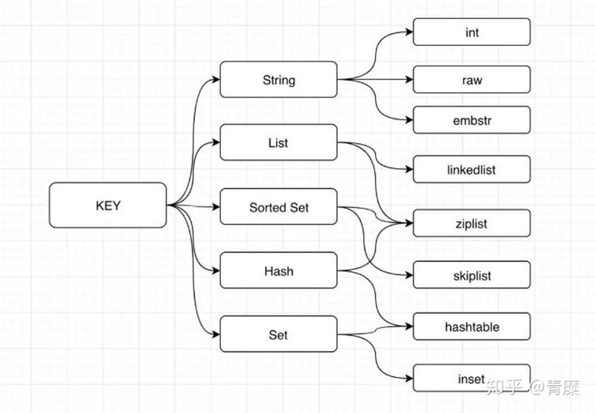

在 `Redis` 命令中，对 `key` 进行处理的命令占了很大一部分。对于不同的 `value` 类型，`key` 能执行的命令又大不相同。比如说，`LPUSH` 和 `LLEN` 只能用于 `list` 类型的 `key`。另外一些命令，比如 `DEL`、`TTL` 和 `TYPE`，可以用于任何类型的 `key`，但底层的执行逻辑又是不一样的。说明 `Redis` 必须让每个 `key` 都带有类型信息，使得程序可以检查 `key` 的类型，并为它选择合适的处理方式。


# RedisObject

为了解决以上问题，`Redis` 构建了自己的类型系统，用来储存 `value`。`RedisObject` 是其中的核心。其结构如下：
```c
// src/server.h，基于 redis 6.2
// 空间占用16B
typedef struct redisObject {
	unsigned type:4;     // 类型, 4bit
	unsigned encoding:4; // 编码方式, 4bit
	unsigned lru:22;     // LRU时间（相对于server.lrulock）, 3B
	int refcount;        // 引用计数, 4B
	void *ptr            // 指向值的指针, 8B
} robj;
```

`type`, `encoding`, 和 `ptr` 是最重要的3个属性。

`type ` 可能的值如下：

```c
#define OBJ_STRING 0    /* String object. */
#define OBJ_LIST 1      /* List object. */
#define OBJ_SET 2       /* Set object. */
#define OBJ_ZSET 3      /* Sorted set object. */
#define OBJ_HASH 4      /* Hash object. */
#define OBJ_MODULE 5    /* Module object. */
#define OBJ_STREAM 6    /* Stream object. */
```

`encoding ` 可能的值如下：

```c
#define OBJ_ENCODING_RAW 0        /* Raw representation */
#define OBJ_ENCODING_INT 1        /* Encoded as integer */
#define OBJ_ENCODING_HT 2         /* Encoded as hash table */
#define OBJ_ENCODING_ZIPMAP 3     /* 已弃用，Encoded as zipmap */
#define OBJ_ENCODING_LINKEDLIST 4 /* 已弃用，No longer used: old list encoding. */
#define OBJ_ENCODING_ZIPLIST 5    /* Encoded as ziplist */
#define OBJ_ENCODING_INTSET 6     /* Encoded as intset */
#define OBJ_ENCODING_SKIPLIST 7   /* Encoded as skiplist */
#define OBJ_ENCODING_EMBSTR 8     /* Embedded sds string encoding */
#define OBJ_ENCODING_QUICKLIST 9  /* 3.2出的，替代 LINKEDLIST，用作 List 结构的编码。底层其实是把 ziplist 串了起来*/
#define OBJ_ENCODING_STREAM 10    /* Encoded as a radix tree of listpacks */
```


#### String

结构为 `SDS`，编码有如下三种：

- `int`：这种编码支持 `incr`、`decr` 命令
- `embstr`：长度小于 `44` 的字符串
- `raw`：长度超过 `44` 的字符串


#### List

- `quicklist`: `linkedlist` 与 `ziplist` 的结合。


#### Hash

- `ziplist`: 数据量小时，会直接用 `ziplist` 编码
- `hashtable`: 数据量大时，改为 `hashtable` 编码


#### Set

- `intset`: 元素全为 `int`，且数量小于配置时，使用该特殊编码
- `hashtable`: 其它情况使用 `hashtable` 编码。其实就是个 `value` 为 `NULL` 的  `Hash` 的结构


#### Sorted Set

- `ziplist`: 数据量小时，使用该编码
- `skiplist` + `hashtable`: 其余情况使用该编码，跳表用于排序，`hashtable` 用于 `O(1)` 查找元素




这个图还是老版本的，`3.2` 后的 `List` 已经改用 `quicklist` 编码了。


# 高级数据结构
##### Bitmap
底层为 `String`，只不过操作的粒度变成了位。因为 `String` 类型最大长度为 `512MB`，所以 `bitmap` 最多可以存储 `2^32` 个 `bit`


##### GEO

 - 本质上还是借助于 `ZSET`，并且使用 `GeoHash` 技术进行填充。`Redis` 中将经纬度使用 `52` 位整数进行编码，放进 `zset` 中，`score ` 就是这 `52` 位整数值
 - 通过对 `score` 进行排序就可以得到坐标附近的其它元素，将 `score` 还原成坐标值就可以得到元素的原始坐标


##### HyperLogLog

- 基本原理是伯努利实验，比如进行 `n` 轮抛硬币实验，每轮直到出现 `1` 为止，如果最多出现连续 `2` 个 `0` 然后才是 `1` 的情况 (`001`)，那么 `n` 大概率为 `8`
  - `001` 的概率为 `1/2^3`，也就是说如果 出现了 `001` 这个序列，说明起码抛了 `8` 次硬币。
- 但是这样误差太大，因此 `HyperLogLog` 做了分桶。使用 `PFAdd key offset` 添加元素时，先计算元素的 `64` 位 `hash`， 前 `14` 位用于分桶，后 `50` 位即伯努利过程，计算最长的连续 `0` 的个数。
- 基于每个桶里 `0` 的最大长度计算平均值，并乘以修正因子，得到最后的计数。
- 感觉桶里 `0` 的最大长度，其实类似布谷鸟过滤器里的指纹。


##### Stream

 - 用作消息队列。底层的数据结构是 `radix tree`（基数树）


# 命令的类型检查和多态

有了 `redisObject` 结构的存在，在执行处理数据类型的命令时，进行类型检查和对编码进行多态操作就简单得多了。

当执行一个处理数据类型的命令时，`Redis` 执行以下步骤：

1. 根据给定 `key`, 在数据库字典中查找和它相对应的 `redisObject`，如果没找到, 就返回 `NULL`
2. 检查 `redisObject` 的 `type` 属性和执行命令所需的类型是否相符，如果不相符，返回类型错误
3. 根据 `redisObject` 的 `encoding` 属性所指定的编码，选择合适的操作函数来处理底层的数据结构。返回数据结构的操作结果作为命令的返回值


#### 参考

> [redis容量估算](https://blog.csdn.net/weixin_41571449/article/details/79781367)
>
> [头条面试真题：请谈谈Redis 9种数据结构以及它们的内部编码实现](https://zhuanlan.zhihu.com/p/102120122)
>
> [Jackey - 走近源码：神奇的HyperLogLog](https://zhuanlan.zhihu.com/p/58519480)