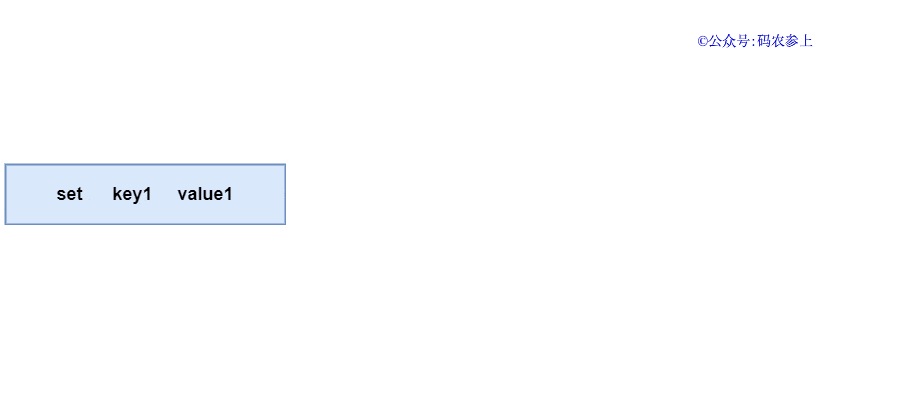

`redis` 没有使用 `HTTP` 协议，那个太重了。而是自行设计了一个协议，称为 `Redis Serialization Protocal (RESP)` 协议。它工作在 `TCP` 协议的上层，作为和客户端之间进行通讯的标准形式。


当客户端使用 `SET KEY VALUE` 的命令时，实际发送的报文长这个样子：

```
*3   // 参数数量
$3   // 参数长度
set  // 参数值
$4   // 长度
key1 // key
$6
value1
```



#### 参考

> [码农参上 - Redis：我是如何与客户端进行通信的](https://mp.weixin.qq.com/s/pnNQ6zURbzAjD1KevDSvPw)

