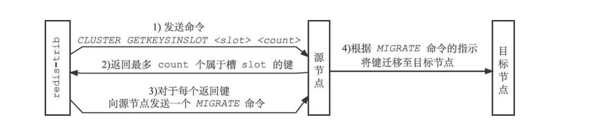
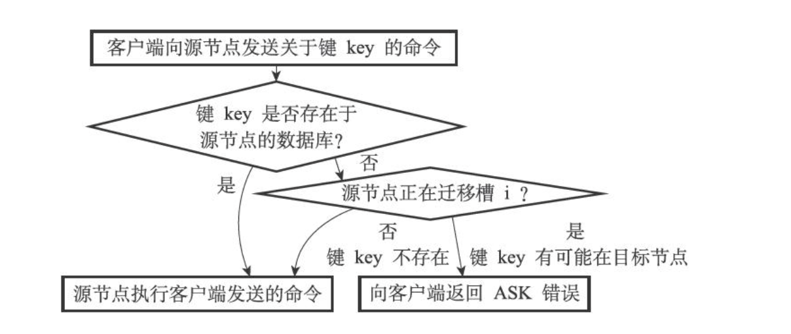

# 概述
`redis ` 的哨兵模式基本已经可以实现高可用，读写分离 ，但是在这种模式下每台 `redis` 服务器都存储相同的数据，很浪费内存，并且总容量有限，所以在 `redis3.0` 上加入了 `cluster` 模式，实现的 `redis` 的分布式存储，也就是说每台 `redis` 节点上存储不同的内容。

`redis-cluster` 采用无中心结构，它的特点如下：

* 多个主节点连成一个集群，每个主节点下可挂载从节点
* 所有节点彼此互联 (`PING-PONG` 机制)，内部使用二进制协议（`gossip 协议`）优化传输速度和带宽。
* 高可用：主节点故障时，从节点提升为主节点。
  * 主观下线：主节点 `PING` 另一个主节点时一定时间内未收到 `PONG`
  * 客观下线：半数以上主节点判定某个主节点处于下线状态
  * 从节点升主选举：半数以上主节点投票给某个从节点
* 客户端与 `redis` 节点直连，不需要中间代理层。客户端不需要连接集群所有节点，连接集群中任何一个可用节点即可。任一节点都保存了所有节点的信息。


## 工作方式
在 `redis` 的每一个节点上，都有这么两个东西，一个是插槽 `slot`，它的的取值范围是：`0-16383`。还有一个就是 `cluster`，可以理解为是一个集群管理的插件

当我们的存取的 `key` 到达的时候，`redis` 会根据 `crc16` 的算法得出一个结果，然后把结果对 `16384` 取余，这样每个 `key` 都会对应一个编号在 `0-16383` 之间的哈希槽，通过这个值，去找到对应的插槽所对应的节点，然后跳转到这个对应的节点上进行存取操作。

为了保证高可用，`redis-cluster` 集群引入了主从模式，一个主节点对应一或多个从节点。主节点宕机的时候，就会启用从节点。当其它主节点 `ping` 一个主节点 `A` 时，如果半数以上的主节点与 `A` 通信超时，那么认为主节点`A` 宕机了。如果主节点 `A` 和它的从节点都宕机了，那么该节点负责的槽就无法再提供服务了，集群可用性无法得到保障。


### 槽指派

`redis` 集群通过分片的方式来保存数据库中的键值对：集群的整个数据库被分为 `16384` 个槽 `slot`，数据库中的每个键都属于这 `16384` 个槽的其中一个，集群中的每个节点可以处理 `0 ~ 16384` 个槽。

当数据库中的 `16384` 个槽都有节点在处理时，集群处于上线状态（`ok`）；相反地，如果数据库中有任何一个槽没有得到处理，那么集群处于下线状态（`fail`）。


#### clusterNode

`clusterNode` 结构的 `slots` 属性和 `numslot` 属性记录了节点负责处理哪些槽：

```c
struct clusterNode {
    unsigned char slots[16384/8];
    int numslots;
};
```

`slots` 属性是一个数组类型的 `bitmap`，这个数组的长度为 `16384/8=2048` ，共包含 `16384` 个二进制位。`redis` 以 `0` 为起始索引，`16383` 为终止索引，对 `slots` 数组中的 `16384` 个二进制位进行编号，并根据索引 `i`上的二进制位的值来判断节点是否负责处理槽 `i`：

* 如果 `slots` 数组在索引 `i` 上的二进制位的值为 `1`，那么表示节点负责处理槽 `i`。
* 如果 `slots` 数组在索引 `i` 上的二进制位的值为 `0`，那么表示节点不负责处理槽 `i`。

`numslots` 属性则记录节点负责处理的槽的数量，即 `slots` 数组中值为 `1` 的二进制位的数量。

> 可以通过 `cluster nodes` 命令查看集群所有节点负责的槽区间


#### clusterState

一个节点除了会将自己负责处理的槽记录在 `clusterNode` 结构的 `slots` 属性和 `numslots` 属性之外，它还会将自己的 `slots` 数组通过消息发送给集群中的其他节点，以此来告知其他节点自己目前负责处理哪些槽。

`clusterState` 结构中的 `slots` 数组记录了集群中所有 `16384` 个槽的指派信息：

```c
typedef struct clusterState {
    clusterNode *slots[16384];
} clusterState;
```

`slots` 数组包含 `16384` 个项，每个数组项都是一个指向 `clusterNode` 结构的指针：

* 如果 `slots[i]` 指针指向 `NULL`，那么表示槽 `i` 尚未指派给任何节点。
* 如果 `slots[i]` 指针指向一个 `clusterNode` 结构，那么表示槽 `i` 指派给了 `clusterNode` 结构所代表的节点。
* `clusterNode`，和 `clusterState` 是不同的，前者是 `01` 数组，后者是对象数组。前者用来记录一个节点负责哪些 `slot`，后者记录整个集群的所有节点。


#### 命令执行流程

* 如果键所在的槽正好就指派给了当前节点，那么节点直接执行这个命令。
* 如果键所在的槽并没有指派给当前节点，那么节点会查找该槽所属的节点，向客户端返回一个 `MOVED` 错误，指引客户端转向至正确的节点，客户端向正确的节点重试。
* 你也可以自己在客户端实现节点缓存，记录 `key` 和 `slot` 的关系，可以更高效


#### 槽指派
节点使用以下算法来计算给定键 `key` 属于哪个槽：

```c
def slot_number(key):
	return CRC16(key) & 16383
```


#### 重分片

`redis` 集群可以通过 `add-note` 命令进行水平扩容。扩容后需要通过 `reshard` 命令重新分片，将一部分槽改指派给扩容后的新节点。

1. `redis` 首先会在源和目标节点设置好中间过渡状态（`migrating` 状态）；

2. 然后一次性获取源节点槽位的所有 `key` 列表 (`keysinslot` 指令，可以部分获取)，再挨个 `key` 进行迁移：
   1. 源节点对当前的 `key` 执行 `dump` 指令得到序列化内容； 
   2. 源节点向目标节点发送指令 `restore` 携带序列化的内容作为参数； 
   3. 目标节点进行反序列化将内容恢复到目标节点的内存中，然后返回源节点 `OK`； 
   4. 源节点收到后再把 `key` 删除；
   5. 执行期间主线程阻塞，如果 `key` 的内容过大会导致源节点和目标节点卡顿，影响集群稳定性，所以需要尽可能避免大 `key` 产生。




### ASK错误
迁移期间，源节点和目标节点处于 `migrating` 状态，此时客户端查询源节点的流程如下：

* 源节点会先在自己的数据库里面查找指定的键，如果找到的话，就直接执行客户端发送的命令。
* 如果源节点没能在自己的数据库里面找到指定的键，那么这个键可能被迁移到了目标节点，源节点将向客户端返回一个 `ASK` 错误，指引客户端转向目标节点，并再次发送之前想要执行的命令。




### 复制与故障转移

#### 复制
`redis` 集群中的节点分为主节点 `master` 和从节点 `slave`，其中主节点用于处理槽，而从节点则用于复制某个主节点，并在被复制的主节点下线时，代替下线主节点继续处理命令请求。（客户端也可以做读写分离，将读请求打到从节点上）


#### 故障检测
集群中的每个主节点都会定期地向集群中的其他节点发送 `PING` 消息，以此来检测对方是否在线，如果接收 `PING` 消息的节点没有在规定的时间内返回 `PONG` 消息，那么发送 `PING` 消息的节点就会将接收 `PING` 消息的节点标记为疑似下线，又称主观下线（`probable fail，PFAIL`），并广播给其他节点。

当一个主节点 `A` 通过消息得知主节点 `B` 认为主节点 `C` 进入了主观下线状态时，主节点 `A` 会在自己的 `clusterState.nodes` 字典中找到主节点 `C` 所对应的`clusterNode` 结构，并将主节点 `B` 的下线报告（`failure report`）添加到 `clusterNode` 结构的 `fail_reports` 链表里面。

如果在一个集群里面，**半数以上**的主节点都将某个主节点 `X` 报告为主观下线，那么这个主节点 `X` 将被标记为客观下线（`FAIL`），将主节点 `X` 标记为已下线的节点会向集群广播一条关于主节点 `X` 的 `FAIL` 消息，所有收到消息的节点都会立即将主节点 `X` 标记为客观下线。


#### 故障转移

当一个从节点发现自己正在复制的主节点进入了已下线状态时，从节点将开始对下线主节点进行故障转移，以下是故障转移的执行步骤：

* 复制下线主节点的所有从节点里面，会有一个从节点被选中。
* 被选中的从节点会执行 `SLAVEOF no one` 命令，成为新的主节点。
* 新的主节点会撤销所有对已下线主节点的槽指派，并将这些槽全部指派给自己。
* 新的主节点向集群广播一条 `PONG` 消息，这条 `PONG` 消息可以让集群中的其他节点立即知道这个节点已经由从节点变成了主节点，并且这个主节点已经接管了原本由已下线节点负责处理的槽。
* 新的主节点开始接收和自己负责处理的槽有关的命令请求，故障转移完成。


#### 选举新的主节点 Leader Election
`redis` 的主节点选举采用了 `raft` 协议类似的方式，基本思路是选举数据最接近原主节点的从节点。以下是集群选举新的主节点的方法：

* 集群的配置纪元是一个自增计数器，它的初始值为 `0`，每次选举 `+=1`（配置纪元 = 触发选举的轮数）
* 对于每轮选举，集群里每个主节点都有一次投票的机会，而第一个向主节点要求投票的从节点将获得主节点的投票。
* 当从节点发现自己正在复制的主节点进入客观下线状态时，会发起一轮投票。


##### 从节点拉票步骤：

* **选举资格检查**：检查自己是否已经与之前的 `master` 节点太久未进行通信。正常来讲，`master` 会定期向 `slave` 发送 `ping` 消息，如果长时间未通信，那么该 `slave` 节点极有可能在数据上落后 `master` 过多，于是放弃发起选举，否则就进入第二步。
* **随机休眠**：每个参与选举的 `slave` 会进行一段时间的休眠，休眠的时间与自身的数据同步进度有关。数据越新 (`repl_offset` 更大) ，休眠时间越短，越早醒来，优先级越高，越有可能被选举。
* **发起拉票**：从节点会向集群广播一条消息，要求所有收到这条消息、并且具有投票权的主节点向给自己投票。


##### 主节点投票步骤：

* **投票资格检查**：尚未投票的主节点才有资格投票
* **拉票资格检查**：检查拉票方的轮数 `term`，比自己的大才行
* 如果主节点尚未投票，那么主节点将向要求投票的从节点返回一条消息，表示这个主节点支持从节点成为新的主节点。
* 如果一个从节点收集到半数以上主节点 `N/2+1` 的支持票时，这个从节点就会当选为新的主节点。
* 如果在一轮选举里没有从节点能收集到足够多的支持票，那么集群进入下一轮选举，直到选出新的主节点为止。

> 注意这一点和 `sentinel` 是不一样的，`sentinel` 是先选一个 `leader sentinel`，再由这个 `leader` 选同步进度最新的作为主。


### 节点间的内部通信机制
在 `redis cluster` 架构下，每个 `redis` 要放开两个端口号，比如一个是 `6379`，另外一个就是加 `10000` 的端口号，比如 `16379`。

`16379` 端口号是用来进行节点间通信的，也就是 `cluster bus` 的通信，用来进行故障检测、配置更新、故障转移授权。`cluster bus` 用了另外一种二进制的协议，`gossip` 协议，用于节点间进行高效的数据交换，占用更少的网络带宽和处理时间。

集群元数据的维护有两种方式：集中式、`gossip` 协议。

* 集中式：时效性好；有压力 / 单点问题。
* `gossip`：元数据的更新比较分散，降低压力；有延时、滞后。


#### gossip 协议
`gossip` 协议包含多种消息，包含 `ping, pong, meet, fail` 等等。

* `meet`：某个节点发送 `meet` 给新加入的节点，让新节点加入集群中，然后新节点就会开始与其它节点进行通信。
    * `redis-trib.rb add-node` 命令其实内部就是发送了一个 `gossip meet` 消息给新加入的节点，通知那个节点去加入集群。
    * 新节点加入时也有三次握手，分别是：`A: meet -> B、B: pong -> A、A: ping -> B`
* `ping`：每个节点都会频繁给其它节点发送 `ping`，其中包含自己的状态还有自己维护的集群元数据，互相通过 `ping` 交换元数据。
* `pong`：返回 `ping` 和 `meet`，包含自己的状态和其它信息，也用于信息广播和更新。
* `fail`：某个节点判断另一个节点 `fail` 之后，就发送 `fail` 给其它节点，通知其它节点说，某个节点宕机了。


#### ping 消息深入

* `ping` 时要携带一些元数据，如果很频繁，可能会加重网络负担。
* 每个节点每秒会执行 `10` 次 `ping`，每次会选择 `5` 个最久没有通信的其它节点。当然如果发现某个节点通信延时达到了 `cluster_node_timeout / 2`，那么立即发送 `ping`，避免数据交换延时过长，落后的时间太长了。比如说，两个节点之间都 `10` 分钟没有交换数据了，那么整个集群处于严重的元数据不一致的情况，就会有问题。所以 `cluster_node_timeout` 可以调节，如果调得比较大，那么会降低 `ping` 的频率。
* 每次 `ping`，会带上自己节点的信息，还有就是带上 `1/10` 其它节点的信息，发送出去，进行交换。至少包含 `3` 个其它节点的信息，最多包含 总节点数减 `2` 个其它节点的信息。


#### 参考

> https://zhuanlan.zhihu.com/p/112651338
