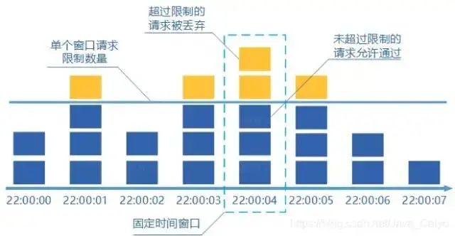

# 为什么要限流？

日常的业务上有类似秒杀活动、双十一、突发新闻等场景，用户流量突增，后端服务的处理能力是有限的，如果不能处理好突发流量，后端服务很容易就被打垮。

亦或是爬虫 / 攻击等不正常流量，我们对外暴露的服务都要以最大恶意去防备调用者。

还有对于很多第三方开放平台来说，不仅仅要防备不正常流量，还要保证资源的公平利用，大家平均分配配额。


# 限流分类

1. 通过鉴权限制掉不合法的流量，如验证码、token、IP白名单等
2. 网关层面限流，如 `tomcat` 可以设置最大线程数；`nginx` 可以限制速率、连接数
3. 服务限流。这一层又可以细分为分布式限流和本地限流


## 分布式限流

可以用 `redis` 来实现。

固定窗口：将时间窗作为 `key`，对其 `inc` 后判断即可。

令牌桶：见最下方的实现，可以写成 `lua` 脚本后加载到 `redis`

漏桶：`redis` 有人提供了插件，和布隆过滤器一样的加载方式，用 `rust` 写的：https://github.com/brandur/redis-cell

阿里的 `sentinel` 也是分布式限流，懒得研究了。业务上用单机已经很适合了，没必要上分布式。


# 常见的限流算法


## 计数限流

保存一个计数器，处理了一个请求，计数器就加一，一个请求处理完毕之后计数器减一。每次请求来的时候看看计数器的值，如果超过阈值就拒绝。

优点就是：简单粗暴，单机在 Java 中可用 Atomic 等原子类、分布式就 Redis incr。

但一般的限流都是为了限制在指定时间间隔内的访问量，因此一般要用下面的窗口来做。


## 固定窗口限流

它相比于计数限流主要是多了个时间窗口的概念，计数器每过一个时间窗口就重置。规则如下：

请求次数小于阈值，允许访问并且计数器 +1；

请求次数大于阈值，拒绝访问；

这个时间窗口过了之后，计数器清零。




#### 固定窗口临界问题

假设系统每秒允许 100 个请求，假设第一个时间窗口是 0-1s，在第 0.55s 处一下次涌入 100 个请求，过了 1 秒的时间窗口后计数清零，此时在 1.05 s 的时候又一下次涌入100个请求。

虽然窗口内的计数没超过阈值，但是全局来看在 0.55s-1.05s 这 0.1 秒内涌入了 200 个请求，这其实对于阈值是 100/s 的系统来说是无法接受的。

固定窗口为了解决这个问题引入了滑动窗口限流。


## 滑动窗口限流

相对于固定窗口，滑动窗口除了需要引入计数器之外还需要记录时间窗口内每个请求到达的时间点，因此对内存的占用会比较多。

规则如下，假设时间窗口为 1 秒：

- 记录每次请求的时间
- 统计每次请求的时间 至 往前推1秒这个时间窗口内请求数。并且 1 秒前的数据可以删除。
- 统计的请求数小于阈值就记录这个请求的时间，并允许通过，反之拒绝。


## 漏桶算法

水滴持续滴入漏桶中，底部定速流出。如果水滴滴入的速率大于流出的速率，当存水超过桶的大小的时候就会溢出。

规则如下：

- 请求来了放入桶中
- 桶内请求量满了拒绝请求
- 服务定速从桶内拿请求处理

它的优点也即缺点：平滑。过于平均。

面对突发请求，服务的处理速度和平时是一样的，有时候不是我们想要的。


## 令牌桶算法

令牌桶其实是对固定窗口的优化。它和固定窗口一样将时间划分为了多个时间窗，限制每个时间窗内的流量。在此基础之上，又以比时间窗更小的粒度定速向桶里放入令牌，这个更小的粒度令牌桶里叫做 `tick`。

这样由于是定速放令牌，不会有固定窗口的临界问题；由于限制的是取令牌的速度而不是消耗令牌的速度，又不会有漏桶过于匀速、无法处理突发流量的问题。

比如限流 `1000/s`，每 `ms` 放入 `1` 个令牌。如果有 `1000` 个请求在 `1ms` 到来了：

- 令牌桶可以一下全部放行，及时处理。漏桶只能每 `0.01s` 放一个，无法及时响应。因此令牌桶更适合应对高并发下突增的流量。
- 如果又有 `1000` 个请求在下 `1ms` 到来了，由于每 `ms` 只会填充 `1` 个令牌，即使走到下一个时间窗 `tick` ，也只有 `1` 个令牌，只会放行 `1` 个，不会有固定窗口的临界问题。
- 如果 `tick` 的值和时间窗的值一样，那实际上就是固定时间窗算法，会有临界问题。如限流 `1/s`，每秒填充 `1` 个，那么 `0.9s` 和 `1.1s` 的请求都会被放行，实际上 `1` 秒过了两个请求。这种情况下只能用滑动窗口做。


#### 规则

- 定速的往桶内放入令牌
- 令牌数量超过桶的限制，丢弃
- 请求来了先向桶内索要令牌，索要成功则通过被处理，反之拒绝/等待


#### 实现

实现上不用这么复杂，只需要记录上一次请求所属的 `tick`，和本次请求所属的 `tick`，判断该 `tick` 内是否有余额即可。如果距离上一次的时间差超过一个 `tick`，就重新把它填满。

```go
type Bucket struct {
	clock Clock
	startTime time.Time        // 桶的创建时间
	capacity int64             // 每个时间窗限制的量
	quantum int64              // 每个 tick 填充的量
	fillInterval time.Duration // 填充间隔
	mu sync.Mutex              // 锁
	availableTokens int64      // 当前 tick 剩余的令牌数
	latestTick int64           // 上一个请求所属的 tick 
}

// 取令牌
func (tb *Bucket) Take(count int64) time.Duration {
	tb.mu.Lock() // 加锁
	defer tb.mu.Unlock()
	d, _ := tb.take(tb.clock.Now(), count, infinityDuration)
	return d
}

// 取令牌
func (tb *Bucket) take(now time.Time, count int64, maxWait time.Duration) (time.Duration, bool) {
	if count <= 0 {
		return 0, true
	}
    
	tick := tb.currentTick(now)    // 离 now 最近的一次填充时间轮
	tb.adjustavailableTokens(tick) // 比对最近一次 take 的时间和 tick，判断应该填充多少令牌
	avail := tb.availableTokens - count
	if avail >= 0 {
		tb.availableTokens = avail
		return 0, true
	}

    //如果令牌不够，返回应等待的时长
	endTick := tick + (-avail+tb.quantum-1)/tb.quantum
	endTime := tb.startTime.Add(time.Duration(endTick) * tb.fillInterval)
	waitTime := endTime.Sub(now)
	if waitTime > maxWait {
		return 0, false
	}
	tb.availableTokens = avail
	return waitTime, true
}

// 判断当前时间所属 tick
func (tb *Bucket) currentTick(now time.Time) int64 {
	return int64(now.Sub(tb.startTime) / tb.fillInterval)
}

// 调整 tick 内的令牌数
func (tb *Bucket) adjustavailableTokens(tick int64) {
	if tb.availableTokens >= tb.capacity {
		return
	}
	tb.availableTokens += (tick - tb.latestTick) * tb.quantum // 如果当前 tick > 上一次 tick，就将令牌桶填满
	if tb.availableTokens > tb.capacity {
		tb.availableTokens = tb.capacity
	}
	tb.latestTick = tick
	return
}
```


#### 问题

##### 为什么采用xxx方案而不是别的？

结合业务场景，挑选适合的方式，而不是最好的方式。