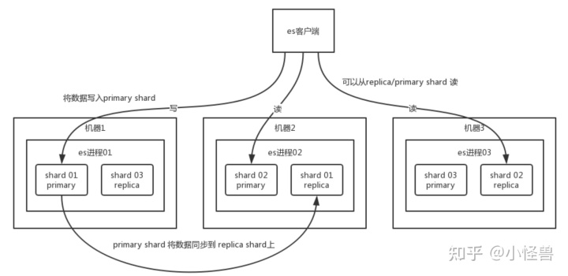

Elasticsearch（简称ES）是一种分布式、开源的搜索和分析引擎，它使用倒排索引和分布式文档存储等技术，能够快速地处理大规模的数据，提供高效的全文检索、数据分析和实时查询等功能。

ES的架构可以分为三层：

1. 客户端层：客户端可以使用REST API或各种客户端库来与ES集群进行交互，执行各种搜索、聚合和数据分析操作。
2. 协调层：协调层是ES集群的核心，它包括了Master节点和Data节点。Master节点负责管理集群中的元数据信息，例如索引和分片等信息，而Data节点则负责存储和处理实际的文档数据。
3. 存储层：存储层由各个Data节点组成，它们负责存储和管理文档数据，并执行各种查询和聚合操作。

ES的核心技术原理包括：

1. 倒排索引：ES使用倒排索引来加速全文检索，它将每个单词与包含它的文档进行映射，而不是将每个文档与包含它的单词进行映射。这种方式可以快速地找到包含特定单词的文档，并支持复杂的布尔查询和排序等操作。
2. 分布式文档存储：ES将文档数据分为多个分片存储在不同的节点上，每个分片都是独立的Lucene索引，可以独立地进行查询和更新操作。这种方式可以提高可扩展性和可用性，并支持水平扩展。
3. 聚合框架：ES的聚合框架可以在查询结果中进行分组、排序、计算和统计等操作，支持各种聚合函数和管道操作，例如求和、平均值、最大值、最小值、分组计数和日期范围等。
4. 实时查询和分析：ES支持实时查询和分析，可以在文档更新后立即进行搜索和聚合操作，支持类似于流处理的实时查询和聚合。
5. 插件和扩展：ES具有强大的插件和扩展功能，可以轻松地扩展其功能，例如支持地理空间数据处理、机器学习、图像处理、安全认证和监控等。

#### 分布式架构

ES的设计理念就是分布式搜索引擎，底层还是基于lucene，核心就是ES集群，在多台机器上启动多个ES进程。

创建一个索引index，这个索引可以被拆分成多个shard，每个shard存储部分数据量，拆分多个shard的好处是：一是支持横向扩展，比如，你有3T的数据量，3个shard，每个shard也就1T的数据，若现在数据增加到4T，怎么扩展？很简单，重新创建索引，拆分成4个shard，将数据导进去（mapping和data）；二是提高性能，数据分布在多个shard上，即多台服务器上，所有操作都会在多台服务器上并行分布式执行，提高吞吐量和性能。

多副本机制：ES 在每个机器上存放一部分数据，同时在其他的机器上备份。就是说 每个 shard 都有一个 primary shard 负责写入数据，但是还有几个replica shard 。primary shard 写入数据之后，会把数据同步到其他的replica shard上。

通过这种replica 的方案，每个shard的数据都有备份，如果某个机器宕机了，没有关系，还有副本数据在其他机器备份呢。高可用吧。

选主：ES集群有多个节点，会自动选取一个节点为主节点（基于 Zookeeper，或使用内置的  Zen Discovery）。这个master 节点就是干一些管理的工作，比如维护索引元数据，负责切换 primary shard 和 replic shard 身份等，要是 master 节点宕机，那么会重新选举 master。

如果是从节点宕机了，那么主节点会让从节点上的 primary shard 的身份转移到其他机器上的 replica shard。从节点恢复后，主节点会控制将缺失的 replica shard 分配过去，同步后续修改的数据之类的，让集群回复正常。

