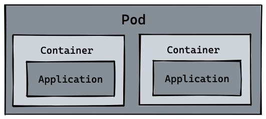

Kubernetes（简称K8s）是一个开源的容器编排平台，主要用于管理和部署容器化应用程序。Kubernetes提供了一组API和工具，可以轻松地自动化管理容器化应用程序的部署、伸缩、故障恢复和负载均衡等操作。它还提供了丰富的资源管理和监控功能，可以帮助用户有效地管理和调度容器。


#### 架构

Kubernetes 的架构包括 Master 和 Node 两部分

Master 是 Kubernetes 的控制平面，主要负责管理和控制整个系统的状态和行为，包括资源管理、Pod 调度、弹性伸缩、安全控制、系统监控等，且都是自动完成的

Node 是集群中的工作节点，其上运行着真正的应用程序


#### Service

Service 是一种逻辑抽象，用于表示一组具有相同功能的 Pod 的访问方式和网络终结点。对外提供一个稳定的IP地址和DNS名称，使得客户端可以通过这个IP和DNS名称来访问Pod组，并通过负载均衡将请求分配到不同的Pod上。


#### Pod

Pod 是 k8s 最小的部署单元，它是由一个或多个容器组成的、共享网络和存储资源的运行环境。

Pod 这个单词是豆荚的意思，里面包了多个豆子（容器）。

每个 Pod 中都运行着一个特殊的被称为 Pause 的容器，类似与边车模式里的代理，为其他业务容器提供共享的网络栈和存储，使业务容器之间的通信更加高效。因此在设计时可以充分利用这一特性将一组密切相关的进程放入同一 Pod 中。

服务重启或发布新版本时，会逐步新建 pod 并替换旧 pod，pod 名称会发生改变，非常不利于负载均衡。因此在 pod 之上又设计了一个 Service 层，用来关联 pod 名和服务名，对外提供稳定的服务名和 Endpoint。Service 位于 pod 的前面，负责接收请求并将它们传递给它后面的所有pod。一旦服务中的 Pod 集合发生更改，Endpoints 就会被更新，请求的重定向自然也会导向最新的 pod。


#### Container

容器是一种轻量级的、可移植的、可隔离的软件包，用于打包应用程序和其依赖项以便在任何环境中运行。在k8s中，容器是Pod的基本组成部分，它包含应用程序、依赖项和运行时环境，并且在Pod中共享网络和存储资源。


#### Node

Node是k8s集群中的一个工作节点，它是集群中的一个物理机器或虚拟机器。上面运行一个或多个Pod，并且运行kubelet进程以接收和执行Pod的调度请求。





# 安装及使用

环境：CentOS

```bash
# 停用防火墙
sudo systemctl stop firewalld
sudo systemctl disable firewalld

# 安装 docker
sudo yum install -y yum-utils device-mapper-persistent-data lvm2
sudo yum-config-manager --add-repo https://download.docker.com/linux/centos/docker-ce.repo
sudo yum install docker-ce
sudo systemctl start docker
sudo systemctl enable docker

# 添加 k8s repo
sudo vi /etc/yum.repos.d/kubernetes.repo
# 粘贴如下文本
[kubernetes]
name=Kubernetes
baseurl=https://packages.cloud.google.com/yum/repos/kubernetes-el7-x86_64
enabled=1
gpgcheck=1
repo_gpgcheck=1
gpgkey=https://packages.cloud.google.com/yum/doc/yum-key.gpg https://packages.cloud.google.com/yum/doc/rpm-package-key.gpg
exclude=kubelet kubeadm kubectl

# 安装 k8s 组件
sudo yum install -y kubelet kubeadm kubectl --disableexcludes=kubernetes
sudo systemctl enable kubelet

# 使用 kubeadm 初始化集群
sudo kubeadm init --pod-network-cidr=192.168.0.0/16
# 初始化后按终端提示创建目录及配置
mkdir -p $HOME/.kube
sudo cp -i /etc/kubernetes/admin.conf $HOME/.kube/config
sudo chown $(id -u):$(id -g) $HOME/.kube/config

# 安装网络插件，这里用 Calico：
git clone https://github.com/projectcalico/calico.git
cd calico
kubectl apply -f manifests/calico.yaml

# 检查节点
kubectl get nodes
NAME             STATUS   ROLES           AGE   VERSION
vm-8-16-centos   Ready    control-plane   92m   v1.27.2

# 因为这里部了单节点集群，需要允许主节点参与抢占
kubectl taint nodes --all node-role.kubernetes.io/control-plane-
```

