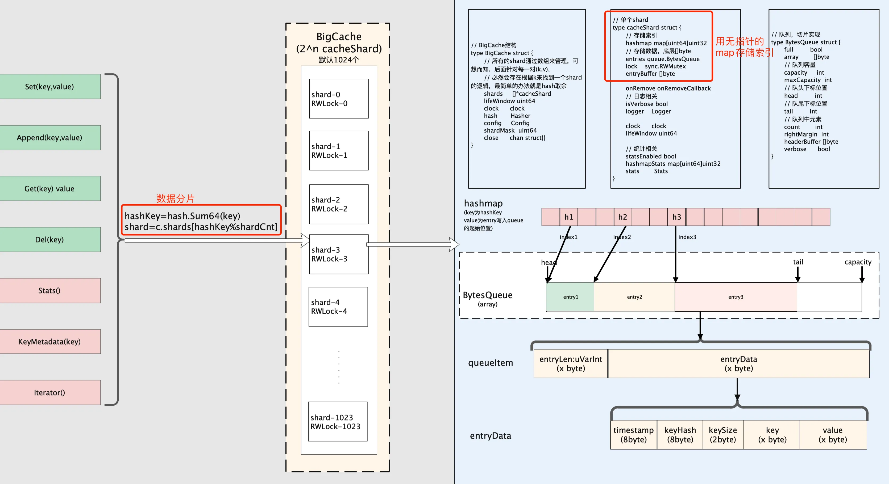
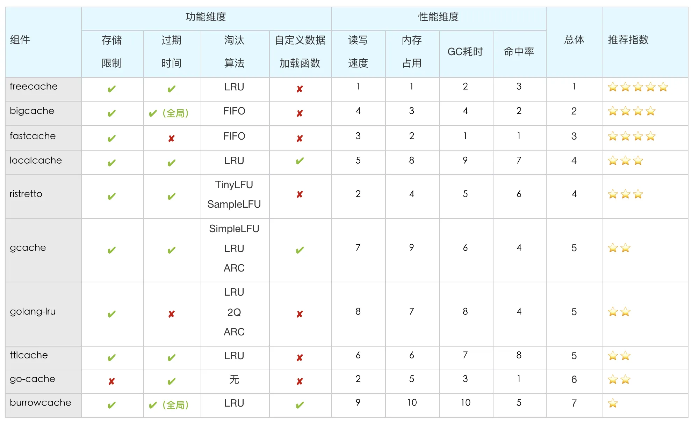

一个优秀的本地缓存组件一般需要具有如下特点：

1. **线程安全**：支持并发访问，在多线程场景下，能处理并发读写等数据竞争问题
   1. key 哈希后数据分片，缩小锁粒度
   2. 实现 singleflight 机制，避免缓存穿透
2. **支持内存限制**：
   1. 可限制内存使用量，避免OOM
   2. 支持数据过期淘汰

3. **高吞吐量**：避免系统长时间GC，导致实际性能下降。


目前常见的 golang 本地缓存组件有：


## 2.1. bigcache

**代码库**：[GitHub - allegro/bigcache: Efficient cache for gigabytes of data written in Go.](https://github.com/allegro/bigcache)

简单用法：

```go
cache, err := bigcache.New(context.Background(),bigcache.DefaultConfig(10*time.Minute))
cache.Set("my-unique-key", []byte("value"))
value, err := cache.Get("my-unique-key")
```


### 组件功能

1. 支持高并发访问：通过数据分片减小锁的粒度，数据需要序列化之后使用[]byte存储，索引使用无指针的Map存储，避免了高额的GC开销，支持更高的并发量。
2. 支持对整个cache中的元素设置一个全局过期时间，不支持对单个元素设置不同的过期时间。当缓存容量满时，数据以FIFO策略淘汰，不支持LRU。数据过期删除触发时机：初始化时通过设置CleanWindow参数可开启定时清理过期数据任务；每次Set操作会尝试清理一个过期数据。
3. 支持删除元素：仅标记删除，即只删除map中的key，不删除key对应的value。
4. 支持设置最大使用内存：初始化时设置HardMaxCacheSize参数可限制底层 ByteQueue 的最大内存使用量。使用过程中底层的ByteQueue会动态扩容直到上述设置值。

### 设计思想

作者原文：https://blog.allegro.tech/2016/03/writing-fast-cache-service-in-go.html

#### 1. 数据分片减少锁粒度

支持并发访问需要使用锁来保证同一时间只允许一个协程修改缓存内容，加锁会阻塞后续操作，导致缓存性能下降。bigcache使用数据分片减少锁粒度，一个bigcache实例包含个cacheShard对象（默认1024个，初始化时可设置），每个cacheShard对象维护一把sync.RWMutex，使用 [fnv哈希函数](https://en.wikipedia.org/wiki/Fowler–Noll–Vo_hash_function) 对key进行哈希后将数据打散到不同分片，将锁的范围从全局缩小到单个分片，减少锁竞争，提升并发性能。

#### 2. 使用无指针的map[uint64]uint32存储索引数据，规避GC开销

实现缓存最简单直接的方式是使用map来存储，对于包含指针的map，golang垃圾回收器在GC标记阶段会访问map中的每一个元素，当缓存元素很多，map非常大时，GC会影响并发性能。为规避GC开销问题，bigcache使用key和value都不包含指针的map来索引数据，map的key存储的是内容key哈希之后的uint64值，value存储的是缓存内容序列化之后在底层全局[]byte中的下标。



### 优缺点

#### 优点

1. 支持设置全局的过期时间(不支持给单个数据设过期时间），每次Set会尝试清理一个过期数据，也可开启后台定时清理任务。
2. 支持初始化时通过参数限定缓存容量，仅预先分配少量内存，后续动态扩容，扩容时不超过初始限制值，容量满时以FIFO策略自动淘汰。
3. 数据分片减少了锁粒度，无指针的map[uint64]uint32存储索引数据，零GC，支持高并发。

#### 缺点

1. 底层是全局的[]byte，数据需要序列化存储，频繁序列化会消耗内存和CPU。
2. 整个cache实例仅能有一个全局过期时间，不支持单个数据设置过期时间，如果有多类数据，要个性化过期时间，需要用多个实例。
3. 没有singleflight机制，存在热key缓存穿透，需要扩展。
4. 不支持将缓存持久化到硬盘文件和从文件中恢复缓存，需要扩展。
5. 不支持缓存回调函数，在key加载、过期、删除时做一些处理。

#### 适用场景

可以只用一个全局的过期时间，比如都是写入后60s过期，数据不用持久化，数据量较大，高并发的场景。


## 2.5. freecache

简单用法：

```go
cache := freecache.NewCache(10 * 1024 * 1024)
key := []byte("my-unique-key")
cache.Set(key, []byte("value"), 5)
value, err := cache.Get(key)
```

### 组件功能

1. 支持高并发访问：通过数据分片减小锁的粒度，key和value仅支持[]byte类型，没有使用map，而是使用slice实现了一套数据索引逻辑，规避GC。
2. 支持数据过期：可对单个元素设置过期时间，不支持定时清理过期数据，仅在 SET 时动态标记数据是否过期，当缓存满时基于LRU和过期时间对过期数据覆写。
3.  支持删除数据：可以显式地删除缓存中的某个数据。
4. 支持设置最大内存：初始化时通过传入的size参数可限制底层[]byte数组的大小（内存是根据size预先分配的，没写入数据也会占用size大小的内存），限制内存使用量。


### 实现原理

#### 1. 数据分片减少锁粒度

freecache使用数据分片减少锁粒度，freecache使用三层数据结构：freecache-》segment-》slot。一个freecache实例固定包含256个segment，一个segment固定包含256个slot，一个slot包含若干个entryPtr，一个entry代表一个数据。同一个segment的256个slots共享一个RingBuf（底层是[]byte）用于存储实际数据，segment中有一个[256]int32的数组用于存储每个slot的元素个数。锁在segment这一层， 一个segment一把互斥锁。

#### 2. 采用slice自实现一套无指针的数据索引逻辑

freecache在存储索引时并没有采用go语言内置的map结构，而是通过slice维护数据的索引。key-value数据进来后，首先根据key计算得到hashVal，hashVal & 255得到segmentID；再根据hashVal >> 8得到slotID，hashVal >> 16得到哈希码(hash16)；再根据hash16二分查找key在slot中的位置idx；确定idx后比较传入key与该位置当前的key*是否相等，相等则更新，不等则插入新节点。


### 优缺点

#### 优点

1. 支持单个元素级别的过期时间，支持显式删除数据。
2. 支持初始化时限定缓存容量，容量满时近似LRU策略淘汰。
3. 数据分片减少了锁粒度，采用slice实现了一套数据索引逻辑，零GC，支持高并发。
4. API完善，使用简单，读、写、更新、删除、刷新过期时间都有。

#### 缺点

1. KV都是[]byte类型，需要频繁序列化，频繁序列化会消耗内存和CPU。
2. 缓存容量根据初始size参数预先分配，而不是动态扩容（未设置时最小容量为512KB），在数据量比较小的情况下，内存有浪费。
3. **freecache官方提醒在分配大内存场景下，需要通过debug.SetGCPercent(percent)设置一个比较低的百分比，避免可能因垃圾回收过慢而出现服务整体内存占用过大而OOM的问题。**[**这篇文章**](https://km.woa.com/group/11800/articles/show/416762#实现原理：)**中提到，在实际场景中，设置debug.SetGCPercent(20)提高了垃圾回收的频率，但在并发量比较大的情况下，会影响服务本身，出现收发包不稳定，丢包超时问题。**
4. 没有singleflight机制，存在热key缓存穿透，需要扩展。
5. 不支持将缓存持久化到硬盘文件和从文件中恢复缓存，需要扩展。

#### 适用场景

freecache适合高并发的场景，但由于内存是初始化时指定并预先分配的（不支持运行时修改扩容），大内存场景还可能会有潜在问题（未亲身遇到，[**这篇文章**](https://km.woa.com/group/11800/articles/show/416762#实现原理：)有提到），适用于内存不大的高并发场景。


# 对比结论

1. 对于**整体业务数据量不是很大的高并发**场景，推荐使用**freecache**（PS：freecache内存是根据初始参数预先分配好的，可能会浪费内存）
2. 对于**数据量大、高并发，所有数据可共用一个全局的过期时间**（比如都是写入60s后过期）的场景，推荐使用**bigcache**（PS：bigcache仅预先分配少量内存，后续动态扩容）。
3. 对于**数据不需要定时过期，且后续需要持久化到磁盘**，单个缓存数据都小于64KB，高并发的场景，推荐使用**fastcache**。
4. 对于可以接受数据写入可能延迟（Set之后立刻去取可能取不到，Delete之后可能还会读到），**读多写少的场景**，推荐使用**localcache**。（PS：localcache是内部自研组件）
5. 对于**可以接受Set操作不保证成功，对缓存key的价值有清晰认识，数据访问模式符合LFU策略**的场景，推荐尝试一下**ristretto**。（PS：在本文的各基准数据集上ristretto命中率并不高，可能是config设置和cost传值不合适，需要更多探索）
6. 对于**数据量小，业务并发量不高**的场景，也可以使用**gcache**（支持过期时间）和**golang-lru**（不支持过期时间），这两个组件支持多种淘汰算法，其中ARC是一种自适应的缓存淘汰算法，是基于Recency/Frequency的平衡策略。
7. ttlcache、go-cache和burrowcache不太推荐。go-cache无法限制缓存容量，没有淘汰策略，历史数据会一直累积，有OOM的风险。

