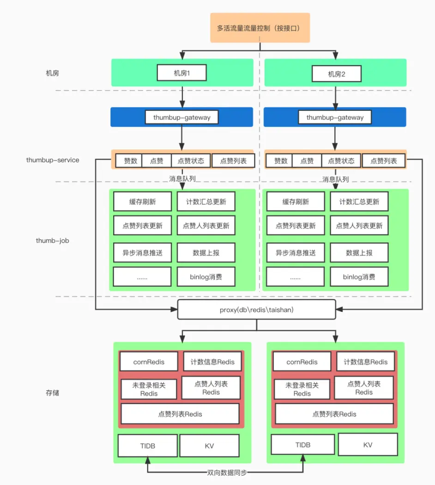

[TOC]

# 1. 需求分析

## 1.1 业务能力

- 以 “稿件” 为例，点赞服务需要提供
- 对某个稿件点赞/取消赞
- 点赞状态查询：查询是否对 单个/一批稿件 点过赞
- 查询某个稿件的点赞数
- 查询某个稿件的点赞人列表
- 查询某个用户的点赞列表
- 查询用户收到的总点赞数


## 1.2 容灾能力

存储不可用

- 例如当DB不可用时，需要依托缓存尽可能提供服务。
- 同理当缓存不可用时，DB也需要保证自己不宕机的情况下尽可能提供服务。 

消息队列不可用 

- 通过RPC调用的方式自动降级

机房灾难

- 切换机房


## 1.3 流量压力

全局流量压力：

1. 批量聚合写；比如聚合10s内的点赞数，一次性写入
2. 异步化处理，保证速率

单点流量（热点）压力：

1. 本地缓存


# 2. 架构
## 2.1 总览



整个点赞服务的系统可以分为五个部分

1. 流量路由层（决定流量应该去往哪个机房）
2. 业务网关层（统一鉴权、反黑灰产等统一流量筛选）
3. 点赞服务（thumbup-service）,提供统一的RPC接口
4. 点赞异步任务（thumbup-job）
5. 数据层（db、kv、redis）


## 2.2 表设计

最重要的点赞记录表：

存储 `用户 uid、被点赞的实体ID（messageID）、点赞来源、时间` 等信息

并且在 `uid、messageID` 两个维度上建立索引，这样既可以查用户点赞了哪些稿件，也可以查稿件有哪些点赞用户


## 2.3 三级数据存储

DB + Redis + 本地缓存


### 第一层存储：DB层 - （TiDB）

见 2.2 表设计


### 第二层存储 Redis

缓存层Cache：点赞作为一个高流量的服务，缓存的设立肯定是必不可少的。点赞系统主要使用的是 CacheAside 模式。这一层缓存主要基于Redis缓存：以点赞数和用户点赞列表为例：


1.点赞数

用业务ID和该业务下的实体ID作为缓存的Key,并将点赞数与点踩数拼接起来存储以及更新

```go
key = count:patten:{business_id}:{message_id}
value = {likes},{disLikes}
```


2.用户点赞列表

用mid与业务ID作为key，value则是一个ZSet，member为被点赞的实体ID，score为点赞的时间。

当该业务下某用户有新的点赞操作的时候，被点赞的实体则会通过 zadd的方式把最新的点赞记录加入到该ZSet里面来

为了维持用户点赞列表的长度（不至于无限扩张），需要在每一次加入新的点赞记录的时候，按照固定长度裁剪用户的点赞记录缓存。比如缓存中只记录第一页数据，超过该长度的数据请求需要回源DB查询

```go
key = user:likes:patten:{mid}:{business_id}
member(messageID)
score(likeTimestamp)
```


3.为稿件点赞的用户

这个也是存最近的一页用户就可以


### 第三层存储 本地缓存

本地缓存的建立，目的是为了应对缓存热点问题。

利用最小堆算法，在可配置的时间窗口范围内，统计出访问最频繁的缓存Key，并将热Key（Value）按照业务可接受的TTL存储在本地内存中。


### 2.4 灾备

一主多从、同城多活。主故障时提升从为主

降级：在所有兜底、降级能力都已失效的前提下也不会直接返回错误给用户，而是会以空值或者假特效的方式与用户交互。后续等服务恢复时，再将故障期间的数据写回存储


# 参考

[芦文超 - 【点个赞吧】 - B站千亿级点赞系统服务架构设计](https://www.bilibili.com/read/cv21576373)
