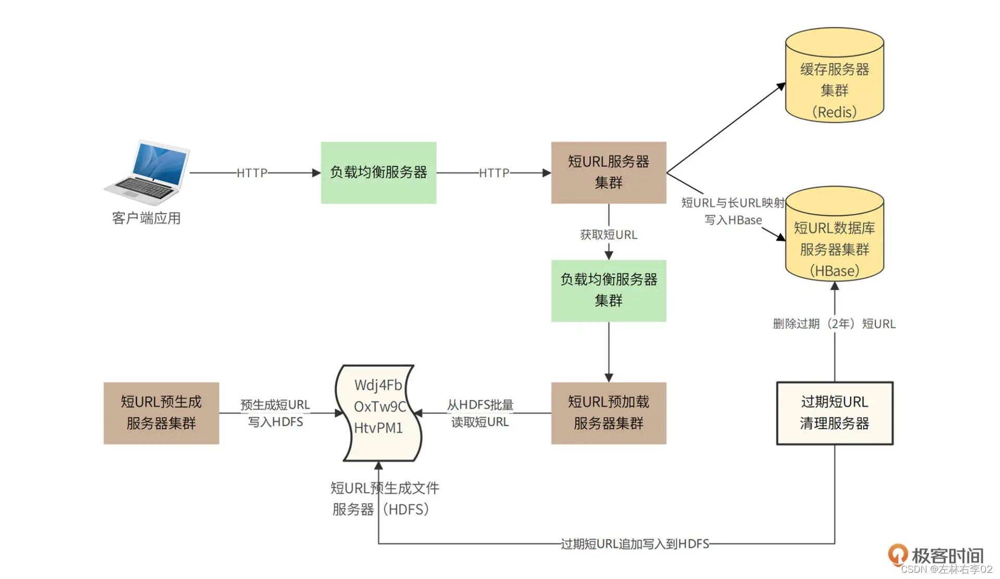

# 1.需求分析

## 1.3.性能指标估算

预计每月新生成短URL 5亿条，短URL有效期2年，那么总URL数量120亿。

- 存储空间
  - 每条短URL数据库记录以最大1KB算，那么需要总存储空间12TB（不含数据冗余备份）。
  - 这个空间量太大了，所以后面设计用HBase存
  
- 吞吐量
  - 每条短URL平均读取次数100次，那么平均访问吞吐量（每秒访问次数）2万。
  - 一般系统高峰期访问量是平均访问量的2倍，因此系统架构需要支持的吞吐能力应为4万。

- 网络带宽
  - 短URL的重定向响应包含长URL地址内容，长URL地址大约500B，HTTP响应头其他内容大约500B，所以每个响应1KB，高峰期需要的响应网络带宽 = 4万*1KB = 320Mbps。


## 1.4.非功能需求

1. 系统需要保持高可用，不因为服务器、数据库宕机而引起服务失效。
2. 系统需要保持高性能，服务端80%请求响应时间应小于5ms，99%请求响应时间小于20ms，平均响应时间小于10ms。
3. 短URL应该是不可猜测的，即不能猜测某个短URL是否存在，也不能猜测短URL可能对应的长URL地址内容。


# 2.概要设计

## 2.1.方案对比

短URL生成器的设计核心就是短URL的生成，即长URL通过某种函数，计算得到一个6个字符的短URL。短URL有几种不同的生成算法。

1. 单项散列函数生成短URL
   1. 将长URL利用MD5或者SHA256等单项散列算法，进行Hash计算，得到128bit或者256bit的Hash值。然后对该Hash值进行Base64编码，得到22个或者43个Base64字符，再截取前面的6个字符，就得到短URL了。
   2. 可能会发生Hash冲突（MD5或者SHA256计算得到的Hash值几乎不会冲突，但是Base64编码后再截断的6个字符有可能会冲突）。所以在生成的时候，需要先校验该短URL是否已经映射为其他的长URL，如果是，那么需要重新计算（换单向散列算法，或者换Base64编码截断位置）。如果在此冲突，需要再重新计算。这样的冲突处理需要多次到存储中查找URL，无法保证性能要求。
2. 自增长短URL
   1. 直接使用自增ID作为短URL。每新增一条长URL，ID+1
   2. 操作简单，但可猜测

3. 离线预计算
   1. 预先生成一批没有冲突的短URL字符串，当外部请求输入长URL需要生成短URL的时候，直接从预先生成好的短URL字符串池中获取一个即可
   1. 预生成短URL的算法可以采用随机数来实现，6个字符，每个字符都用随机数产生（用0~63的随机数产生一个Base64编码字符）。
   1. 为了避免随机数产生的短URL冲突，需要在预生成的时候检查该URL是否已经存在（用布隆过滤器检查）。因为预生成短URL是离线的，所以这时不会有性能方面的问题。
   1. 6个字符可以生成64^6 = 687亿条短URL，远超所需了


## 2.2.整体部署模型

Fuxi的业务逻辑比较简单，相对比较有挑战的就是高并发的读请求如何处理、预生成的短URL如何存储以及访问。高并发访问主要通过负载均衡与分布式缓存解决，而海量数据存储则通过HDFS以及HBase来完成。具体架构图如下。




系统调用可以分成两种情况，一种是用户请求生成短URL的过程；另一种是用户访问短URL，通过Fuxi跳转到长URL的过程。


### 用户请求生成短URL的过程

在短URL系统Fuxi上线前，已经通过随机数算法预生成144亿条短URL并将其存储在HDFS文件系统中。系统上线运行后，应用程序请求生成短URL的时候，请求通过负载均衡服务器被发送到短URL服务器集群，短URL服务器再通过负载均衡服务器调用短URL预加载服务器集群。

短URL预加载服务器此前已经从短URL预生成文件服务器（HDFS）中加载了一批短URL存放在自己的内存中，这时，只需要从内存中返回一个短URL即可，同时将短URL与长URL的映射关系存储在HBase数据库中。


### 用户通过客户端请求访问短URL的过程

请求通过负载均衡服务器发送到短URL服务器集群，短URL服务器首先到缓存服务器中查找是否有该短URL，如果有，立即返回对应的长URL，短URL生成服务器构造重定向响应返回给客户端应用。

如果缓存没有用户请求访问的短URL，短URL服务器将访问HBase短URL数据库服务器集群。如果数据库中存在该短URL，短URL服务器会将该短URL写入缓存服务器集群，并构造重定向响应返回给客户端应用。如果HBase中没有该短URL，则返回404。


过期短URL清理服务器会每个月启动一次，将已经超过有效期（2年）的URL数据删除，并将这些短URL追加写入到短URL预生成文件中。

为了保证系统高可用，Fuxi的应用服务器、文件服务器、数据库服务器都采用集群部署方案，单个服务器故障不会影响Fuxi短URL的可用性。

对于Fuxi的高性能要求，80%以上的访问请求将被设计为通过缓存返回。Redis的缓存响应时间1ms左右，服务器端请求响应时间小于3ms，满足80%请求小于5ms的性能目标。对于缓存没有命中的数据，通过HBase获取，HBase平均响应时间10ms，也可以满足设计目标中的性能指标。

对于Redis缓存内存空间估算，业界一般认为，超过80%请求集中在最近6天生成的短URL上，Fuxi主要缓存最近六天生成的短URL即可。根据需求容量估计，最近6天生成的短URL数量约1亿条，因此需要Redis缓存服务器内存空间：1亿*1KB=100GB（实际可不止哦。


# 3.详细设计

## 3.2.短URL预生成文件及预加载

Fuxi的短URL是在系统上线前全部预生成的，并存储在HDFS文件中。共144亿个短URL，每个短URL 6个字符，文件大小144亿*6B=86.4GB。

文件格式就是直接将144亿个短URL的ASC码无分割地存储在文件中，如下是存储了3个短URL的文件示例：

```
Wdj4FbOxTw9CHtvPM1
```

**所以如果短URL预加载服务器第一次启动的时候加载1万个短URL，那么就从文件头读取60K数据，并标记当前文件偏移量60K。下次再加载1万个短URL的时候，再从文件60K偏移位置继续读取60K数据即可**。

因此，Fuxi除了需要一个在HDFS记录预生成短URL的文件外，还需要一个记录偏移量的文件，记录偏移量的文件也存储在HDFS中。同时，由于预加载短URL服务器集群部署多台服务器，会出现多台服务器同时加载相同短URL的情况，所以还需要利用偏移量文件对多个服务器进行互斥操作，即利用文件系统写操作锁的互斥性实现多服务器访问互斥。

应用程序的文件访问流程应该是：**写打开偏移量文件 -> 读偏移量 -> 读打开短URL文件 -> 从偏移量开始读取60K数据 -> 关闭短URL文件 -> 修改偏移量文件 -> 关闭偏移量文件**。

由于写打开偏移量文件是一个互斥操作，所以第一个预加载短URL服务器写打开偏移量文件以后，其他预加载短URL服务器无法再写打开该文件，也就无法完成读60K短URL数据及修改偏移量的操作，这样就能保证这两个操作是并发安全的。

加载到预加载短URL服务器的1万个短URL会以链表的方式存储，每使用一个短URL，链表头指针就向后移动一位，并设置前一个链表元素的next对象为null。这样用过的短URL对象可以被垃圾回收。

当剩余链表长度不足2000的时候，触发一个异步线程，从文件中加载1万个新的短URL，并链接到链表的尾部。


#### 参考

[李智慧 - 短 URL 生成器设计：百亿短 URL 怎样做到无冲突](https://blog.csdn.net/u011624157/article/details/125171746)