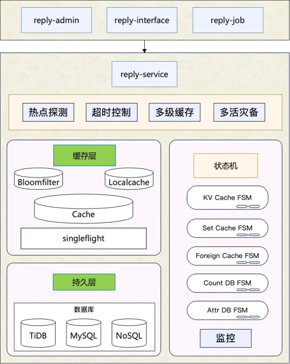
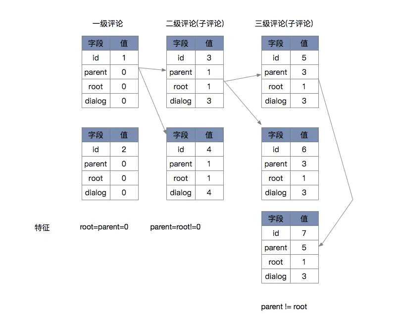

# 1. 功能需求分析

1. 发布评论：支持无限盖楼回复。
2. 读取评论：按照时间、热度排序；显示评论数、楼中楼等。
3. 删除评论：用户删除、UP主删除等。
4. 管理评论：置顶、精选、后台运营管理（搜索、删除、审核等）。

结合B站以及其他互联网平台的评论产品特点，评论一般还包括一些更高阶的基础功能：

1. 评论赞踩：点赞、点踩、举报等。

2. 评论富文本展示：例如表情、@、分享链接、广告等。

3. 评论标签：例如UP主点赞、UP主回复、好友点赞等。

4. 评论装扮：一般用于凸显发评人的身份等。

5. 热评管理：结合AI和人工，为用户营造更好的评论区氛围。

# 2. 架构设计

## 2.1 接入层

略

## 2.2 管理后台

运营人员的数据查询具有：

1. 组合、关联查询条件复杂；

2. 刚需关键词检索能力；

3. 写后读的可靠性与实时性要求高等特征。

此类查询需求，ES几乎是不二选择。

## 2.3 基础服务层

这一层是较少做业务逻辑变更的，但是需要提供极高的可用性与性能吞吐。因此，reply-service集成了多级缓存、布隆过滤器、热点探测等性能优化手段。 

## 2.4 评论异步处理层

1. 解耦
2. 削峰
   1. C端的发评接口会返回展示新评论所需的数据内容，客户端据此展示新评论，完成一次用户交互。若用户重新刷新页面，因为发评的异步处理端到端延迟基本在2s以内，此时所有数据已准备好，不会影响用户体验。

# 3. 存储设计

## 3.1 数据库

评论设计了三张表：

1. 评论关联表，主键是评论id，存储评论和稿件的关联关系
2. 评论区表，主键是评论对象的id、业务分类。里面存储诸如稿件id这样的内容
3. 评论详情表。由于评论内容是大字段，且相对独立、很少修改，因此独立设计这张表。 

评论表和评论区表的字段主要包括4种：

1. 关系类，包括发布人、父评论等，这些关系型数据是发布时已经确定的，基本不会修改。

2. 计数类，包括总评论数、根评论数、子评论数等，一般会在有评论发布或者删除时修改。

3. 状态类，包括评论/评论区状态、评论/评论区属性等，评论/评论区状态是一个枚举值，描述的是正常、审核、删除等可见性状态；评论/评论区属性是一个整型的bitmap，可用于描述评论/评论区的一些关键属性，例如UP主点赞等。

4. 其他，包括meta等，可用于存储一些关键的附属信息。

评论回复的树形关系，如下图所示：

## 3.2 缓存

主要有3项缓存：

1. subject，对应于「查询评论区基础信息」，redis string类型，value使用JSON序列化方式存入。

2. reply_index，对应于「查询某稿件下的评论id列表」，zet类型。member是评论id，score对应于ORDER BY的字段，如时间、点赞数等。

3. reply_content，对应于「查询某条评论详情」，存储内容包括同一个评论id对应的reply_index表和reply_content表的两部分字段。

缓存的一致性依赖binlog刷新，主要有几个关键细节：

1. binlog投递到消息队列，分片key选择的是评论区，保证单个评论区和单个评论的更新操作是串行的，消费者顺序执行，保证对同一个member的zadd和zrem操作不会顺序错乱。

2. 数据库更新后，程序主动写缓存和binlog刷缓存，都采用删除缓存而非直接更新的方式，避免并发写操作时，特别是诸如binlog延迟、网络抖动等异常场景下的数据错乱。那大量写操作后读操作缓存命中率低的问题如何解决呢？此时可以利用 `singleflight` 进行控制，防止缓存击穿。 

# 4. 其他优化

1. 在内存中合并写请求，批量更新，减轻写压力
2. 本地内存缓存热点评论
3. 如何展示人工热评？新增服务、新增人工权重字段，预先计算好分数，并排序写入热评列表

# 原文链接

[黄振 - B站评论系统架构设计](https://www.bilibili.com/read/cv20346888)