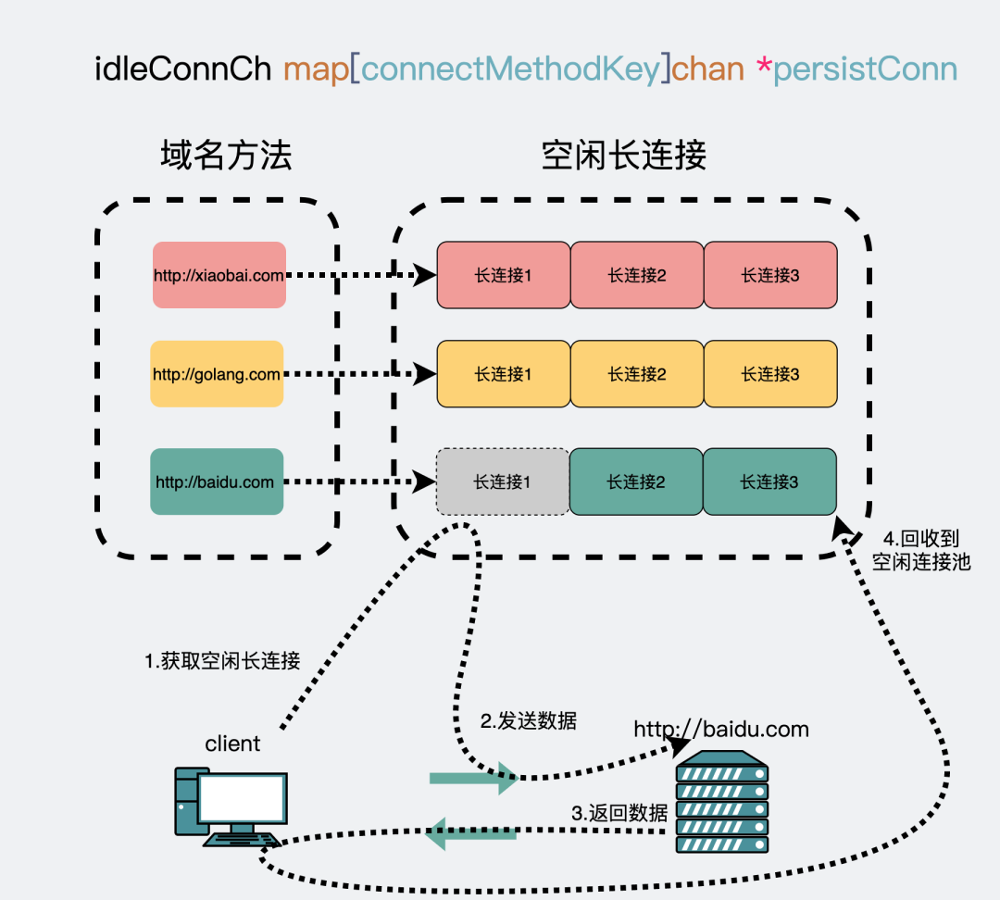
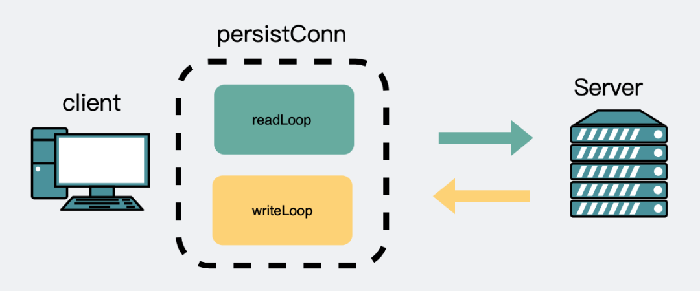

# http.Client

## 连接的建立和获取

HTTP协议从 1.1 之后就默认使用长连接， `golang` 标准库里也兼容这种实现。

通过建立一个连接池，针对 **每个域名** 建立一个TCP长连接，比如 `http://baidu.com` 和 `http://golang.com` 就是两个不同的域名。

第一次访问 `http://baidu.com` 域名的时候会建立一个连接，用完之后放到空闲连接池里，下次再要访问 `http://baidu.com` 的时候会重新从连接池里把这个连接捞出来复用。



当没有空闲连接时，会建立一个新连接。同时会创建一个 **读goroutine** 和 **一个写goroutine**。



源码如下：

```go
// 基于 go1.14
res, err := client.Do(req)

// 调用 c.do
func (c *Client) Do(req *Request) (*Response, error) {
    return c.do(req)
}

// 调用 c.send
func (c *Client) do(req *Request) {
    if resp, didTimeout, err = c.send(req, deadline); err != nil {
        // ...
    }
}  

// 调用 send
func (c *Client) send(req *Request, deadline time.Time) (resp *Response, didTimeout func() bool, err error) {
    resp, didTimeout, err = send(req, c.transport(), deadline)
}

// 调用 rt.RoundTrip
func send(ireq *Request, rt RoundTripper, deadline time.Time) {
    resp, err = rt.RoundTrip(req)
} 

// 从这里进入 RoundTrip 逻辑
// src/net/http/roundtrip.go: 16
func (t *Transport) RoundTrip(req *Request) (*Response, error) {
    return t.roundTrip(req)
}

// 调用 t.GetConn
func (t *Transport) roundTrip(req *Request) (*Response, error) {
    // 尝试去获取一个空闲连接，用于发起 http 连接
    pconn, err := t.getConn(treq, cm)
}

// 实现 t.getConn
func (t *Transport) getConn(treq *transportRequest, cm connectMethod) (pc *persistConn, err error) {
    w := &wantConn{
        key:        cm.key(), // 这个key就是域名
    }
  
    // 获取空闲连接，或者新建一个连接
    t.queueForDial(w)
}

func (t *Transport) queueForDial(w *wantConn) {
    // 空闲连接以 map 的形式存储，key 为域名。HTTP2里一个域名下可以有多个连接
    n := t.connsPerHost[w.key];
  
    // 如果未获取到，则新建连接
    if n < t.MaxConnsPerHost {
        go t.dialConnFor(w)
    }
}

// 没有空闲连接，就创建连接
func (t *Transport) dialConnFor(w *wantConn) {
    // 新建连接
	  pc, err := t.dialConn(w.ctx, w.cm)
  
    // 并将连接放入连接池
  	delivered := w.tryDeliver(pc, err)
	  if err == nil && (!delivered || pc.alt != nil) {
		    t.putOrCloseIdleConn(pc)
	}
}

// 就创建连接
// src/net/http/tansport.go
func (t *Transport) dialConn(ctx context.Context, cm connectMethod) (pconn *persistConn, err error) {
    pconn = &persistConn{}
    conn, err := t.dial(ctx, "tcp", cm.addr())
    pconn.conn = conn
  
    // 读、写共起了2个新协程
    // 如果收到响应后没有执行 resp.Body.Close(), 这里就会泄露2个 goroutine
    go pconn.readLoop()
    go pconn.writeLoop()
}
```

## 为什么不执行 resp.Body.Close 会内存泄漏

回到上面启动的读 `pconn.readLoop()` 代码里

```go
func (pc *persistConn) readLoop() {
    alive := true
    for alive {
        waitForBodyRead := make(chan bool, 2)
        body := &bodyEOFSignal{
            body: resp.Body,
          
            // 提前返回函数
            // 将 waitForBodyRead 置为false, 以便下面退出 for 循环
            earlyCloseFn: func() error {
                waitForBodyRead <- false
                <-eofc // will be closed by deferred call at the end of the function
                return nil
            },
          
            // 正常返回函数
            fn: func(err error) error {
                isEOF := err == io.EOF
                waitForBodyRead <- isEOF
                if isEOF {
                    <-eofc // see comment above eofc declaration
                } else if err != nil {
                    if cerr := pc.canceled(); cerr != nil {
                        return cerr
                    }
                }
                return err
            },
        }
      
        select {
        case bodyEOF := <-waitForBodyRead:
            pc.t.setReqCanceler(rc.req, nil) // before pc might return to idle pool
            alive = alive &&
            bodyEOF &&
            !pc.sawEOF &&
            pc.wroteRequest() &&
            tryPutIdleConn(trace)
            if bodyEOF {
                eofc <- struct{}{}
            }
        case <-rc.req.Cancel:
            alive = false
        case <-rc.req.Context().Done():
            alive = false
        case <-pc.closech:
            alive = false
        }
    }
}
```

简单来说 `readLoop` 就是一个死循环，只要不满足以下的退出场景， `alive` 就为 `true`，循环就不会中断：

* `body` 被读取完毕或 `body` 关闭
* `request` 主动 `cancel`
* `request` 的 `context Done` 状态 `true`
* 当前的 `persistConn` 关闭

其中第一个 `body` 被读取完或关闭的这个 `case` 里，`bodyEOF` 来源于一个通道 `waitForBodyRead`，这个字段的 `true` 和 `false` 直接决定了 `alive` 变量的值。这个通道的值是从上面的 `body` 部分里来的。

* 如果执行 `earlyCloseFn` ，`waitForBodyRead` 通道输入的是 `false`，`alive` 也会是 `false`，那 `readLoop()` 这个 `goroutine` 就会退出。
* 如果执行 `fn` ，其中包括正常情况下 `body` 读完数据抛出 `io.EOF` 时的 `case`，`waitForBodyRead` 通道输入的是 `true`，那 `alive` 会是 `true`， `readLoop()` 这个 `goroutine` 就不会退出，同时还顺便执行了 `tryPutIdleConn(trace)` 。会导致内存泄露。

**什么时候会执行这个 fn 和 earlyCloseFn 呢？**

正常读取 `res.Body` 会触发 `fn`，`res.Body.Close` 会触发 `earlyCloseFn`

**earlyCloseFn**

```go
func (es *bodyEOFSignal) Close() error {
    es.mu.Lock()
    defer es.mu.Unlock()
    if es.closed {
        return nil
    }
    es.closed = true
    if es.earlyCloseFn != nil && es.rerr != io.EOF {
        return es.earlyCloseFn() // 关闭时执行 earlyCloseFn
    }
    err := es.body.Close()
    return es.condfn(err)
}
```

上面这个其实就是我们比较收悉的 `resp.Body.Close()` ，在里面会执行 `earlyCloseFn`。

此时 `readLoop()` 里的 `waitForBodyRead` 通道输入的是 `false`，`alive` 也会是 `false`，那 `readLoop()` 这个 `goroutine` 就会退出，`goroutine` 不会泄露。

**fn**

```go
b, err = ioutil.ReadAll(resp.Body)

func ReadAll(r io.Reader) 

func readAll(r io.Reader, capacity int64) 

func (b *Buffer) ReadFrom(r io.Reader)


// go/1.12.7/libexec/src/bytes/buffer.go:207
func (b *Buffer) ReadFrom(r io.Reader) (n int64, err error) {
    for {
        m, e := r.Read(b.buf[i:cap(b.buf)])  // 看这里，是body在执行read方法
    }
}

func (es *bodyEOFSignal) Read(p []byte) (n int, err error) {
    n, err = es.body.Read(p)
    if err != nil {
        // 这里会有一个io.EOF的报错，意思是读完了
        err = es.condfn(err)
    }
    return
}

func (es *bodyEOFSignal) condfn(err error) error {
    err = es.fn(err)  // 这了执行了 fn
    es.fn = nil
    return err
}
```

上面这个其实就是我们比较收悉的读取 `body` 里的内容。 `ioutil.ReadAll()` , 在读完 `body` 的内容时会执行 `fn`。

此时 `readLoop()` 里的 `waitForBodyRead` 通道输入的是 `true`，`alive` 也会是 `true`，那 `readLoop()` 这个 `goroutine` 就不会退出，`goroutine` 会泄露，然后执行 `tryPutIdleConn(trace)` 把连接放回池子里复用。

## 参考

[咏春警告的胖虎 - i/o timeout ， 希望你不要踩到这个net/http包的坑](https://mp.weixin.qq.com/s/UBiZp2Bfs7z1\_mJ-JnOT1Q)

[咏春警告的胖虎 - 给大家丢脸了，用了三年golang，我还是没答对这道内存泄漏题](https://zhuanlan.zhihu.com/p/302217453)
