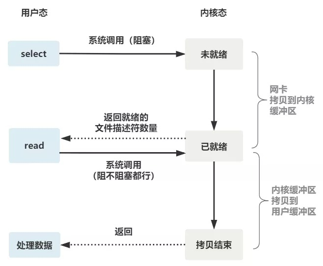

# IO多路复用

## 阻塞 IO

想一下如果让你来写一个处理网络请求的服务端，你会怎么写？

最基础的做法是，先起一个线程监听所有的网络连接。成功建立连接后，处理该请求。请求处理完成后，建立下一个连接，处理下一个请求。如此串行的、阻塞的处理。

```c
listenfd = socket();   // 打开一个网络通信端口
bind(listenfd);        // 绑定
listen(listenfd);      // 监听
while(1) {
    connfd = accept(listenfd);  // 建立连接（阻塞）
    int n = read(connfd, buf);  // 读数据（阻塞）
    doSomeThing(buf);           // 处理数据
    close(connfd);              // 关闭连接，循环等待下一个连接
}
```


可以看到，服务端的线程阻塞在了两个地方，一个是 `accept` 函数，一个是 `read` 函数。

如果再把 `read` 函数的细节展开，我们会发现其阻塞在了两个阶段：从网卡复制到内核缓冲区，和从内核复制到用户缓冲区。


这就是传统的阻塞 IO。如果这个连接的客户端一直不发数据，那么服务端线程将会一直阻塞在 `read` 函数上不返回，也无法接受其他客户端连接。

这肯定是不行的。

## 非阻塞IO

为了解决上面的问题，其关键在于改造这个 `read` 函数。

有一种办法是，每次都创建一个新的进程或线程，去调用 `read` 函数，并做业务处理。这样当给一个客户端建立好连接后，就可以立刻等待新的客户端连接，而不用阻塞在原客户端的 `read` 请求上。

不过，这不叫非阻塞 IO，只不过用了多线程的手段使得主线程没有卡在 `read` 函数上不往下走罢了。操作系统为我们提供的 `read` 函数仍然是阻塞的。并且无限制的开新线程，很容易导致资源被耗光。

真正的非阻塞 IO，不能是通过我们用户层的小把戏，**而是要请操作系统为我们提供一个非阻塞的 read 函数**。

这个 `read` 函数的效果是，如果没有数据到达时（到达网卡并拷贝到了内核缓冲区），立刻返回一个错误值（-1），而不是阻塞地等待。

操作系统提供了这样的功能，只需要在调用 `read` 前，将文件描述符设置为非阻塞即可。

```c
fcntl(connfd, F_SETFL, O_NONBLOCK);        // 将文件描述符设置为非阻塞
int n = read(connfd, buffer) != SUCCESS);  // read函数
```

这样，就需要用户线程循环调用 `read`，直到返回值不为 -1，再开始处理业务。


这里注意一个细节：

非阻塞的 `read`，指的是在数据到达前，即数据还未到达网卡，或者到达网卡但还没有拷贝到内核缓冲区之前，这个阶段是非阻塞的。

当数据已到达内核缓冲区，此时调用 `read` 函数仍然是阻塞的，需要等待数据从内核缓冲区拷贝到用户缓冲区，才能返回。

整体流程如下图


## IO 多路复用

为每个客户端创建一个线程，服务器端的线程资源很容易被耗光。有个聪明的办法，我们可以每 `accept` 一个客户端连接后，将这个文件描述符 `connfd` 放到一个数组/队列里。

```c
fdlist.add(connfd); // 将连接放入队列
```

然后起一个新的线程去不断遍历这个数组，调用每一个元素的非阻塞 `read` 方法。

```c
while(1) {
    for (fd <-- fdlist) {      // 循环从队列里取连接
        if (read(fd) != -1) {  // 调用read
            doSomeThing();
        }
    }
}
```

这样我们只需要2个线程（一个把连接放入队列，一个从队列里取连接出来处理），就可以处理多个客户端连接。

你是不是觉得这有些多路复用的意思？

但这和我们用多线程去将阻塞 IO 改造成看起来是非阻塞 IO 一样，这种遍历方式也只是我们用户自己想出的小把戏，每次遍历遇到 `read` 返回 -1 时仍然是一次浪费资源的系统调用。

所以，还是得恳请操作系统老大，提供给我们一个有这样效果的函数，我们将一批文件描述符通过一次系统调用传给内核，由内核层去遍历，才能真正解决这个问题。

### **select**

`select` 是操作系统提供的系统调用函数，通过它，我们可以把一批文件描述符发给操作系统， 让操作系统去遍历，确定哪个文件描述符可以读写， 然后告诉我们去处理，不需要我们自己通过 `for` 循环来遍历了。


`select` 系统调用的函数定义如下。

```c
int select(
    int nfds,                 // 文件描述符数量
    fd_set *readfds,          // 监控有读数据到达文件描述符集合，传入传出参数
    fd_set *writefds,         // 监控写数据到达文件描述符集合，传入传出参数
    fd_set *exceptfds,        // 监控异常发生达文件描述符集合, 传入传出参数
    struct timeval *timeout); // timeout：定时阻塞监控时间，3种情况
//  1.NULL，永远等下去
//  2.设置timeval，等待固定时间
//  3.设置timeval里时间均为0，检查描述字后立即返回，轮询
```

服务端代码，这样来写。首先一个线程不断接受客户端连接，并把 `socket fd` 放到一个 `list` 里。

```c
while(1) {
    connfd = accept(listenfd);          // 建立连接
    fcntl(connfd, F_SETFL, O_NONBLOCK); // 设置非阻塞read
    fdlist.add(connfd);                 // 放到队列里
}
```

然后，另一个线程不再自己遍历，而是调用 `select`，将这个 `list` 交给操作系统去遍历。

```c
while(1) {
    // 把一堆文件描述符 list 传给 select 函数
    // 有已就绪的文件描述符就返回，nready 表示有多少个就绪的
    nready = select(list);
    ...
}
```

不过，当 `select` 函数返回后，用户依然需要遍历刚刚提交给操作系统的 `list`。操作系统只会将准备就绪的文件描述符做上标识，并返回 `ready` 的数量。

```c
while(1) {
    nready = select(list);
    // 用户层依然要遍历，只不过少了很多无效的系统调用
    for (fd <-- fdlist) {
        // 原先是if (read(fd) != -1)，这里调用select后，操作系统给就绪的fd做了标记，不需要再通过read判断了
        if (fd != -1) { 
            read(fd, buf);
            if(--nready == 0) break; // 总共只有 nready 个已就绪描述符，不用过多遍历
        }
    }
}
```


可以看出几个细节（这几点将在 `epoll` 中得到优化）：

1. `select` 调用需要传入 `fd` 数组，需要拷贝一份到内核，高并发场景下这样的拷贝消耗的资源是惊人的。（可优化为不复制）
2. `select` 在内核层仍然是通过遍历的方式检查 `fd` 的就绪状态，是个同步过程，只不过无系统调用切换上下文的开销。（内核层可优化为异步事件通知）
3. `select` 仅仅返回可读文件描述符的个数，具体哪个可读还是要用户自己遍历。（可优化为只返回给用户就绪的文件描述符，无需用户做无效的遍历）

整个 `select` 的流程图如下。



可以看到，这种方式，既做到了一个线程处理多个客户端连接（文件描述符），又减少了系统调用的开销（多个文件描述符只有一次 `select` 的系统调用 + n 次就绪状态的文件描述符的 `read` 系统调用）。

### poll

`poll` 的实现和 `select` 非常相似，只是描述 `fd` 集合的方式不同，`select` 使用了一个10位的 `int` 结构 `fd_set` 作为文件描述符，因此最多只能监听 `2^10 = 1024` 个 `fd`。`poll` 改用了一个链表 `pollfd` ，因此没有这个限制。和 `select` 相比只是实现细节上的区分，并没有本质上的区别。

```c
int poll(struct pollfd *fds, nfds_tnfds, int timeout);

struct pollfd {
    intfd;        /*文件描述符*/
    shortevents;  /*监控的事件*/
    shortrevents; /*监控事件中满足条件返回的事件*/
};
```

### epoll

`epoll` 是最终的大 `boss`，它解决了 `select` 和 `poll` 的一些问题。

还记得上面说的 `select` 的三个细节么？

1. `select` 调用需要传入 `fd` 数组，需要拷贝一份到内核，高并发场景下这样的拷贝消耗的资源是惊人的。（可优化为不复制）
2. `select` 在内核层仍然是通过遍历的方式检查 `fd` 就绪状态，是个同步过程，只不过无系统调用切换上下文的开销。（内核层可优化为异步事件通知）
3. `select` 仅仅返回可读文件描述符的个数，具体哪个可读还是要用户自己遍历。（可优化为只返回给用户就绪的文件描述符，无需用户做无效的遍历）

所以 `epoll` 主要就是针对这三点进行了改进。

1. 内核中保存一份文件描述符集合，无需每次调用 `select` 时都重新传入，只需告诉内核修改的部分即可。
2. 内核不再通过轮询的方式找到就绪的文件描述符，而是通过异步 IO 事件唤醒。
3. 内核仅会将有 IO 事件的文件描述符返回给用户，用户也无需遍历整个文件描述符集合。

具体，操作系统提供了这三个函数。

第一步，创建一个 `epoll` 句柄（处理器

```c
int epoll_create(int size);
```

第二步，向内核添加、修改或删除要监控的文件描述符。

```c
// 通过该函数，直接向内核中写入文件描述符，不需要像select调用时每次拷贝大批文件描述符
int epoll_ctl(int epfd, int op, int fd, struct epoll_event *event);
```

第三步，类似发起了 `select()` 调用

```c
int epoll_wait(int epfd, struct epoll_event *events, int max events, int timeout);
```

使用起来，其内部原理就像如下一般丝滑。


`epoll` 利用 `epoll_ctl` 来插入或者删除一个 `fd`，实现用户态到内核态的数据拷贝，这确保了每一个 `fd` 在其生命周期只需要被拷贝一次，而不是每次调用 `epoll_wait` 的时候都拷贝一次。相比 `select & poll` 需要把全部监听的 `fd` 集合从用户态拷贝至内核态的做法，效率高出了一大截。

在实现上 `epoll` 采用**红黑树**来存储所有监听的 `fd`，红黑树本身插入和删除性能比较稳定，时间复杂度 `O(logN)`。通过 `epoll_ctl` 函数添加进来的 `fd` 都会被放在红黑树的某个节点内，所以，重复添加是没有用的。

当把 `fd` 添加进来的时候时候会完成关键的一步：该 `fd` 会与相应的设备（网卡）驱动程序建立回调关系，也就是在内核中断处理程序为它注册一个回调函数，在 `fd` 相应的事件触发（中断）之后（设备就绪了），内核就会调用这个回调函数，该回调函数在内核中被称为： `ep_poll_callback` 。这个回调函数其实就是把这个 `fd` 添加到一个双向链表（就绪链表） `rdllist` 中。

`epoll_wait` 实际上就是去检查 `rdllist` 链表是否为空，不空说明有就绪的 `fd`，直接返回这个链表给调用者使用。为空时挂起当前进程，一直阻塞等着，直到非空时进程才被唤醒并返回。

#### 边缘触发 / 水平触发

`epoll` 支持两种事件触发模式，分别是**边缘触发（edge-triggered，ET）和水平触发（level-triggered，LT）**。

**边缘触发**

使用边缘触发模式时，当被监控的 `socket` 描述符上有可读事件发生时，**服务器端只会从 epoll\_wait 中苏醒一次**，即使进程没有调用 `read` 函数从内核读取数据，也依然只苏醒一次，因此我们程序要保证一次性将内核缓冲区的数据读取完

举个例子，你的快递被放到了一个快递箱里，如果快递箱只会通过短信通知你一次，即使你一直没有去取，它也不会再发送第二条短信提醒你。

如果使用边缘触发模式，I/O 事件发生时只会通知一次，而且我们不知道到底能读写多少数据

因此，我们会**循环**从文件描述符读写数据，那么如果文件描述符是阻塞的，没有数据可读写时，进程会阻塞在读写函数那里，程序就没办法继续往下执行。所以，边缘触发模式一般和非阻塞 I/O 搭配使用，程序会一直执行 I/O 操作，直到系统调用（如 `read` 和 `write`）返回错误，错误类型为 `EAGAIN` 或 `EWOULDBLOCK`。

一般来说，边缘触发的效率比水平触发的效率要高，因为边缘触发可以减少 `epoll_wait` 的系统调用次数，系统调用也是有一定的开销的的。

**水平触发**

使用水平触发模式时，当被监控的 Socket 上有可读事件发生时，**服务器端不断地从 epoll\_wait 中苏醒，直到内核缓冲区数据被 read 函数读完才结束**，目的是告诉我们有数据需要读取

仍然用上面快递的例子，如果快递箱发现你的快递没有被取出，它就会不停地发短信通知你，直到你取出了快递，它才消停

## 同步非阻塞

所有I/O多路复用操作都是**同步**的，涵盖 `select / poll / epoll`。

**阻塞/非阻塞**是相对于同步I/O来说的，与异步I/O无关。

使用 `select / poll / epoll` 时，仍然需要起一个死循环，循环内显示的调用 `select / poll / epoll_wait` 查询是否有就绪的 `fd`，如果有，再自行执行后续的回调函数。因此只是非阻塞了，但回调仍然是同步执行的，即**同步非阻塞**调用。就像餐厅排队，取了号去逛街，逛一会儿就得回来问下到号了没有，需要不断的询问。

真正的异步 I/O，应当是把回调函数交给操作系统，系统在 `fd` 就绪时，自动执行回调，而不是用户进程自己检查、自己执行。

另外，`select / poll / epoll` 实际上也提供了阻塞的调用方式。将参数里的 `timeout` 设成 `NULL / -1`，就变成阻塞的了。不过应该没人这么用吧。

## 总结

1. 如果不使用内核提供的 `IO多路复用`，我们需要遍历每个连接 `fd`，调用内核的 `read` 方法判断 `fd` 的就绪状态。对于那些未就绪的 `fd`，每次 `read` 都是无效且耗费资源的操作
2. 通过 `select` 方法，我们可以将一批 `fd` 交给内核，内核来进行遍历。内核会给就绪的 `fd` 打上标记，我们再遍历一次 `fd`列表，处理其中就绪的 `fd` 就可以了。相比1来说，省去了每次循环里用户态切到内核态再调用 `read` 的开销
3. `poll` 方法去掉了 `select` 只能监听 1024 个 `fd` 的限制
4. `epoll` 方法对 `select` 的一些缺点进行了优化，如：
   1. 用户调用时不再需要复制一份 `fd` 列表给内核，而是通过 `epoll_ctl` 方法直接向内核中写入 `fd`
   2. 内核仅会将就绪的 `fd` 返回给用户，不再需要用户自行遍历 `fd` 列表
   3. 内核也不是通过轮询的方式找到就绪的 `fd` 了 ，而是通过异步唤醒机制，性能更好

**问题**

IO多路复用，复用的是什么？目的是什么？

* 进程 / 线程。使用同一进程 / 线程处理多个连接。目的是使用很少的 CPU、内存资源就可以处理很多的连接，降低系统负载

## 参考

[闪客sun - 你管这破玩意叫 IO 多路复用？](https://mp.weixin.qq.com/s/YdIdoZ\_yusVWza1PU7lWaw)

[同步非阻塞的讨论](https://github.com/CyC2018/CS-Notes/issues/194)

[小林coding - IO 多路复用是什么意思？](https://www.zhihu.com/question/32163005)
