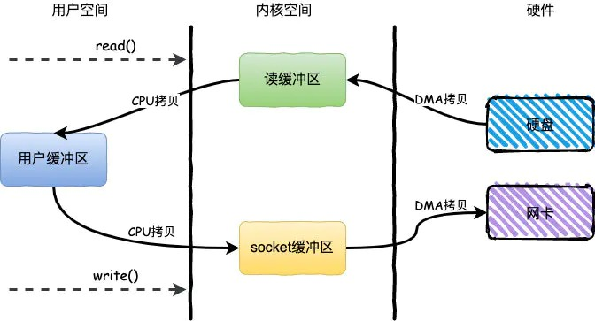
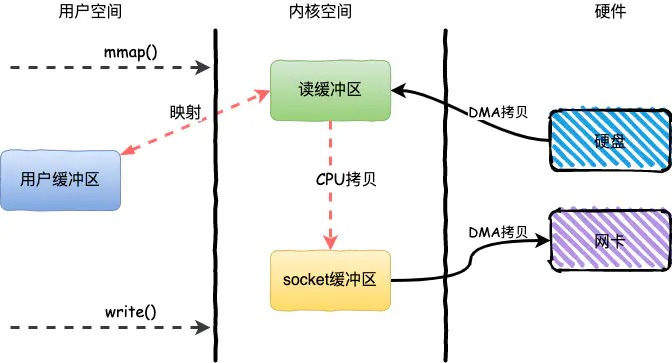
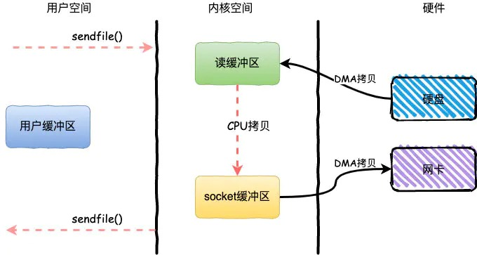
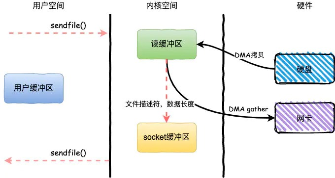

# 零拷贝

平时在面试中你肯定会经常碰见的问题就是：`RocketMQ` 为什么快？`Kafka` 为什么快？什么是 `mmap`？

这一类的问题都逃不过的一个点就是零拷贝，虽然还有一些其他的原因，但是今天我们的话题主要就是零拷贝。

## 传统IO

### read + write

在开始谈零拷贝之前，首先要对传统的IO方式有一个概念。

基于传统的IO方式，底层实际上通过调用 `read()` 和 `write()` 来实现。

通过 `read()` 把数据从硬盘读取到内核缓冲区，再复制到用户缓冲区；然后通过 `write()` 写入到 socket缓冲区，最后写入网卡设备。

整个过程发生了4次用户态和内核态的上下文切换和4次拷贝，具体流程如下：

1. 用户进程通过 `read()` 方法向操作系统发起调用，此时上下文从用户态转向内核态
2. DMA控制器把数据从硬盘中拷贝到读缓冲区
3. CPU把读缓冲区数据拷贝到应用缓冲区，上下文从内核态转为用户态，`read()` 返回
4. 用户进程通过 `write()` 方法发起调用，上下文从用户态转为内核态
5. CPU将应用缓冲区中数据拷贝到socket缓冲区
6. DMA控制器把数据从socket缓冲区拷贝到网卡，上下文从内核态切换回用户态，`write()` 返回

**那么，这里指的用户态、内核态指的是什么？上下文切换又是什么？**

简单来说，用户空间指的就是用户进程的运行空间，内核空间就是内核的运行空间。

如果进程运行在内核空间就是内核态，运行在用户空间就是用户态。

为了安全起见，他们之间是互相隔离的，而在用户态和内核态之间的上下文切换也是比较耗时的。

从上面我们可以看到，一次简单的IO过程产生了4次上下文切换，这个无疑在高并发场景下会对性能产生较大的影响。

**那么什么又是DMA拷贝呢？**

对于一个IO操作而言，都是通过CPU发出对应的指令来完成，但是相比CPU来说，IO的速度太慢了，CPU有大量的时间处于等待IO的状态。

因此就产生了DMA（Direct Memory Access）直接内存访问技术，本质上来说他就是一块主板上独立的芯片，通过它来进行内存和IO设备的数据传输，从而减少CPU的等待时间。

但是无论谁来拷贝，频繁的拷贝耗时也是对性能的影响。

## 零拷贝

> 零拷贝技术是指计算机执行操作时，CPU不需要先将数据从某处内存复制到另一个特定区域，这种技术通常用于通过网络传输文件时节省CPU周期和内存带宽。

对于零拷贝而言，并非真的是完全没有数据拷贝的过程，只不过是减少用户态和内核态的切换次数以及CPU拷贝的次数。

这里，仅仅有针对性的来谈谈几种常见的零拷贝技术。

### mmap + write

`mmap` 主要是对 `read` 进行了优化，实现方式是将读缓冲区的地址和用户缓冲区的地址进行**映射** (所以叫map)，从而减少了从内核到用户缓冲区的一次拷贝。

整个过程发生了4次用户态和内核态的上下文切换和3次拷贝，具体流程如下：

1. 用户进程通过 `mmap()` 方法向操作系统发起调用，上下文从用户态转向内核态
2. DMA控制器把数据从硬盘中拷贝到读缓冲区
3. 上下文从内核态转为用户态，`mmap` 调用返回
4. 用户进程通过 `write()` 方法发起调用，上下文从用户态转为内核态
5. CPU将读缓冲区中数据拷贝到socket缓冲区
6. DMA控制器把数据从socket缓冲区拷贝到网卡，上下文从内核态切换回用户态，`write()` 返回

相比 `read`, `mmap` 的方式节省了一次CPU拷贝，同时由于用户进程中的内存是虚拟的，只是映射到内核的读缓冲区，所以可以节省一半的内存空间，比较适合大文件的传输。

### sendfile

`sendfile` 是Linux2.1内核版本后引入的一个系统调用函数，通过使用 `sendfile` 数据可以直接在内核空间进行传输，替代了 `read + write` ，进一步节省了一次系统调用，也就是2次上下文切换。

整个过程发生了2次用户态和内核态的上下文切换和3次拷贝，具体流程如下：

1. 用户进程通过 `sendfile()` 方法向操作系统发起调用，上下文从用户态转向内核态
2. DMA控制器把数据从硬盘中拷贝到读缓冲区
3. CPU将读缓冲区中数据拷贝到socket缓冲区
4. DMA控制器把数据从socket缓冲区拷贝到网卡，上下文从内核态切换回用户态，`sendfile` 调用返回

`sendfile` 方法IO数据对用户空间完全不可见，所以只能适用于完全不需要用户空间处理的情况，比如静态文件服务器。

### sendfile + DMA Scatter/Gather

Linux2.4内核版本之后对 `sendfile` 做了进一步优化，通过引入新的硬件支持，这个方式叫做DMA Scatter/Gather 分散/收集功能。

它将读缓冲区中的数据描述信息（内存地址和偏移量）记录到socket缓冲区，由 DMA 根据这些将数据从读缓冲区拷贝到网卡，相比之前版本减少了一次CPU拷贝的过程

整个过程发生了2次用户态和内核态的上下文切换和2次拷贝，其中更重要的是完全没有CPU拷贝，具体流程如下：

1. 用户进程通过 `sendfile()` 方法向操作系统发起调用，上下文从用户态转向内核态
2. DMA控制器利用scatter把数据从硬盘中拷贝到读缓冲区离散存储
3. CPU把读缓冲区中的文件描述符和数据长度发送到socket缓冲区
4. DMA控制器根据文件描述符和数据长度，使用scatter/gather把数据从内核缓冲区拷贝到网卡
5. `sendfile()` 调用返回，上下文从内核态切换回用户态

DMA gather和 `sendfile` 一样数据对用户空间不可见，同时输入文件描述符只能是文件。过程中完全没有CPU拷贝过程，极大提升了性能。

但是需要硬件支持，老的服务器就别想了。

## 应用场景

对于文章开头说的两个场景：RocketMQ和Kafka都使用到了零拷贝的技术。

对于MQ而言，无非就是生产者发送数据到MQ然后持久化到磁盘，之后消费者从MQ读取数据。

对于RocketMQ来说这两个步骤使用的是 `mmap + write`，而Kafka则是使用 `mmap + write` 持久化数据，发送数据给消费者使用 `sendfile`。
